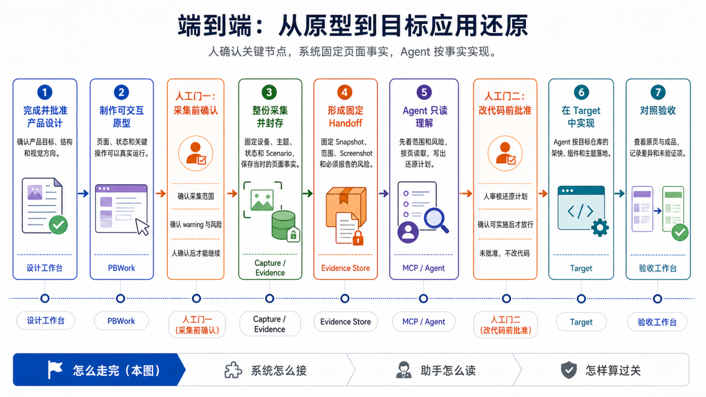

# ProtoBridge

**让 Coding Agent 按固定、可追溯的页面事实，在目标工程中还原并验收可交互原型。**

ProtoBridge（PB）是一套面向 Coding Agent 的端到端原型还原与验收基础设施。它从可交互 Runtime 确定性采集结构、文字、状态、操作和 Screenshot，保存为不可变 Evidence，再通过 MCP 把固定事实交给 Agent。Agent 结合目标仓库自己的规范完成实现，最后按五个维度对照复查。

PB 的产品输出是 **Evidence 与固定 Handoff**，不是自动生成的成品代码。

## 为什么需要 ProtoBridge

原型交给 Coding Agent 时，真正困难的不是“怎么把一个网页改写成另一种代码”，而是如何让 Agent 在有限上下文里准确回答这些问题：页面有哪些状态，哪些内容必须实现，哪些风险尚未解决，目标工程应该复用什么，以及完成后怎样证明没有漏掉关键细节。

常见交接材料各自只能回答问题的一部分：

| 交接方式 | 能提供什么 | 缺少什么 |
| --- | --- | --- |
| 一组 Screenshot | 最终视觉外观 | 状态来源、交互、结构语义、覆盖范围和风险 |
| 原型源码或 DOM | 实现材料和结构线索 | 当时的确定状态、不可变引用和 Target 落地边界 |
| 设计说明 | 意图、规范和阅读方法 | 可复现页面事实与真实运行结果 |
| Agent 上下文整包 | 大量材料 | 稳定读取顺序、上下文预算和固定事实边界 |
| Agent 完成报告 | 实施者的自报 | 独立目视确认与未验证项约束 |

ProtoBridge 在原型和目标代码之间建立一个可固定、可追溯的 Evidence 层：先证明“要还原什么”，再让 Agent 决定“怎样在 Target 中实现”。

## 产品总览


这条链路把产品职责分成五个相互约束的部分：

| 参与者 | 负责什么 | 不负责什么 |
| --- | --- | --- |
| PBWork / Runtime | 做完整页面，声明 Screen、Variant、状态和 Scenario，并提供确定性运行环境 | 不决定 Target 文件、路由或状态框架 |
| Capture / Store | 固定 Case，采集 Facts 与 Screenshot，写入新的 revision 和 Snapshot | 不用源码或 Target 猜测 Runtime 未证明的事实 |
| MCP | 按固定 Handoff 渐进提供 Evidence，并只读查询 Target | 不触发采集、不修改 Evidence、不替 Agent 选择实现 |
| Coding Agent | 理解 Evidence 与 Target 上下文，制定计划，获批后完成实现和验证 | 不改读 `active/latest`，不把 Target 习惯覆盖到页面事实上 |
| 人 | 确认范围与风险、批准实现计划、最终对照原页和成品 | 不把风险确认或 Agent 自报当成最终通过 |

系统固定的是页面事实，不是生产代码。Evidence 回答“原型当时是什么样”，Target 仓库自己的规范回答“应该如何落地”；两者发生冲突时，Target 习惯不能反向改写已经封存的 Evidence。

### 核心能力

| 能力 | ProtoBridge 做什么 | 对 Agent 的价值 |
| --- | --- | --- |
| Authored Runtime | 由原型明确声明可采集边界、状态和 Scenario | 不靠 DOM 启发式猜页面何时完整 |
| 确定性 Capture | 固定设备、主题、Variant、Fixture 与 Scenario 后逐 Case 采集 | 同一任务拥有可解释、可复查的页面状态 |
| 不可变 Store | 以 Run、revision、Snapshot 和 Blob 保存历史 | Handoff 不会随之后的重新采集漂移 |
| 固定 Handoff | 固定 Workspace、Snapshot、revision、范围、风险和 Staleness | Agent 与人始终讨论同一份 Evidence |
| MCP 渐进消费 | 先给地图，再按 Screen 给事实与 Screenshot，必要时展开差异 | 避免整包上下文过载，也不跳过关键图像 |
| Target 查询与验证 | 只读发现既有规范、组件、Token 和示例，并检查实际改动 | 优先复用 Target 已有做法，而不是从零发明 |
| 五维复查 | 编译结构、组件、颜色与文字、状态、操作义务并汇总差异 | 完成结论保留 deviation 与 unverified，不用总分遮蔽问题 |

[查看产品职责与边界](docs/product/overview.md)

## 一条闭环：从原型到验收



完整闭环包含两道人工作业门。第一道门发生在采集前：人确认整份原型的实际范围、warning 和主要风险；第二道门发生在改代码前：Agent 必须先完成只读理解并提交实现计划，得到人批准后才能修改 Target。

| 阶段 | 人做什么 | 系统或 Agent 做什么 | 形成什么 |
| --- | --- | --- | --- |
| 完成产品设计 | 确认产品目标、结构、视觉方向和关键旅程 | PBWork 保存获批设计基线 | 已批准产品与体验方向 |
| 制作可交互原型 | 查看真实页面、状态和操作是否完整 | Runtime 提供可准备、可复现的页面状态 | 可采集原型 |
| 采集前确认 | 确认范围、warning、Case 数量和风险 | Preflight 校验 authored boundary 并形成 Case Matrix | 明确的采集任务 |
| 整份采集与封存 | Review Screenshot、Coverage、Issue 和风险 | Capture 逐 Case 采集，Store 写入 revision 与 Snapshot | 不可变 Evidence |
| 形成 Handoff | 确认交付目标与必须报告的风险 | 系统固定范围、引用和 Agent 提示词 | 固定 Handoff |
| Agent 只读理解 | 纠正理解，审核实现计划 | Agent 按 Screen 读取 Evidence、Screenshot 和 Target 上下文 | 可执行计划 |
| Target 实现 | 批准计划后跟进实施 | Agent 修改目标代码并运行原生验证 | 目标应用变更 |
| 对照验收 | 查看原页和成品，确认差异与未验证项 | Agent 汇总五维复查和验证事实 | 完成报告与人工结论 |

任何 warning 或 risk 的人工确认都只表示“允许任务继续”，不会从 Evidence 中删除风险，也不会自动提升为验收通过。

[查看完整工作流](docs/product/workflow.md) · [了解 PBWork 与 PB 如何协作](docs/guides/pbwork-and-pb.md)

## 一次 Handoff 固定什么

Handoff 是 Evidence 的固定索引，不是实现计划，也不是把所有内容复制进 Prompt。一次正式交接至少固定：

- 所属 Workspace、Bundle、Snapshot 与 Staleness Report；
- 实现范围内的 Screen、Case、Scenario、revision 和 Fragment 引用；
- 不同 Screenshot 内容及其覆盖的 Case；
- `partial-coverage`、`stale-evidence`、`required-unknown`、`unresolved-conflict` 等 mandatory risks；
- 本次实施范围；Delivery Prompt 另行携带 Workspace 配置的默认 Target 路径，该路径不进入 Evidence；
- Agent 必须遵守的渐进读取、计划批准和完成报告纪律。

Deliver 目录中的 Prompt、Receipt、Brief、Review 和去重 Screenshot 方便人查看与交接，但它们仍是 Store 的索引或导出。Agent 的正式事实来源是 MCP 读取到的固定 Handoff 和可达 Evidence。

## 页面事实与 Target 代码保持分离


ProtoBridge 使用 Core-owned semantics：Contract、Selection、Preflight、Capture、Store、Handoff、状态和引用都由 Core 定义。PBWork、CLI、Local Service 与 MCP 只适配自己的进程与 IO，不维护第二套 Case identity、risk 或“取最新成功结果”算法。

### 谁能写，谁只能读

| 模块 | 对 Evidence | 对 Target | 关键边界 |
| --- | --- | --- | --- |
| PBWork Workbench | 发起 Selection、Preflight、Capture 和 Review，不直接定义 Store 语义 | 不访问 | 人机控制面，复用 Core 能力 |
| Runtime | 提供 authored manifest、准备状态和语义快照 | 不访问 | 声明并准备，不持久化 Evidence |
| Core Capture | 创建 Attempt、revision、Coverage、Issue 与 Snapshot | 不用 Target 补造事实 | 唯一页面事实写入者 |
| Immutable Store | 只追加保存对象和 Blob，原子更新引用 | 不访问 | 旧 Snapshot 与 Handoff 保持可读 |
| MCP | 只读固定 Handoff 可达的 Evidence | 只读查询与验证 | 不猜 Store 路径，不回退 `active/latest` |
| Coding Agent | 只通过 MCP 消费 | 修改代码并运行目标原生验证 | 自行决定文件、组件、路由和状态实现 |
| Target repository | 不得写回 Evidence | 拥有自己的规范和生产代码 | Target 事实只指导实现 |

这套边界提供三项核心保证：

1. 重新采集产生新 Run、新 revision 和新 Snapshot，不覆盖历史交接。
2. Target 当前代码、组件命名和工程习惯不能填补或覆盖 Evidence 中的 unknown、conflict 或 partial coverage。
3. Agent 不能绕过 MCP 遍历原始 Store，也不能把一次任务切换到 `active` 或 `latest` 恢复执行。

[查看系统架构](docs/architecture/overview.md) · [理解 Evidence 模型](docs/architecture/evidence-model.md) · [查看实现边界](docs/architecture/proto-bridge.md)

## MCP 给 Agent 事实，不替 Agent 做决定


ProtoBridge 的 Agent 协作不是“把一个大包塞给模型然后要求直接编码”。MCP、Docs / Skills、Agent 和人分别拥有不同职责：

| 角色 | 提供什么 | 不能替代什么 |
| --- | --- | --- |
| MCP | 固定范围、风险、Screen packet、Screenshot、Case delta、Detail 和 Target 只读查询 | 不替 Agent 选择目标文件、组件或架构 |
| Docs / Skills | 读取顺序、风险纪律、计划门禁、Target 的组件与主题习惯 | 不替代页面事实，不改变 Evidence |
| Coding Agent | Evidence 理解、Target 落点方案、实现、原生验证和完成报告 | 不拥有最终视觉验收权威 |
| 人 | 风险确认、理解纠偏、计划批准和最终目视 | 不把批准计划等同于验收完成 |

### 为什么要渐进读取

Agent 先读取 Workspace 和 Handoff index，知道有多少 Screen、Case、Scenario、Screenshot 分组和 mandatory risk；然后每个 Screen 读取一次 implementation packet，并查看每份不同 Screenshot 内容。只有 baseline 无法解释状态或场景差异时，才展开 Case delta 或定向 Detail。

这样做同时满足两件事：

- 不把完整 Snapshot、Catalog、原始 revision 和全部 provenance 一次塞进上下文；
- 不因为“上下文太大”而省略关键 Screenshot、状态差异或未解决风险。

默认协作顺序是：

1. 校验 Workspace、能力、契约版本和进程身份；
2. 固定 Handoff 范围、Screen 顺序、Case / Scenario 和 mandatory risks；
3. 按 Screen 理解结构、滚动边界、状态矩阵和固定业务数据；
4. 查看代表 Screenshot，记录它覆盖的全部 Case；
5. 查询 Target conventions、readiness、组件、Token 和既有示例；
6. 必要时读取非 baseline Case 的语义差异和定向来源；
7. 用白话概括 Evidence 理解，提交预计文件、验证方式和剩余风险；
8. 暂停并等待人批准计划；
9. 获批后实施、运行 Target 原生验证，再进行五维复查。

固定 Evidence 回答“要还原什么”；Target 习惯只回答“怎样实现”。没看关键 Screenshot、没理解完整或没获得计划批准时，Agent 都不能修改 Target。

[查看 Agent 消费指南](docs/guides/agent-consumption.md) · [查看 MCP Tool、Resource 与 Prompt](packages/mcp-server/README.md)

## 不是“写完了”，而是“对照过关”


ProtoBridge 明确区分三件事：

| 层次 | 回答什么 | 不能证明什么 |
| --- | --- | --- |
| 页面采集完整 | authored required boundary 是否被采到，Coverage 与 Issue 是否可见 | Target 是否已经实现正确 |
| Evidence 足够支持还原 | 现有 Facts、Screenshot、状态和交互是否足以指导实施 | Target 与原页是否一致 |
| Target 对照过关 | 原页和成品是否已经逐项比较，并记录所有差异或未验证项 | 不产生一个可替代人目视的自动总分 |

### 五个复查维度

| 维度 | 主要检查 |
| --- | --- |
| 结构 | 布局、层级、分区、滚动边界和留白 |
| 组件 | 组件类型、包含内容、尺寸、位置和关键属性 |
| 颜色与文字 | 颜色、字体、字号、字重、间距和文案 |
| 状态 | 默认、选中、禁用、加载、空态、错误等表现 |
| 操作 | 触发、反馈、跳转、弹层、Scenario 和 Checkpoint 结果 |

每项复查只能保持明确状态：有可靠依据并一致、发现差异、或者仍未验证。没有可靠验证依据时必须保持 `unverified`；不能用空 observation、Agent 自报或一个总分把它变成通过。

`summarize_reconstruction_review` 汇总已处理 Case、已查看 Screenshot、已重放 Scenario、已知偏差和未验证事项。它是 consumer-reported summary，不是独立 Runtime receipt，也不是最终视觉验收。最终仍要由人查看原页 Screenshot 与 Target 成品是否一致。

[查看验收判据](docs/guides/agent-consumption.md#怎样算过关) · [使用人工五维验收模板](docs/acceptance/README.md)

## 适合解决什么

ProtoBridge 适合这些任务：

- 把包含多 Screen、Variant、状态和关键交互的代码原型交给 Coding Agent 实现；
- 让 Agent 在不同 Target 技术栈中按固定视觉与行为事实还原，而不是翻译原型源码；
- 在 Target 已有 Design System、Token、主题和架构约定时优先复用既有做法；
- 为一次 Agent 实施固定范围、引用、风险和 Screenshot，避免任务进行中证据漂移；
- 将“写完代码”推进到带差异与未验证项的五维对照复查；
- 保留可追溯的原型事实、Handoff 和人工验收记录。

它不适合被描述成 DOM-to-code 生成器、云端设计协作平台、全自动视觉评分器或替代目标仓库架构决策的 Agent 编排器。

## 当前产品边界

- Evidence Contract 不绑定 Flutter、Kotlin、Swift、React Native 或 Web；当前 Target query/validation 的完整内置 Adapter 是 Flutter。
- ProtoBridge 不把 DOM、Vue 或 Screenshot 自动翻译成生产代码，也不替 Agent 选择目标工程架构。
- Target query 与 Capture Evidence 完全隔离；查询结果只用于指导实现，不能写入 Bundle 或覆盖固定事实。
- 当前默认 MCP Review 是 consumer-reported summary，不冒充独立 Runtime 或全自动视觉验收。
- Store、PBWork、Local Service 与 MCP 均以本地工作流为主；当前不提供云端账号、多人审批或远程共享 Store。

## 快速体验

```bash
pnpm pb:install
pnpm build
pnpm pb:init
pnpm pb:up
```

在 PBWork 中将原型从「待确定」转为「定稿并采集」，系统会采集整个原型并生成固定 Agent 提示词。为 Cursor 或 Codex 生成 MCP 配置材料：

```bash
pnpm pb:mcp -- --print-config
```

完整安装、配置、风险确认、Delivery 和清理步骤见[快速上手](docs/guides/getting-started.md)；CLI 与本地脚本见[操作指南](docs/guides/operator-scripts.md)。

## 从哪里继续

| 如果你想…… | 从这里开始 |
| --- | --- |
| 了解产品职责与边界 | [产品总览](docs/product/overview.md) |
| 跑通首次采集与 Agent 交接 | [快速上手](docs/guides/getting-started.md) |
| 在 PBWork 中定稿、采集和 Review | [PBWork 与 PB 协作](docs/guides/pbwork-and-pb.md) |
| 让 Coding Agent 消费 Evidence | [Agent 消费指南](docs/guides/agent-consumption.md) |
| 理解 Core、Store、Capture 与 MCP | [系统架构](docs/architecture/overview.md) |
| 制作可采集的 PBWork 原型 | [PBWork 原型手册](apps/pbwork/docs/README.md) |
| 修改仓库并运行验证 | [开发规范](docs/maintenance/development.md) |
| 查找所有权威文档 | [文档总入口](docs/README.md) |
