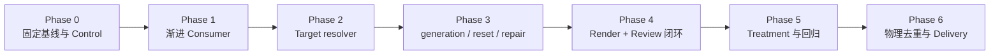

# 冷链原型高保真还原：现状诊断、边界与优化规划

记录日期：2026-08-03（Asia/Shanghai）

修订：2026-08-04 — 完成最终执行级收敛：只保留 Phase 0–6 一套执行维度；Phase 内使用 `P<phase>.<task>` 任务编号；补齐依赖、文件入口、Tool contract、测试矩阵、产物、迁移/回退和下一步执行顺序；继续移除固定字节预算和个案专用产品规则。

状态：Execution Plan Ready / Phase 0 Pending / Code Changes Gated by Phase 0

关联原型：`apps/pbwork/src/prototypes/cold-chain-ops`

目标工程：`apps/flutter_pb_app`

## 文档性质

本文是针对固定原型还原实验的一次性审计与实施规划。它保存本次问题背景、固定基线、已经拍板的产品边界、分阶段实施方案和验证方法。

本文：

- 不是当前产品规范，不声明计划中的 Tool、Contract、Review Session 或门禁已经实现；
- 不替代 `docs/product`、`docs/architecture`、`docs/reference`、ADR、可执行 Schema 和测试；
- 不把本次实验的页面、组件、Token、目录或规模提升为 ProtoBridge 通用规则；
- 后续实现按 Phase 最小交付推进，不等待无关的资源优化决策；
- 与当前权威文档或可执行 Contract 冲突时，以后者为准。

相关权威边界：

- [Evidence 模型](../architecture/evidence-model.md)
- [采集链路](../architecture/capture-pipeline.md)
- [ProtoBridge 实现](../architecture/proto-bridge.md)
- [Agent 消费指南](../guides/agent-consumption.md)
- [语义标记与证据门禁](../reference/semantic-authoring.md)
- [ADR 0004：Producer、Consumer 与 Target 单向分离](../decisions/0004-producer-consumer-target-boundaries.md)
- [ADR 0007：高保真重建使用独立 Acceptance Contract](../decisions/0007-reconstruction-acceptance-contract.md)

## 一、审计结论

本轮暂停是必要的。当前不应继续通过增加 Capture 字段、扩写 Agent Prompt、恢复综合打分或零散增加纪律来追求更高还原度。

已确认：

1. Producer/Capture 的大前提成立。固定 Evidence 已覆盖页面、主要状态、关键场景、Screenshot、语义节点、拓扑、组件和 Token 信息，没有发现足以单独解释当前还原上限的采集缺口。
2. 主要瓶颈在 Consumer 实施过程：首次工作集过大、读取接口缺少任务投影、Target component/token 解析不足、实施顺序缺少产品级约束，以及实现后没有真实视觉反馈回路。
3. Coverage、reconstruction readiness 与 target fidelity 是三个独立结果。前两个结果不能证明目标工程已经高保真实现。
4. Prompt 膨胀是接口问题的表象。只要默认路径仍返回或内嵌数百 KB 到数 MB 的对象，继续修改自然语言不会稳定提高细节保留率。
5. 目标工程已经拥有公共组件、Theme/Token、路由、弹层和显式适配文档。缺少的是从 Evidence 语义出发查询目标候选、并验证候选真实存在的工具面。
6. 高保真完成必须建立“固定 Source Screenshot → 确定性 Target render → 可解释差异 → 有界修正 → 人工确认”的闭环，不能以测试通过或 Agent 自报替代。
7. `.proto-bridge` 包含 Workspace 身份、不可变 Store、固定 Handoff 和 Delivery，不是可随时删除的普通缓存。
8. MCP 使用构建后的 dist 和长驻 stdio 进程。短期仍需 build + Reload；长期必须通过 capability/build fingerprint 自动识别不兼容进程。
9. Target baseline 不包含本次实验的目标实现。正式实验从固定 Target commit 的独立 worktree 开始，实验输出不进入后续 Target example corpus。

## 二、固定实验基线

本次实验固定使用：

- Workspace：`pbwork-local`
- Bundle：`bundle-2026-08-03t095053078-241d3a74`
- Run：`run-2026-08-03t095053079-14b6f18f`
- Snapshot：`snapshot-2026-08-03t095114638-511379f3`
- Handoff：`handoff-2026-08-03t100731725-9a0121d7`
- Delivery：`.proto-bridge/deliveries/2026-08-03T18-08-20+08-00`
- Target root：`apps/flutter_pb_app`

Delivery receipt 记录：

- `coverageStatus=complete`
- `freshnessStatus=fresh`
- `mandatoryRisks=[]`
- 24 个具有固定 Screenshot 引用的 Case
- 16 份不同 Screenshot 内容

固定 Acceptance Contract 包含：

| 维度 | requirement 数量 |
| --- | ---: |
| structure | 566 |
| components | 270 |
| tokens | 2667 |
| states | 24 |
| interactions | 89 |
| 合计 | 3616 |

其它已确认事实：

- 三个 Screen 的 Case 数量分别为 6、11、7；
- 19 种不同 `componentId`；
- 57 种不同 Token ID；
- 474 个不同 Token subject；
- Screenshot 包含页面默认态、空态、加载态、错误态、弹层态、提交态和关键业务状态；
- logical viewport 是 `390×844`，固定 Screenshot 像素尺寸是 `1170×2532`，即 DPR 3；
- 相同图片内容按 digest 去重，但 Case、Scenario 和 Checkpoint 语义必须分别保留。

这些 ID 不得在对照实验中替换为 active/latest。若重新采集，必须产生新的 Run、Snapshot 和 Handoff，并与本基线分开报告。

### 2.1 当前 Consumer 体积

| 产物/读取 | 大小 |
| --- | ---: |
| `agent-prompt.md` | 623,024 bytes |
| `evidence-brief.md` | 615,768 bytes |
| `acceptance-contract.json` | 3,602,498 bytes |
| `read_evidence_snapshot` 等价完整 JSON | 约 11,927,536 bytes |
| 代表性单 Case | 约 424–677 KB |

当前默认路径的问题是：

- Prompt 在 MCP 读取前已经内嵌完整 Evidence Brief；
- Snapshot 和 Acceptance Contract 都是全量对象；
- Tool 缺少 Screen、dimension、region、fact category 和 continuation 等投影能力；
- Case、revision、Fragment、Brief 和 Acceptance 之间重复注入 Facts；
- Screenshot 进入上下文前，大量语义数据已经占据工作集。

### 2.2 当前 Target 状态

目标 Flutter 工程已经具备：

- `lib/common/widgets/` 公共组件；
- `TS.colors`、`TS.textStyle`、`TS.spacing`、`TS.sizing`、`TS.radius`、`TS.opacity`、`TS.motion`、`TS.elevation`；
- 命名路由和统一弹层边界；
- `docs/components.md`、`docs/theme.md`、`docs/routing.md`、`docs/testing.md`；
- `docs/proto-bridge.md` 中的目标本地 Evidence 映射。

当前 `packages/core/src/target/flutter-app` 已具备 Flutter 工程识别、目标文档扫描、架构启发式、route/component/example 扫描和目标变更验证。它目前的不足不是“没有扫描能力”，而是：

- 目标文档只产生摘要和提示，显式映射没有形成可直接调用的解析结果；
- resolver 不能以开放的 `componentId[]` / `tokenId[]` 为输入；
- 文档声明、真实 symbol、构造参数和实际使用之间没有统一的 resolved/conflict/stale 结果；
- examples 查询没有正式的 exclude paths、candidate output root 和 gitBase 隔离；
- 现有 `FlutterComponentRole` 是 legacy 技术分类，不适合继续扩充为项目 componentId 闭集。

当前 Target 清理还剩一个确定问题：`apps/flutter_pb_app/test/widget_test.dart` 仍包含已不存在入口的断言。`flutter analyze` 通过，但 `flutter test` 有 3 个失败用例。Phase 0 必须先清除失效测试并固定新的 Target baseline commit。

### 2.3 当前 Review 与运行态状态

- `summarize_reconstruction_review` 当前权威是 `consumer-reported-review`；它只能校验 Agent 提交的 ID 是否属于固定 Contract，不能证明对应 Tool 调用、Target render 或 Scenario replay 实际发生。
- 当前 dist 的独立 MCP 进程可以读取 content-addressed Screenshot，并暴露现有完整工具集；这不等价于 Cursor/Codex 当前挂载的长驻进程已经 Reload。
- `scripts/pb-mcp.mjs` 的 `requireBuilt` 只检查 dist 是否存在，不判断源码和构建产物是否一致。
- 当前 `workspace reset` 可以预览并受控清空存在的 Store；Service 运行中若整个 Store root 被外部删除，旧 writer 仍持有旧 lock/session/object refs，不能把它当成普通缺目录自动补建。

## 三、不可破坏的产品边界

### 3.1 Evidence、Target 与 Review 单向分离

- Producer 生成不可变 Source Evidence；
- MCP Evidence tools 只读取固定 Evidence；
- Target adapter 只读取目标工程；
- Target 结果不能写入 Evidence revision，也不能覆盖 Source unknown/conflict/Screenshot；
- Target Review artifact 和运行记录不写回 Evidence，只引用固定 Handoff；
- 重新采集产生新历史对象，视觉 Review 不修改旧 Snapshot/Handoff。

### 3.2 PB Core 不拥有项目映射

- PB Core 不硬编码项目的 `componentId → target class` 或 `tokenId → accessor`；
- 目标工程自己的规范决定组件、Token、路由、状态和架构落点；
- Target adapter 理解技术栈，负责发现、解析、定位和验证；
- Agent 根据候选、依据、冲突和 unresolved 做最终实现选择；
- Target adapter 不自动规划文件或写代码。

### 3.3 Screenshot 优先但不替代语义

- Screenshot 是最终可见结果的首要依据；
- topology、componentId、Token binding、Variant、Scenario 和 Checkpoint 用于解释 Screenshot 和约束实现；
- 同 digest 图片只读取一次，但同图不同义的 Case/Checkpoint 仍须分别实施和披露；
- 不把全部语义 Fact 展开成评分配额；
- 不因视觉相似省略隐藏状态或交互。

### 3.4 不恢复综合评分

- 五个维度用于实施与复查，不计算加权总分；
- Critical/Major/Minor 用于表达可执行差异，不是分数；
- “8–9”只保留为人工体验描述；
- 完成声明必须由真实 artifact、覆盖事实和人工判断支持。

## 四、已拍板的能力设计

### 4.1 Consumer 渐进取证

默认 Consumer 路径采用固定范围、渐进展开：

1. Handoff index：只返回固定身份、mandatory risks、Screen/Case/digest/Scenario 地图和逻辑引用；
2. Screen packet：返回单 Screen 的 baseline Case、壳层/滚动边界、状态列表、distinct screenshot refs 和下一步逻辑查询入口；
3. Screenshot：当前 Screen 的 distinct digest 优先于完整 structure/token 展开；
4. Detail queries：按 Case delta、dimension、region、componentId、tokenId 或 provenance 深入；
5. 当前 Screen 完成后再进入下一 Screen；
6. 跨 Screen Scenario 在相关默认态完成后统一重放。

不设置产品级固定字节目标、默认字节值或硬编码响应上限。工作集控制由 Tool 的职责和查询粒度保证，而不是用某个原型规模推导全局 KB Contract。

具体规则：

- Bootstrap 的字段闭集固定，不包含完整 Facts、Brief 或 Acceptance Contract；
- Screen packet 只接受一个 `screenId`；
- 明细查询必须带明确范围，不提供“默认返回整个 Handoff”的路径；
- 当一类查询自然需要分页时，返回稳定 continuation；cursor 必须绑定 Handoff、Snapshot、查询条件、排序和 projection version；
- 每个投影返回 `complete`、`omittedCategories` 和可继续读取的逻辑入口；
- full Snapshot/Contract 保留兼容/debug 使用，但不出现在默认 Prompt 路径；
- 响应字节、重复 Facts 和调用耗时继续作为实验指标观察，不作为产品门禁；
- “不重复”在单次响应内由 Tool 保证，跨调用由 Review Session/消费日志记录；
- provenance、unknown、conflict 和固定可达性不能为了瘦身丢失。

### 4.2 Target adapter 与目标工程规范

#### 4.2.1 四层职责

1. Source Evidence：决定源页面结构、文案、状态、交互和视觉结果；
2. Target Contract/文档：决定目标组件、Token、路由、架构和验证规范；
3. 技术栈 adapter：发现目标规范，解析声明，定位真实代码，检查冲突并返回候选；
4. Agent：决定最终文件、组件、参数、状态管理和实现。

`packages/core/src/target/flutter-app` 保留并定位为 Flutter stack adapter。它不是目标项目映射表，也不维护通用业务 componentId 枚举。

#### 4.2.2 声明优先级与有效性

先区分“目标政策权威”和“映射来源优先级”。目标政策权威按以下顺序解释：

```text
目标工程 AGENTS.md / 同级强制指令
  → 目标架构、组件、Theme、路由与测试规范
  → 真实代码对声明有效性的校验
```

机器 Contract 不能覆盖 `AGENTS.md` 或目标架构规范。它只在目标政策允许的范围内，为 component/token 等映射提供更稳定的机器入口。

候选映射来源优先级：

```text
目标机器可读 Contract（若存在）
  → 目标文档显式映射
  → 源码启发式候选
```

声明优先级不等于无条件覆盖。任何显式声明都必须通过真实代码校验：

| 情况 | 结果 |
| --- | --- |
| Contract/文档映射存在，symbol 与 import/定义存在 | `resolved` |
| 显式映射指向不存在或签名不兼容的 symbol | `stale`，不得静默 fallback |
| 文档与代码表达冲突 | `conflict` |
| 无显式映射，只有一个源码候选 | `candidate`，不能自动称为 resolved |
| 无显式映射且有多个相近候选 | `unresolved` |
| 目标技术栈不支持 | `unsupported`，不得误报 Target 闭环完成 |

源码是声明有效性的必要校验，不是项目规范的替代品。目标仓库里存在旧组件，不代表它优先于目标文档指定的组件；目标文档指向不存在的组件，也不能被当成有效映射。

目标机器可读 Contract 是可选的目标侧能力。若提供，文件由目标工程拥有，例如 `docs/proto-bridge.target.json`；它用于机器解析组件/Token 映射、规范入口和查询排除项。人类规范仍保存在 `docs/proto-bridge.md`、`components.md`、`theme.md` 等文件。Phase 2 不要求所有 Target 必须先增加机器文件；没有机器文件时可以解析受控的显式文档，并把解析来源和置信度返回。

#### 4.2.3 `packages/core/src/target/flutter-app` 具体修改

| 文件/边界 | 修改 |
| --- | --- |
| `packages/core/src/target/query.ts` | 保留 adapter 检测和通用调度；增加开放字符串输入的 component/token resolver 调用；透传 `excludePaths`、`candidateOutputRoot`、`gitBase`；不引入 Evidence 持久对象。 |
| `packages/core/src/target/types.ts`（新增或等价位置） | 定义通用 `TargetResolutionStatus`、component/token 输入、候选、声明来源、code validation、conflict、unresolved 类型；这些类型不包含 Flutter 项目专用枚举。 |
| `packages/core/src/types/target-flutter.ts` | 保留现有 `FlutterComponentRole` 以兼容 conventions/examples；标记为 legacy advisory；新 resolver 不依赖该闭集。 |
| `flutter-app/documentation.ts` | 继续受控扫描 AGENTS/README/docs；识别可选目标机器 Contract；提取显式映射和规范入口；返回文件/digest/来源，不把任意关键词命中当成 resolved 映射。 |
| `flutter-app/target-connect.ts` | 将“工程 inventory”与“语义 resolution”分开；批量接受 `componentId[]` / `tokenId[]`；先读取目标声明，再定位 definition/import/constructor/usage；统一输出 resolved/candidate/stale/conflict/unresolved。 |
| `flutter-app/context.ts`、`route-registry.ts` | 继续负责模块、路由、资源和工程上下文发现；结果只作为 Target context，不生成 Source Fact。 |
| `flutter-app/examples.ts` / example 查询 | 增加 `excludePaths`、`candidateOutputRoot`、`gitBase`；默认排除本次调用声明的实验输出；不得在 Core 中硬编码具体 feature 目录。 |
| `flutter-app/validation/index.ts` | 继续检查 allowed paths、expected files 和目标工程约束；增加显式映射引用的 symbol/import 存在性校验；不承担视觉验收。 |
| MCP Tool registry | 保留 `read_target_conventions`、`find_target_examples`、`validate_target_changes`；新增 `resolve_target_components` 和 `resolve_target_tokens`，输入为开放 ID 批次。 |
| Target 工程文档 | `docs/proto-bridge.md` 继续作为目标落地规范入口；组件、Theme、路由和测试文档保持各自职责；可选机器 Contract 只能由目标工程维护。 |

不在本阶段执行的事项：

- 不把 Flutter adapter 移出 Core；只有出现第二个真实技术栈 adapter、且公共接口稳定后再评估独立 package；
- 不删除 legacy roles/tools；先保留兼容，默认新流程不依赖；
- 不让 Target resolver 写目标文件；
- 不把 resolver 输出写回 Evidence。

#### 4.2.4 默认调用顺序

对每个 Screen：

1. `read_target_conventions` 读取一次目标规范入口和工程轮廓；
2. 从 Screen packet 获取实际使用的 `componentId[]` / `tokenId[]`；
3. 批量调用 `resolve_target_components`；
4. 批量调用 `resolve_target_tokens`；
5. 只对 unresolved/candidate 项调用 `find_target_examples` 或进一步读取 definition；
6. Agent 记录最终选择与依据；
7. 实现后调用 `validate_target_changes`。

同一次目标 revision 下可以按 target root、gitBase 和规范/源码 digest 做进程内缓存；目标文件发生变化后必须失效。缓存只提高性能，不改变权威顺序。

### 4.3 Target Review Session

当前自报 Review 不足以成为验收。新增独立 Target Review Session，保存于 Evidence 之外的 Review/Target 工作区，由工具实际结果派生。

最小记录：

- `reviewRunId`；
- Handoff、Bundle、Snapshot 和 Workspace generation；
- Target root、baseline commit/worktree 和当前 target revision；
- 实际成功读取的 Source screenshot digest；
- Source/Target/Diff artifact digest；
- Screen、Case、Scenario、阶段和 attempt；
- open/fixed/accepted/unverified 差异；
- Scenario replay receipt；
- 自动判断、人工决定和依据。

Review Session：

- 不写回 Evidence；
- 默认保存在配置目录下 `.proto-bridge/reviews/<workspaceId>/<reviewRunId>/`，与配置指向的 Evidence Store root 和 `deliveries` 分离；
- event 使用 append-only 记录，二进制 artifact 按 digest 寻址；导出的审计包可以位于 Workspace 外；
- `session.json` 只允许作为 event reducer 的派生索引/缓存，不能覆盖或替代 event chain；
- MCP/Target runner 重启后可以按 `reviewRunId` 恢复；
- Workspace generation 或固定 Handoff 不匹配时确定性终止；
- 最终 Review 从实际 Tool/runner 结果派生，不接受只有数组的 Agent 自报。

### 4.4 Target fidelity 完成门禁

完成条件：

- 所有选中 Case 已实施或明确记录为未完成；
- 所有 distinct Screenshot digest 已读取并产生可比较 Target artifact；
- 所有必需 Scenario 已重放；
- 没有未解决 Critical/Major；
- Accepted target-native deviation 具有目标规范依据和人工确认；
- Unverified/unsupported 可以结束能力调查，但不能宣称高保真完成；
- 人工最终确认前只能是 `awaiting-human-review`。

差异分类：

- Critical：错误页面/状态、主要区域缺失、错误导航或交互；
- Major：构图、滚动边界、关键组件、显著颜色/字体/尺寸偏差；
- Minor：不影响主要层级的细节；
- Accepted：有目标规范依据、经过人工确认的目标原生差异；
- Unverified：环境或输入不足以稳定比较。

Source visual fidelity 与 Target conformance 分开报告。Accepted 可以使目标交付合规，但不能从 Source visual diff 中消失。

### 4.5 有界视觉修正

自动修正以“批次”为授权单位：

- 每个 Screen 一次自动批次最多 3 轮修正；
- 一轮可以批量修复多个 Critical/Major；
- Tool 每次只完成一次 render、compare 或记录动作，不能在 Tool 内部触发下一轮 Agent/Tool；
- 达到批次上限后，只有用户明确批准才能启动下一批次。

以下任一条件立即停止当前批次：

- 没有未解决 Critical/Major → `awaiting-human-review`；
- 连续两轮 diff digest 基本相同 → `needs-human`；
- Critical/Major 数量或严重度连续两轮没有下降 → `needs-human`；
- 渲染环境或状态不可比较 → `unverified`；
- 三轮预算耗尽仍未收敛 → `needs-human`。

Minor 不自动触发无限修正。人工可以接受 Minor、要求下一批修正或认定 Target-native deviation。

### 4.6 MCP build/capability 握手

短期操作仍是：

```text
pnpm build → Reload/重启 MCP → 再开始实验
```

长期在 Bootstrap 返回：

- Core/MCP build fingerprint；
- process started time；
- tool/projection contract version；
- supported Store layouts；
- supported capabilities；
- Workspace ID 和 generation。

Delivery/Handoff index 声明 required capabilities。该字段由 Consumer projection contract 派生，不修改已经冻结的 Handoff 持久对象。工具数量和 dist mtime 只保留为诊断信息，不作为兼容 Contract。若能力或 generation 不匹配，应返回 typed terminal error，不让 Agent 把它解释为 Evidence 缺失。

### 4.7 Workspace reset 与 generation

生命周期事件必须区分：

- `workspace init`：创建配置和新 Workspace generation；
- `workspace reset`：永久清空当前 Workspace 的 Evidence、Delivery 和未导出的 Review Session，并创建新 generation；
- `bundle clean/archive`：按历史策略回收或冻结部分对象；
- `delivery clean/export`：管理 Review 副本，不修改 Store Evidence；
- `doctor repair/reinitialize`：处理可安全重建的运行状态或显式确认的外部破坏。

Reset 设计：

- 默认 preview；preview 返回 `planId`、当前 generation、Evidence/Delivery/Review 对象与字节范围和不可恢复警告；
- apply 必须绑定 planId 和 generation；期间范围变化则拒绝并要求重新 preview；
- Service 运行时先停止新任务、取消或等待运行任务，再 reset；
- reset 后撤销旧 session，清空 preflight/job/selection/detail 引用，并使 PBWork 重新同步 generation；
- MCP 和 Review Session 检测到 generation 变化后终止旧任务；
- 旧 Handoff 永久不可恢复，除非有独立备份。

外部删除：

- Service 运行期间 root 消失时进入 `external-store-destroyed`，不能在旧 writer lock 仍存活时自动 `mkdir`；
- 必须关闭旧 writer，显式 repair/reinitialize 并重新取得 lock；
- Service 已停止且 Store 未初始化时，可以由 init 创建新的 generation；
- “缺失 root 幂等”只适用于无存活 writer 的初始化/显式重建，不适用于运行中的外部破坏。

本次固定实验 Workspace 必须冻结，实验期间禁止 reset。目标代码清理使用独立 worktree，不触碰固定 Evidence Workspace。新 Capture 使用新历史对象；需要重建 Workspace 时先结束本基线实验或保存独立备份。

### 4.8 Delivery 与物理去重

这是资源优化，不阻塞 Consumer/Target/Review 主链路。

方向性默认：

- 物理内容寻址先在 Workspace 范围内设计；
- Blob owner metadata 与物理 content 分离；
- Delivery 默认作为本机索引/Review 视图，可选导出便携包；
- clean/reset 前按可达性判断回收，不能破坏旧 Handoff；
- legacy layout 在明确版本边界前保持兼容或显式迁移。

具体硬链、跨卷复制、引用回收和导出格式在对应 Phase 开工前单独确认。

## 五、默认端到端流程

### A. Bootstrap

读取：

- Consumer guide；
- MCP build/capability 与 Workspace generation；
- Handoff index 和 mandatory risks；
- Screen/Case/digest/Scenario 地图；
- Target root 与规范入口。

输出：固定引用、能力兼容结果、风险、Screen 顺序和未加载对象清单。不得读取完整 Snapshot/Contract。

### B. 单 Screen 视觉理解

- 读取显式 `baselineCaseId`；
- 查看 baseline Screenshot；
- 读取壳层、主要区域、滚动边界和状态列表；
- 查看当前 Screen 的其它 distinct digest；
- 读取 Case delta，同时保留同图不同义的 Scenario/Checkpoint。

### C. Target 解析

- 读取目标规范入口；
- 批量解析当前 Screen component/token；
- 校验 symbol/import/constructor；
- 只对未解决项查询 examples；
- 记录 resolved/candidate/stale/conflict/unresolved。

### D. 默认态实施与收敛

- 实现壳层和默认态；
- 运行目标静态检查；
- 以固定 logical viewport、DPR、theme、locale、font、text scale、safe area 和动画稳定条件渲染；
- 生成 Target artifact 和 diff；
- 进入有界修正批次；
- 默认态达到门禁或停在明确状态后再扩展状态。

### E. 状态与交互扩展

- 实现 Case delta、Overlay 和业务状态；
- 为所有 distinct digest 生成 Target artifact；
- 重放 Scenario；
- 验证 Variant/Checkpoint；
- 同图不同义的 Case 分别记录语义覆盖。

### F. 跨 Screen 与最终 Review

- 重放跨页面导航和参数/状态传递；
- 运行完整目标 tests 和 Target validation；
- 汇总实际 artifact、修正 attempts、Scenario receipts、剩余差异和未验证项；
- 人工确认后才允许完成。

## 六、受控对照实验

### 6.1 输入固定

- 使用第二节固定 Handoff/Snapshot；
- fixed logical viewport `390×844`、DPR 3、light theme；
- 16 份 distinct Screenshot；
- 清理失效测试后固定 Target baseline commit；
- 每次运行使用相同 baseline 的独立 worktree/branch；
- Target query 通过传入的 excludePaths/candidateOutputRoot 排除实验输出；
- 记录模型版本、权限、Prompt、Tool/capability、目标 commit、运行日期和时间预算。

### 6.2 Control 与 Treatment

正式对照使用同一个空 Target baseline：

- Control：当前全量消费流程重新实现；
- Treatment：优化后的渐进消费/Target/Review 流程重新实现。

Control 和 Treatment 使用相同模型配置、权限、输入、目标规范、总时间预算和人工介入规则。没有 Control，就不能把 Treatment 的改善归因于新消费链路。

主要里程碑完成后再做独立 Agent 重跑；不要求每一个小提交都运行完整双 Agent 实验。

### 6.3 记录指标

这些指标只用于诊断，不合成为总分：

| 指标 | 目的 |
| --- | --- |
| Bootstrap 与每 Screen 读取字节 | 观察工作集变化，不作为门禁 |
| Tool 调用次数/耗时 | 判断渐进读取是否碎片化 |
| 重复 Fact/图片注入 | 判断上下文浪费 |
| distinct Screenshot 查看率 | 防止视觉状态遗漏 |
| Case/Scenario 实施率 | 防止只实现默认态 |
| component/token resolved/candidate/unresolved/conflict/stale | 判断 Target resolver 有效性 |
| 平行公共组件数量 | 判断是否绕过目标边界 |
| Critical/Major/Minor/Accepted/Unverified | 判断真实视觉结果 |
| 首次与最终 Target artifact | 判断视觉修正是否有效 |
| 修正轮次和停止原因 | 判断闭环是否过浅或自循环 |
| 首次可运行时间与收敛时间 | 观察实施效率 |
| MCP build/capability | 排除过期进程假阴性 |
| `.proto-bridge` 逻辑/物理增长 | 观察资源效率 |

## 七、分阶段实施计划

### 7.1 唯一执行顺序

`Phase` 是本计划唯一的执行和进度维度。执行者只需要判断“当前在哪个 Phase、该 Phase 的退出标准是否满足”。`P0.1`、`P1.1` 等编号只表示 Phase 内的任务，不形成第二条计划轴；提交不再单独编号。



依赖约束：

- 前一 Phase 未满足退出标准时，不进入下一 Phase；
- Phase 0 未完成时不得实现新 Consumer 能力或运行 Treatment；
- Phase 1 的纯投影 Contract 先于 MCP Tool 和 Prompt 修改；
- Phase 2 resolver 先于自动 Target implementation flow；
- Phase 3 只能使用 Store fixture/备份副本验证 migration/reset，不能作用于冻结实验 Workspace；
- Phase 4 内部先实现 Review contracts/session store，再实现 launcher/render/有界修正；
- Phase 5 是本轮 Consumer/Target/Review/reset 优化的最终 Treatment 与发布判断；
- Phase 6 是最后执行的资源优化，不影响 Phase 5 已得出的实验结论。

### 7.2 Phase 与提交边界

每个 Phase 可以包含多个小提交，但提交只服务于代码 Review 和回退，不代表计划进度。Phase 状态只能由该 Phase 的退出标准决定。

- Phase 内按 `P<phase>.<task>` 顺序执行；
- 每个任务尽量形成可独立 Review、可独立回退的提交；
- 一个 Phase 的中间提交不能提前切换默认流程或声明该 Phase 已实现；
- Phase 1 只有投影、MCP、Prompt/文档和 E2E 全部通过后才切换默认 Consumer；
- Phase 4 只有 Review store、launcher/render、receipt 和有界状态机全部通过后才声明 `target-review-authoritative`；
- 不得把全部 Phase 压成一个提交，也不得以删除固定 Evidence 作为回退手段。

### 7.3 实验记录与产物位置

每次 Control/Treatment 使用唯一 `experimentRunId`。仓库只保存小型、可审计的索引和结论，二进制 Screenshot/Target/Diff 留在 Review artifact store：

```text
docs/acceptance/runs/<experimentRunId>/
  manifest.json
  control-summary.json
  treatment-summary.json
  comparison.md

.proto-bridge/reviews/<workspaceId>/<reviewRunId>/
  session.json
  events.ndjson
  artifacts/<digest-derived-path>
```

`manifest.json` 至少记录：固定 Workspace/Bundle/Run/Snapshot/Handoff、Workspace generation（实现前可记为 `legacy-unavailable`）、Target baseline commit、Control/Treatment worktree commit、MCP build fingerprint（实现前使用源码 commit + dist digest 的人工记录）、projection/comparator version、模型与权限配置、viewport/DPR/theme/locale/font/text scale/safe area/animation 条件、开始/结束时间和人工介入策略。

`control-summary.json` 与 `treatment-summary.json` 只保存指标、状态、artifact digest/逻辑路径和停止原因，不复制 Source Evidence。`comparison.md` 不输出综合分数，按覆盖、目标复用、视觉差异、效率和未验证项分别给出判断。

### Phase 0：实验基础与运行态卫生

目标：建立可复现、不会误删 Evidence、不会运行过期 MCP 的基线。

任务：

| ID | 动作与主要文件 | 必须产物/验证 |
| --- | --- | --- |
| `P0.1` | 只清理 `apps/flutter_pb_app/test/widget_test.dart` 中指向已删除入口的断言/用例；不恢复任何历史实现。 | `flutter analyze`、`flutter test` 全绿；记录 Target baseline commit。 |
| `P0.2` | 创建 `experimentRunId` 和 `docs/acceptance/runs/<id>/manifest.json`；记录固定 ID、16 个 distinct digest、Target baseline、当前源码 commit、工作树状态和环境。 | manifest 可重放且不含 Source 二进制副本；冻结 Workspace 的操作约束写入运行记录。 |
| `P0.3` | `pnpm build` 后 Reload/重启当前客户端 MCP；列出 tools，并通过固定 Handoff 验证 16 个 Screenshot 都能返回真实 ImageContent。 | 保存 tool list、源码 commit、Core/MCP dist digest、进程启动时间和失败项；任何一份图片不可读都停止。 |
| `P0.4` | 从同一 Target baseline 创建隔离 Control worktree；使用当前全量消费流程完成一次独立实现。 | 首次/最终 Target artifact、测试、实际上下文字节、Tool 调用、耗时、偏差和未验证项。 |
| `P0.5` | 审核 Control 记录与隔离性。 | Control 输出未进入 Treatment examples；Target baseline 与 Evidence Workspace 均未漂移。 |

执行顺序固定为 `P0.1 → P0.2 → P0.3 → P0.4 → P0.5`。Phase 0 不修改 Capture、Consumer Tool schema、Target resolver 或 reset 实现。

工作：

- 删除 Target 失效测试并运行 `flutter analyze`、`flutter test`；
- 固定 Target baseline commit；
- 冻结当前 Evidence Workspace，禁止 reset；
- 验证 16 个 Source digest 可读；
- build Core/MCP，Reload 客户端长驻 MCP；
- 验证当前 capability、Store layout 和固定 Handoff；
- 保存当前 Prompt/Tool/context/time 指标；
- 在独立 worktree 执行一次 Control。

退出标准：

- Target baseline tests 通过；
- 固定 Handoff/Screenshot 在当前客户端进程可读；
- Target commit、MCP build/capability、Workspace/generation 有记录；
- Control artifact 和运行指标已保存；
- 没有修改 Capture Contract。

Phase 0 停止条件：

- 固定 ID 或 digest 与第二节不一致；
- Target baseline 存在未解释的实验实现或无关脏文件；
- 当前客户端不能返回真正的 Screenshot ImageContent；
- Control 使用了 Treatment 新 Tool、Treatment Prompt 或另一个 Target baseline；
- 运行期间发生 Workspace reset、重新 Capture 或 Handoff 漂移。

### Phase 1：Handoff index 与单 Screen 渐进查询

目标：让按需读取成为接口能力，而不是 Prompt 纪律。

#### P1.1 Consumer projection contract

主要修改：

- 新增 `packages/core/src/v2/consumer-projection.ts`（或同职责文件）及 `packages/core/test/v2/consumer-projection.test.ts`；
- 从固定 Handoff、Snapshot、revision、blob metadata 和 Acceptance Contract **纯派生**投影，不新增 Producer 持久对象；
- 在 `packages/core/src/v2/index.ts` 导出投影输入/输出类型和 projector；
- 所有数组使用稳定业务键排序，不依赖文件系统遍历顺序。

投影边界：

| 投影 | 必需输入 | 闭集输出 | 明确不返回 |
| --- | --- | --- | --- |
| `HandoffIndex` | `handoffId` | 固定 refs、全部 mandatory risks、readiness、Screen 顺序、Case/Scenario 计数、digest group 地图、required capabilities、可用 projection 入口 | 完整 Facts、完整 Brief、完整 Acceptance dimensions |
| `ScreenPacket` | `handoffId + screenId` | `baselineCaseId`、Case/Variant/Scenario/Checkpoint 地图、壳层摘要、滚动边界、distinct screenshot refs、component/token ID 集、omittedCategories、detail query hints | 其它 Screen Facts、完整 region/token 明细 |
| `CaseDelta` | `handoffId + screenId + caseId` | 相对 baseline 的 added/removed/changed/unknown/conflict、Scenario/Checkpoint 语义、Screenshot alias/digest | 与 baseline 完全相同的 Fact 重复副本 |
| `EvidenceDetail` | `handoffId + screenId + projection`，可选 `caseId/regionIds/componentIds/tokenIds/cursor` | 指定 structure/components/tokens/interactions/provenance 明细、complete、omittedCategories、continuation | 未请求维度、其它 Screen |

`baselineCaseId` 不写回 Evidence。投影按固定 Case 顺序确定：优先非 Scenario 的 `default` Variant，其次第一个非 Scenario Case，最后才是第一个 Case；响应必须返回选择依据。若无法形成 baseline，`CaseDelta` 返回 `baseline-unavailable`，不能静默选择 active/latest。

Case delta 按 Fact identity、resolution、effective value 和 provenance 比较。unknown/conflict 的增加、减少或候选变化都必须出现在 delta；同 digest 的不同 Case 仍返回各自 Scenario/Checkpoint 语义。

Continuation 使用 opaque cursor，至少绑定 Handoff、Snapshot、projection version、规范化查询摘要、稳定排序键和下一逻辑位置。cursor 只在某个投影天然需要分段时返回；分段按 Case/region/dimension 等稳定逻辑边界执行，不使用响应字节阈值。查询或版本不匹配返回 typed terminal error。

#### P1.2 MCP Tool 与 capability handshake

主要修改：

- `packages/mcp-server/src/services/evidence-store-reader.ts`：增加固定 Handoff 投影读取，继续只从配置绑定的 Store 读取；
- `packages/mcp-server/src/tools/read-evidence.ts`：增加 projector handlers；
- `packages/mcp-server/src/tools/registry.ts`：新增 `read_handoff_index`、`read_screen_packet`、`read_case_delta`、`read_evidence_detail`；
- `inspect_evidence_workspace` 增加 build fingerprint、process started time、tool/projection contract version、Store layout、capabilities、Workspace ID；Phase 3 前 generation 返回明确的 `legacy-unavailable`，不能伪造 generation；
- build fingerprint 由构建步骤生成的 build info 提供，不能只依赖 dist mtime 或 Tool 数量；
- `read_agent_handoff`、`read_evidence_snapshot`、`read_acceptance_contract` 保留兼容/debug，但标记为非默认消费路径。

`read_handoff_index.requiredCapabilities` 由 projection version 派生，不修改冻结 Handoff。至少声明本流程依赖的 `handoff-index`、`screen-packet`、`case-delta`、`evidence-detail`、`image-content-screenshot`；缺失时 Bootstrap 立即停止并报告 `incompatible-consumer-capability`。

#### P1.3 默认 Prompt、文档和 PBWork 切换

同一功能交付内更新：

- `packages/core/src/v2/prompts/handoff-consumer.md`、`implementation-discipline.md`、`verification.md`、`final-report.md`、`target-contract.md`；
- 运行 `packages/core/scripts/generate-prompt-assets.mjs` 更新 `generated-assets.ts`，禁止手改生成文件代替源文件；
- `packages/mcp-server/src/consumer-guide.ts`、`packages/mcp-server/README.md`；
- `docs/guides/agent-consumption.md`、`docs/guides/getting-started.md`、`docs/product/workflow.md`、相关架构/ADR；
- `apps/flutter_pb_app/.agents/skills/proto-bridge-consumer/SKILL.md`；若后续把它改为生成/同步产物，必须在本批次明确唯一源文件和校验方式；
- PBWork Delivery/Prompt 文案和任何仍暴露完整 Contract 默认路径的 UI。

默认顺序只能是 `inspect → read_handoff_index → read_screen_packet → screenshot → case_delta/detail`。不得同时保留另一套文档要求 Agent 先读完整 Snapshot/Contract。

#### P1.4 测试矩阵

- 单元：字段闭集、稳定排序、baseline 选择、同图不同义、unknown/conflict/provenance、cursor 绑定和失配；
- 语义等价：遍历三个 Screen 的所有投影后，与固定 full read 比较 Case、Scenario、digest、component/token、unknown/conflict/provenance 集合；
- 负向：其它 `screenId` 泄漏、active/latest 漂移、伪造 cursor、缺失 capability、错误 Handoff/Snapshot；
- Prompt：生成后不包含 Evidence Brief/完整 Contract payload 或默认本地 Contract 路径；
- E2E：真实 MCP 返回新 Tool、真正 ImageContent 和 typed errors。

验证命令至少包括：

```bash
pnpm --filter @proto-bridge/core test
pnpm --filter @proto-bridge/core build
pnpm --filter @proto-bridge/mcp-server build
pnpm test:e2e:mcp
pnpm docs:verify
```

最小交付：

- Handoff index；
- Screen packet；
- distinct screenshot group/index；
- `read_evidence_screenshot` digest 去重消费；
- Case delta，至少包含 Scenario/Checkpoint 语义轴；
- 明确范围的 acceptance/region/provenance 查询和稳定 continuation；
- Prompt 移除 Evidence Brief、完整 Contract 内容及默认 Contract 本地路径；
- full Snapshot/Contract 保留 debug/兼容入口；
- 同一变更集更新 Agent 消费指南、MCP README、PBWork 文案、Getting Started、产品工作流、生成 Prompt assets 和 Target Skill；
- 投影遍历结果与固定 full read 的语义等价测试。

退出标准：

- Bootstrap 不读取完整 Snapshot/Contract；
- 一个 Screen 可以在不加载其它 Screen Facts 的情况下被理解和规划；
- Source Screenshot 在该 Screen 的结构/Token 全量展开前进入工作集；
- 所有省略内容都有明确的逻辑读取入口；
- 同图不同义不丢 Case/Scenario；
- 默认文档和 Skill 不再要求先读全量对象；
- MCP E2E 证明固定引用、unknown/conflict/provenance 未弱化。

发布切换：只有 P1.1–P1.4 全部通过后，才把新路径设为默认。失败时保留旧 full read 作为 debug/兼容入口，回退默认 Prompt；不得删除或重采固定 Evidence。

### Phase 2：Target component/token resolver

目标：从开放 Evidence component/token ID 出发，解析目标声明并校验真实代码。

#### P2.1 通用 resolver contract

在 `packages/core/src/target/types.ts`（或等价通用位置）定义：

- `TargetResolutionStatus = resolved | candidate | stale | conflict | unresolved | unsupported`；
- component/token 批量输入，ID 类型保持开放字符串；
- declaration source（kind、path、digest、location、priority）；
- candidate（symbol/accessor、import、definition、constructor/usage hints）；
- code validation（exists、importable、signatureCompatible、usageFound、validation details）；
- conflict/unresolved reason 和 next queries；
- target revision key（target root realpath、gitBase/current revision、相关规范/源码 digest）。

`packages/core/src/types/target-flutter.ts` 只保留 legacy advisory 类型，不增加任何固定实验 component/token ID。

#### P2.2 Target 规范发现与声明解析

主要修改 `packages/core/src/target/flutter-app/documentation.ts`：

- 先读取目标作用域内的 `AGENTS.md` 与项目规范入口，形成 policy sources；
- 识别可选 `docs/proto-bridge.target.json`，并使用严格 schema；
- 解析 `docs/proto-bridge.md`、`docs/components.md`、`docs/theme.md` 等文件中的受控显式映射；
- 每条声明返回文件、位置、digest 和来源类型；任意关键词命中只能形成搜索线索；
- 机器 Contract 与强制目标政策冲突时返回 `conflict`，不能以机器文件优先覆盖政策。

可选机器 Contract 的最小职责仅包含版本、技术栈、规范入口、component mappings、token mappings 和 query exclusions。目标 route/state launcher 属于 Phase 4 的可选 review section；不存在机器 Contract 不构成 Target unsupported。

#### P2.3 Flutter 代码校验与批量解析

主要修改 `packages/core/src/target/flutter-app/target-connect.ts`、`context.ts`、`route-registry.ts`：

- inventory 与 resolution 分离，inventory 只扫描一次并按 target revision key 缓存；
- component resolver 批量接受 `componentId[]`，先查声明，再查 class/function/extension definition、import path、constructor 和 usage；
- token resolver 批量接受 `tokenId[]`，校验 accessor 链、定义和目标 Theme 使用；
- 显式声明存在且代码有效才是 `resolved`；启发式单候选只能是 `candidate`；
- stale/conflict 不允许静默 fallback；多个候选必须 unresolved 并返回区分依据；
- 目标文件变化或 git revision 变化立即失效缓存。

#### P2.4 Example 隔离与 Target validation

修改 `packages/core/src/target/query.ts`、`flutter-app/examples.ts` 和 `flutter-app/validation/index.ts`：

- `find_target_examples` 增加 `gitBase`、`excludePaths`、`candidateOutputRoot`；
- 所有路径 realpath 后验证位于 targetRoot 内，排除项按目标根相对路径匹配；
- Treatment 查询必须排除 Control worktree/output 和当前 candidate output；
- `validate_target_changes` 除路径/占位符检查外，校验 Agent 采用的 resolved mapping symbol/import 仍存在；
- validation 不运行视觉验收，也不把 candidate 自动升级为 resolved。

#### P2.5 MCP 与测试

在 MCP registry/handlers 新增：

- `resolve_target_components(targetRoot, componentIds[], gitBase?, excludePaths?, candidateOutputRoot?)`；
- `resolve_target_tokens(targetRoot, tokenIds[], gitBase?, excludePaths?, candidateOutputRoot?)`。

测试至少覆盖：显式映射成功、机器/文档政策冲突、stale symbol、签名不兼容、唯一 heuristic candidate、多候选 unresolved、未知 ID、token accessor、缓存失效、路径越界、example 排除、unsupported target，以及另一组与固定实验无关的开放 ID。

验证命令至少包括：

```bash
pnpm --filter @proto-bridge/core test
pnpm --filter @proto-bridge/core build
pnpm --filter @proto-bridge/mcp-server build
pnpm test:e2e:mcp
pnpm docs:verify
```

工作按 4.2.3 文件矩阵实施，重点是：

- 定义通用 resolver types；
- legacy `FlutterComponentRole` 不再扩充；
- 扫描可选 Target Contract 与显式目标文档；
- component/token 批量 resolver；
- symbol/import/constructor/usage 有效性校验；
- resolved/candidate/stale/conflict/unresolved 结果；
- example pollution 参数化隔离；
- 新 MCP tools 与 E2E；
- 使用至少一个其它目标范围验证没有把实验 componentId 写进 Core。

退出标准：

- 当前 Handoff 使用的 componentId 均返回 resolved/candidate 或明确 unresolved/conflict/stale；
- Agent 不必先猜目标 symbol；
- 当前 Screen 关键 Token 均返回 accessor candidate 或明确未解决状态；
- 显式文档映射会校验真实代码；
- Target 输出不进入 Evidence；
- 实验输出不会进入 examples 结果。

Phase 2 失败回退：保留 conventions/examples/validation legacy 工具，但默认流程将对应项标为 unresolved 并要求人工读取目标定义；不得用 Core 硬编码映射来临时“修通”实验。

### Phase 3：Workspace lifecycle 与 reset

目标：先建立 generation 和确定的 reset/repair 语义，为后续 Review Session 的重启恢复与失效判断提供稳定身份。

#### P3.1 Manifest、generation 与兼容升级

主要修改 `packages/core/src/v2/store/paths.ts`、`local-file-store.ts`、Store types/tests：

- Workspace manifest 增加 `storeLayoutVersion` 和不可复用的 `generationId`；
- 新 init 创建 generation；reset 成功后创建新 generation；普通 reopen 保持 generation；
- legacy manifest 缺 generation 时，只能由取得 writer lock 的显式升级生成一次，并记录 migration；只读 MCP 在升级前报告 legacy capability，不能自行写入；
- LocalFileStore open 时记录 root identity（realpath/device/inode 或平台等价物）和 lock ownership，关键写入前验证 root/lock 未被外部替换。

#### P3.2 Reset preview/apply Contract

在 `packages/core/src/v2/service-contract/protocol.ts` 定义：

- `WorkspaceResetPlan`：`planId`、workspaceId、generationId、inventory digest、Evidence/Delivery/Review 数量与字节、运行任务、createdAt/expiresAt 和不可恢复警告；
- `WorkspaceResetApplyRequest`：workspaceId、generationId、planId；
- `WorkspaceResetResult`：old/new generation、实际移除范围、被撤销 session 和停止的 job/review；
- typed errors：`workspace-generation-mismatch`、`reset-plan-expired`、`reset-plan-drift`、`workspace-resetting`、`external-store-destroyed`、`writer-lock-lost`。

preview 计划持久化在配置目录下 `.proto-bridge/reset-plans/<planId>.json`，不放入即将删除的 Store root。apply 重算 inventory digest；任何对象、字节、generation 或运行任务变化都拒绝并要求重新 preview。过期计划清理不影响 Workspace。

#### P3.3 Service、CLI 与 PBWork

- Local Service 存活时，preview 和 apply 都必须经 Service；Service 先拒绝新任务，再取消/等待运行任务，关闭 Review writer，执行 reset，撤销所有旧 session，最后发布新 generation；
- Service 不存在时，CLI preview/apply 必须先获取 Store writer lock；无法获取即停止，不得绕过活跃 Service；
- `packages/cli/src/cli.ts` 默认 preview，并输出后续带 `planId` 的明确 apply 命令；`--apply` 无 planId 拒绝；
- `packages/cli/src/service-client.ts` 和 Local Service route 使用相同 Contract；
- PBWork stores（capture/selection/workbench/prototype lifecycle 等）在 session/generation 变化时清空 preflight、job、selection、detail 缓存并重新拉取 console state；
- MCP 的每次 Bootstrap/Review 操作校验 generation；若旧 Handoff 从 Workspace 外的导出/备份再次出现，仍因 generation mismatch 不能继续当前任务。

Reset 范围包括当前 Workspace 的 Store 内容、`deliveries` 和未导出的 `reviews`；配置文件、reset plan audit 和 Workspace 外已导出审计包不删除。preview 必须逐类披露。

#### P3.4 外部删除与 repair/reinitialize

- 活跃 Service 检测到 root/lock identity 消失或变化后，立即停止写入并进入 `external-store-destroyed`；
- 关闭旧 writer 和 job/review worker，撤销 session；不得在旧进程内 `mkdir` 后继续使用原 generation；
- `doctor repair` 只处理可证明不改变 Evidence 身份的可修复状态；root 整体丢失不能 repair 成原 Workspace；
- `workspace reinitialize` 需要显式不可恢复确认，创建新 root/new generation 并重新取得 lock；
- Service 已停止且 root 不存在时，普通 read 不自动创建；只有 init/reinitialize 可以创建。

#### P3.5 组合测试

至少覆盖：

| Root | Service/writer | 操作 | 期望 |
| --- | --- | --- | --- |
| 存在 | 运行 | preview/apply | 经 Service drain，plan 无漂移才成功，新 generation |
| 存在 | 停止 | preview/apply | CLI 取得 lock 后成功，否则拒绝 |
| 缺失 | 运行 | 任意读写/reset | `external-store-destroyed`，无自动 mkdir |
| 缺失 | 停止 | read/reset | 明确未初始化；只有 init/reinitialize 创建 |

另外覆盖 preview 后新增 Bundle/Delivery/Review、旧 session 调用、新 MCP generation、reset 中进程崩溃、legacy manifest 升级和 writer lock 丢失。

验证命令至少包括：

```bash
pnpm --filter @proto-bridge/core test
pnpm --filter @proto-bridge/local-service test
pnpm --filter @proto-bridge/cli test
pnpm --filter @proto-bridge/pbwork test
pnpm test:e2e:runtime
pnpm docs:verify
```

工作：

- Workspace generation；
- reset planId + generation-bound apply；
- Service drain/session revoke/PBWork stale state 清理；
- MCP/Review generation mismatch；
- external-store-destroyed typed error；
- 显式 repair/reinitialize 和 writer lock 重建；
- root 存在/缺失、Service 运行/停止组合测试；
- operator 文档与不可恢复警告。

退出标准：

- 四种 root/Service 组合都有确定结果；
- reset 范围不能在 preview/apply 间静默漂移；
- 旧 Handoff/Review 在新 generation 下确定性终止；
- 运行中外部删除不会在旧 lock 上自动重建；
- reset 后新 Capture 的重启要求明确且可执行；
- legacy manifest 的一次性 generation migration 已先在固定 Workspace 备份副本验证；如随后应用于固定实验 Workspace，只允许更新 lifecycle manifest，迁移前后 Evidence inventory digest 和全部固定 ID 必须完全一致，并记录新 generation。

迁移与回退：固定实验 Workspace 永远禁止 reset。layout/generation migration 在备份副本通过后，才允许以持锁、manifest-only 方式升级其 legacy manifest；任何 Evidence/Delivery/Review 范围变化都立即停止。失败回退代码不能把已经创建的新 generation 改回旧 generation；只能停止服务、恢复明确备份或继续使用兼容 reader。

### Phase 4：Target render、Review Session 与有界视觉闭环

目标：从“代码通过”升级为“可见结果经过真实检查和有界修正”。

#### P4.1 Review contract 与状态机

先在 Core 增加独立 Review contract/reducer；建议位置为 `packages/core/src/review/`，不能放入 `v2/contracts/evidence`：

- `ReviewSession` 只引用固定 Evidence IDs/generation 和 Target refs；
- `ReviewEvent` 为 append-only，包含 event ID、前序 event digest、时间、actor/tool、输入 refs 和结果 refs；
- `ReviewArtifact` 记录 kind、digest、mime、尺寸、环境和逻辑 owner；
- `ReviewAttempt` 绑定 Screen/Case/Scenario/tranche/round、Source/Target/Diff digest；
- `ReviewFinding` 使用 Critical/Major/Minor/Accepted/Unverified，保存依据和 open/fixed 状态；
- 状态机至少包含 `active`、`awaiting-human-review`、`needs-human`、`unverified`、`completed`、`invalidated`；
- 只有真实 Tool/runner receipt 可以建立 screenshot-viewed、target-rendered、scenario-replayed 事实；Agent 文本只能新增 finding/说明；
- `completed` 事件只能由人工确认写入，并由 reducer 复核 4.4 全部门禁。

事件链、artifact digest、attempt 计数、generation/Handoff/target revision 不匹配都必须在 Core 单元测试中失败。

#### P4.2 Session 与 artifact 持久化

由 Local Service 作为 Review 的单 writer 和恢复入口：

- Core 提供 contracts、reducer 和路径无关接口；
- `packages/local-service/src/service.ts` 增加 start/read/append/render/replay 所需 API，所有写入串行化；
- `.proto-bridge/reviews/<workspaceId>/<reviewRunId>/events.ndjson` append-only，artifact 按 digest 写入；
- session open 时取得 reviewRun 级 writer lock；MCP 重启不丢状态，第二 writer 被拒绝；
- Local Service 不可达时，MCP 返回 `review-service-unavailable`，不得退化成 consumer-reported 完成；
- `summarize_reconstruction_review` 保留 legacy 汇总，但 `validationAuthority` 永远不能升级为真实 Review authority。

MCP 新增或等价提供：

- `start_target_review`；
- `read_target_review`；
- `render_target_case`；
- `replay_target_scenario`；
- `compare_target_artifacts`；
- `record_review_findings`；
- `request_review_tranche`（只能由 PBWork/CLI/operator approval 或 MCP host 原生 approval 触发，普通 Tool 参数不能自证用户授权）；
- `finalize_target_review`（需要人工确认 token/event）。

`read_evidence_screenshot` 增加可选 `reviewRunId`；只有成功返回 ImageContent 后才由服务追加 viewed receipt。没有 `reviewRunId` 时仍可 debug 查看，但不计入完成门禁。

#### P4.3 确定性 Flutter launcher 与 render

Flutter adapter 负责理解技术栈并调用目标工程声明的 Review 入口，不在 Core 中硬编码 Case → route/state：

- 目标工程可在 `docs/proto-bridge.target.json` 的 review section 或等价目标文件声明 launcher、route、state seed、settle 条件和 Scenario driver；
- 当前目标实现必须提供可测试的 Case/Scenario launcher；推荐落在目标自己的 `integration_test/`/测试 harness 和文档中；
- runner 固定 Simulator/Emulator、logical viewport、DPR、theme、locale、font、text scale、safe area 和动画/异步 settle；
- render 前后记录 target commit/worktree、工作树状态、设备 ID/runtime、命令和退出状态；
- launcher 缺失、设备尺寸不匹配、字体未就绪、动画未稳定或状态不可达时返回 `unverified`，不能截取桌面/Web 图替代；
- 一次 `render_target_case` 或 `replay_target_scenario` 只执行一个明确动作，不在内部再次调用 Agent 或启动下一轮。

Phase 0 先确认移动 Simulator/Emulator 能启动；Phase 4 再把该人工步骤固化为 adapter/runner smoke test。

#### P4.4 Compare、finding 与修正批次

Compare 产物至少包括 Source、Target、可视 diff/overlay、尺寸/环境可比性和 comparator version。自动算法可以提供区域、边缘、颜色或几何线索，但不生成综合分数，也不单独决定最终通过。

修正状态机严格执行 4.5：

1. 用户授权一个 Screen tranche；
2. runner 生成当前 round 的 Target/Diff receipt；
3. Agent/人工登记 finding；
4. Agent 在目标 worktree 修复；
5. runner 只在状态机允许时进入下一 round；
6. round 3、无改进、重复 diff、不可比较或无 Critical/Major 时自动停机；
7. 新 tranche 必须新增用户授权 event。

“基本相同”由 comparator version 固定的 normalized diff signature 判定；完全相同 digest 直接命中。它只用于终止循环，不是视觉通过分数。无改进按 Critical/Major 的严重级别与未解决数量分别比较，不能用 Minor 下降掩盖 Major 不变。

#### P4.5 Phase 4 测试

- Core：event chain、reducer、三轮上限、提前停止、人工 finalize、generation/revision mismatch；
- Local Service：single writer、append 原子性、重启恢复、artifact digest、服务不可达；
- MCP：真实 screenshot viewed receipt、render/compare/scenario receipts、legacy self-report 不具完成权威；
- Flutter：launcher 默认态、至少一个状态态、至少一个 Scenario、固定尺寸 screenshot；
- 故障注入：设备消失、错误 viewport、超时、重复 diff、目标 commit 漂移、MCP/Service 重启。

验证命令至少包括：

```bash
pnpm --filter @proto-bridge/core test
pnpm --filter @proto-bridge/local-service test
pnpm --filter @proto-bridge/mcp-server build
pnpm test:e2e:mcp
flutter analyze
flutter test
```

移动 render smoke/E2E 使用目标工程 `docs/testing.md` 声明的 Simulator/Emulator 命令，并把命令、设备和 artifact digest 写入 Review receipt。

工作：

- Target Case/route/state 启动描述；
- 固定 viewport/DPR/theme/locale/font/text scale/safe area/animation；
- Target screenshot 和 diff artifact；
- Review Session/attempt/receipt；
- 内容、构图、几何、外观、状态和交互差异；
- Critical/Major/Minor/Accepted/Unverified；
- 每 Screen 三轮修正批次和提前停止条件；
- 人工最终确认；
- 首次与最终 artifact 对照。

退出标准：

- 每个 distinct Screenshot 都有可比较 Target artifact；
- 所有必需 Scenario 有实际 receipt；
- 至少完成一次由差异报告驱动的有效修正；
- Review 能区分 open/fixed/accepted/unverified；
- 没有未解决 Critical/Major 才能进入人工完成确认；
- unsupported/unverified 不会被报告为高保真完成；
- 达到停止条件时 Agent 不会自行继续循环。

Phase 4 发布门禁：只有 P4.1–P4.5 全部完成，capability 才可声明 `target-review-authoritative`。任一 runner/receipt 能力缺失时可以继续人工开发，但最终状态只能是 `unverified` 或 `awaiting-human-review`，不能是 `completed`。

### Phase 5：调度 Prompt 收敛与跨范围回归

目标：让 Prompt 只保留启动、固定引用、当前阶段和停止条件，并证明流程可泛化。

#### P5.1 Prompt 最终收敛

以 Tool schema、capability 和 Review reducer 已经保证的行为为依据删除重复纪律。最终 Prompt 只保留：固定 Handoff、Bootstrap 入口、当前 Screen/阶段、Target root、用户授权范围、停止/人工门禁和最终报告要求。

以下内容不得再内嵌：Evidence Brief、完整 Acceptance Contract、全部 Case/Facts、全部 Target docs、以自然语言重复的 Tool schema、综合评分模板。full read 仍可由人工 debug 调用，但不会被 Prompt 推荐。

#### P5.2 Treatment Run

- 从 Phase 0 相同 `TARGET_BASELINE_SHA` 创建全新 Treatment worktree；
- 使用已发布的渐进 Consumer、Target resolver 和 authoritative Review capability；
- 使用与 Control 相同模型、权限、总时间预算、人工介入规则和设备环境；
- 严格按单 Screen 实施，记录首次 render、每轮 diff、停止原因和最终人工决定；
- Treatment 不可读取 Control worktree、代码、Review artifact 或 comparison 结论。

#### P5.3 对比与决策

分别比较：

- Evidence：Bootstrap/Screen 字节、重复 Fact/图片、调用次数、遗漏；
- Target：resolved/candidate/unresolved/conflict/stale、公共组件复用、平行组件；
- Fidelity：Case/Scenario/digest 覆盖，Critical/Major/Minor/Accepted/Unverified，首次到最终变化；
- Efficiency：首次可运行时间、收敛时间、修正轮次和人工介入；
- Safety：自循环、MCP 过期、generation 漂移、example 污染和错误完成声明。

决策不使用加权总分：

- **Promote**：无覆盖/安全回退，真实 Review 闭合，且 Fidelity 或效率至少一项有明确改善、另一项未显著恶化；
- **Revise**：工作集明显改善但 Target/Review 仍有可定位瓶颈；保留通过的 Phase，仅对瓶颈增加新任务；
- **Do not promote**：出现 Evidence 遗漏、错误完成、循环失控、Target 污染或视觉结果明显退化；默认 Prompt 回到上一稳定路径，固定 Evidence/Review artifact 保留用于诊断。

#### P5.4 跨范围回归与产品验证

- 使用至少一个其它原型和一个不依赖当前项目映射的 Target 查询范围；
- 验证开放 component/token ID、unsupported adapter、无机器 Contract 和部分 Evidence；
- 运行仓库完整 `pnpm verify`；该命令包含 install/build/typecheck/Core/Service/CLI/PBWork/E2E，耗时较长，只在阶段合并前运行；
- 运行 Target `flutter analyze`、`flutter test` 和可用移动视觉 smoke；
- 独立人工 Review `comparison.md` 后更新权威 ADR/产品/架构/指南，不把本审计文档当作长期产品规范。

工作：

- 删除已经由 Tool schema、Review state 和验证结果保证的自然语言纪律；
- 保持 Phase 1 已完成的默认去载荷行为；
- 更新全部权威文档、ADR、Schema 和测试；
- 在相同 Control/Treatment 条件下独立重跑；
- 使用其它原型/目标范围交叉验证；
- 比较上下文、耗时、目标命中、状态覆盖和视觉差异。

退出标准：

- Prompt 不内嵌完整 Evidence，也不引导默认读取 full Contract；
- Agent 不读取 Store 文件或当前 Source 补造固定 Evidence；
- Treatment 相对 Control 在视觉、覆盖或效率上有可解释改善；
- 其它范围没有因单一实验优化而回退；
- 文档、Schema、Tool、Prompt、Skill 和测试只有一套当前行为。

Phase 5 产物是本轮实验的最终审核结论，不是“8–9 分”声明。最终报告必须明确 Promote/Revise/Do not promote、证据依据、尚未验证项和下一批次是否需要用户授权。

### Phase 6：内容寻址与 Delivery

目标：在不破坏历史可达性的前提下减少物理重复。该 Phase 在本轮 Treatment 和发布判断完成后单独执行。

当前 `packages/core/src/v2/store/paths.ts` 已在单 Bundle 内使用 digest content path；本阶段不是从零引入 digest，而是把物理 ownership 从 Bundle 范围提升到 Workspace 范围，并解决 Delivery/Review 导出重复。

任务：

| ID | 主要修改 | 门禁 |
| --- | --- | --- |
| `P6.1` | ADR 明确 Workspace content pool、owner record、引用可达性、Delivery 本机索引与便携导出语义。 | 先用固定 Store 副本做引用图和容量审计；不改线上布局。 |
| `P6.2` | `paths.ts`/Store 增加 Workspace content pool；Bundle blob record 继续保存逻辑 owner 和 digest。 | 跨 Bundle 同 digest 单份物理内容；读 API 行为不变。 |
| `P6.3` | 原子 migration：校验旧内容 digest、写新 pool、切换 owner、最后回收旧内容。 | 任一步失败可重入；旧 Handoff 始终可读。 |
| `P6.4` | Delivery/Review 默认引用 content；便携 export 显式复制并生成 receipt。 | 本机视图与便携包行为可区分、可验证。 |
| `P6.5` | reachability GC 与容量统计。 | owner/ref 存在不回收；逻辑字节与物理字节分开。 |

测试必须覆盖跨 Bundle 同 digest、legacy `.bin`、迁移中断、owner 删除、旧 Handoff、Delivery 导出、Review artifact、跨卷无法硬链和 Windows/macOS 路径差异。实现不得依赖硬链可用；硬链只能是通过能力检测后的可选优化。

工作：

- Workspace 范围内容寻址；
- owner metadata/content 分离；
- 本机索引与可选便携导出；
- 可达性回收；
- legacy migration/compatibility；
- 逻辑/物理容量统计。

退出标准：

- 相同内容在选定范围内只有一份物理内容；
- 旧 Handoff Blob 保持可达；
- Delivery 行为符合确认的便携性定义；
- owner 存在时不会回收 content。

Phase 6 独立发布。任何 migration/reachability 不确定都只允许继续使用旧布局，不能回写固定实验 Store，也不能改变 Phase 5 的实验结论。

## 八、阶段就绪检查

### 通用 Definition of Done

每个 Phase 内任务完成时都必须同时满足：

- Contract/type、实现、单元测试、E2E/集成测试和权威文档同一批次更新；
- 新输出有版本和稳定排序；新错误为可判定 typed error；
- 未弱化固定引用、unknown/conflict/provenance 或 Evidence/Target 单向边界；
- 无未经解释的生成文件差异、无目标工程无关变更、无项目专用 ID 进入 Core；
- 记录实际执行命令、退出码、artifact/digest 和未执行验证；
- `git diff --check` 与 `pnpm docs:verify` 通过；涉及产品代码的阶段运行对应 package tests/build；
- 退出标准逐项有机器 receipt 或人工确认，不能只把 checkbox 改为完成。

阶段状态只能是 `pending`、`in-progress`、`blocked`、`passed`。`blocked` 必须记录阻塞类型和解锁条件；测试未执行、环境不可比或等待人工确认都不能标为 `passed`。

### 进入 Phase 1 前

- [x] Producer/Capture 暂时冻结；
- [x] 固定 Handoff/Snapshot 作为实验基线；
- [x] Target fidelity 使用无未解决 Critical/Major 门禁；
- [x] Consumer 采用单 Screen 渐进查询，不使用固定字节预算；
- [x] Target adapter 保留但不拥有项目映射；
- [x] Review artifact 不写回 Evidence；
- [x] 自动视觉修正按三轮批次有界执行；
- [x] 固定 Workspace 禁止 reset；
- [ ] 清理 Target 失效测试并固定 baseline commit；
- [ ] build + Reload 当前客户端 MCP；
- [ ] 验证固定 Handoff/Screenshot 和 capability；
- [ ] 完成 Control Run。

### 进入 Phase 2 前

- [ ] Phase 1 退出标准满足；
- [x] Target 声明优先级和代码有效性校验已拍板；
- [x] legacy role 不再扩充；
- [x] resolver 使用开放 component/token ID。

### 进入 Phase 3 前

- [ ] Phase 2 退出标准满足；
- [x] reset/generation/external deletion 核心语义已确认；
- [ ] typed confirmation 和 repair 命令细节完成 Schema 评审。

### 进入 Phase 4 前

- [ ] Phase 3 退出标准满足；
- [x] Review Session 归属和字段已确认；
- [x] 三轮修正批次与停止条件已确认；
- [ ] 确认可启动满足固定环境的移动 Simulator/Emulator。

### 进入 Phase 5 前

- [ ] Phase 4 退出标准满足；
- [ ] Control baseline、环境和人工介入规则仍可复用；
- [ ] 渐进 Consumer、Target resolver 和 authoritative Review capabilities 已在当前 MCP/Service 进程验证。

### 进入 Phase 6 前

- [ ] Phase 5 已形成 Promote/Revise/Do not promote 结论；
- [ ] 确认 Delivery 本机索引与便携导出的具体格式；
- [ ] 确认 legacy migration 与内容回收算法。

## 九、主要风险与防护

### 9.1 渐进读取导致漏证据

- Screen packet 返回 baseline、状态、digest、Scenario 和 omittedCategories；
- 明细查询使用固定 Snapshot 和稳定 cursor；
- 完整遍历与 full read 做语义等价回归；
- 最终 Review 按 Case/digest/Scenario 检查覆盖，而不是依赖 Agent 记忆。

### 9.2 Tool 过细导致调用碎片化

- Phase 1 先落地 index + screen packet + screenshot + case delta；
- component/token 使用批量 ID；
- 只有需要 provenance 或冲突调查时再深入；
- 调用次数和耗时作为实验指标，不为了减少调用重新返回全量对象。

### 9.3 Target resolver 变成自动 Planner

- resolver 只返回声明、候选、代码验证和未解决状态；
- 不写文件、不规划目录、不写回 Evidence；
- 目标文档决定项目规范，adapter 不硬编码项目 ID；
- Agent 的最终选择进入计划/Review，不伪装成 Source Fact。

### 9.4 Example 污染

- 每次查询显式传入 gitBase、excludePaths 或 candidateOutputRoot；
- 实验使用独立 worktree；
- adapter 不硬编码具体实验目录；
- Treatment 不读取 Control 输出。

### 9.5 视觉 diff 脆弱或自循环

- 比较前先验证环境可比性；
- 不用像素全等作为通用门禁；
- 保存 Source/Target/Diff artifact 和判断依据；
- 自动修正每批最多三轮，并具有无改进提前停止；
- Agent 不能自授权新批次或单独决定最终通过。

### 9.6 自报 Review 冒充验证

- Review Session 从成功 Tool/runner 结果派生；
- Target artifact、Scenario receipt 和 attempt 均有 digest/引用；
- Agent 报告不能覆盖真实事件记录；
- 人工最终判断与自动差异报告分开。

### 9.7 MCP 过期进程

- 短期 build + Reload；
- 长期 capability/build fingerprint；
- Handoff index 声明 required capabilities；
- 不兼容返回 typed terminal error，不包装成 Evidence missing。

### 9.8 Reset 破坏固定历史

- 固定实验 Workspace 冻结；
- reset 使用 generation-bound plan；
- 外部删除必须显式 repair/reinitialize；
- 旧 Handoff 不可恢复的结果明确披露；
- 物理去重和生命周期安全分 Phase 实施。

### 9.9 过拟合单一实验

- Core 接受开放 Evidence ID，不增加项目枚举；
- Flutter 细节留在 stack adapter；
- example exclusion 参数化；
- 使用其它原型和目标范围交叉验证。

### 9.10 新旧 Consumer 双路径长期并存

- full read 只保留 debug/compat 标签，不出现在默认 Prompt；
- capability/projection version 决定默认路径，不靠文档口头约定；
- Phase 5 后明确兼容期限，避免两套当前行为继续演化。

### 9.11 Review writer 与用户授权被 Agent 绕过

- Review 由 Local Service 单 writer 持久化；
- 新修正 tranche 与最终完成必须经 PBWork/CLI/operator approval 或 MCP host 原生 approval，普通 Agent Tool 参数不能伪造授权；
- reducer 校验授权 event、attempt 上限和 artifact receipt；
- 自报 summary 永远不具 authoritative completion 权限。

### 9.12 实施范围膨胀导致主链路迟迟不可验证

- 每个 Phase 按内部任务顺序独立合并和验收；
- Phase 1 先交付最小四个渐进投影，不提前实现通用查询语言；
- Phase 2 先支持 component/token，不扩展为自动 Planner；
- Phase 4 先跑通一个 Screen 的真实 vertical slice，再扩到 16 个 digest；
- Phase 6 只在 Phase 5 最终结论后开始。

## 十、当前执行建议

下一次执行只做 `Phase 0`，不要同时开始 Phase 1 代码。推荐顺序：

1. 核对工作树，只保留已知文档变更；阅读 `apps/flutter_pb_app/AGENTS.md`、README 和 `docs/testing.md`；
2. 编辑 `apps/flutter_pb_app/test/widget_test.dart`，删除指向已删除入口的断言/用例，不恢复历史页面；
3. 在 `apps/flutter_pb_app` 运行：

   ```bash
   flutter analyze
   flutter test
   ```

4. 为本计划和 Target test cleanup 建立清晰提交边界；完成提交后记录 `TARGET_BASELINE_SHA`，并确认目标实现范围无脏文件；
5. 创建 `experimentRunId` 与 `docs/acceptance/runs/<id>/manifest.json`，填入第二节固定 IDs、16 个 digest、baseline SHA 和当前环境；
6. 在仓库根运行：

   ```bash
   pnpm build
   pnpm test:e2e:mcp
   pnpm docs:verify
   ```

7. Reload/重启当前客户端 MCP；在**当前客户端进程**核对 Workspace/Handoff，并逐一验证 16 个 distinct Screenshot 返回 ImageContent；
8. 从 `TARGET_BASELINE_SHA` 创建独立 Control worktree，记录 `candidateOutputRoot/excludePaths`，执行当前全量流程；
9. 保存 Control 的 manifest、首末 artifact、测试、调用/字节/耗时、偏差和未验证项；确认 Control 输出没有进入 baseline 或 Treatment 查询范围；
10. 完成 P0.5 审核后停止一次，确认 Phase 0 gate，再开始 `Phase 1 / P1.1`。

Phase 1 开工后的首个代码切片只实现纯 `Consumer projection contract + tests`，不先改 Prompt、不先注册 MCP Tool。该切片通过稳定排序、baseline/delta、同图不同义和语义等价测试后，再进入 MCP handlers/capability。

全程禁止：reset 固定 Workspace、重新 Capture、切换 active/latest、恢复旧目标实现、把项目 ID 写入 Core、用综合分数替代 Review、在未获用户授权时开启额外视觉修正 tranche。

正式实现产生的长期决策必须分别沉淀到：

- ADR：Target authority、Review Session、Workspace generation；
- `docs/product` / `docs/architecture`：当前产品流程和状态边界；
- MCP README / Agent 消费指南：Tool 和默认读取顺序；
- operator 文档：build/Reload/reset/repair；
- Target 工程规范：目标 mapping 和验证入口；
- Schema、实现和测试：所有可执行要求。

本计划完成后，权威产品文档只保留已经实现并通过门禁的行为；未实现 Phase 不得提前写成当前能力。
