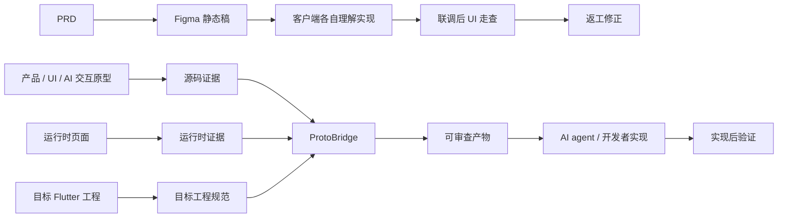
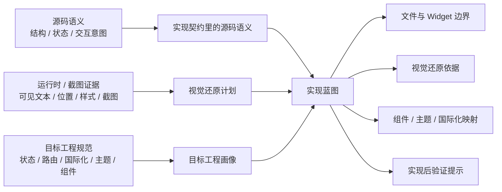
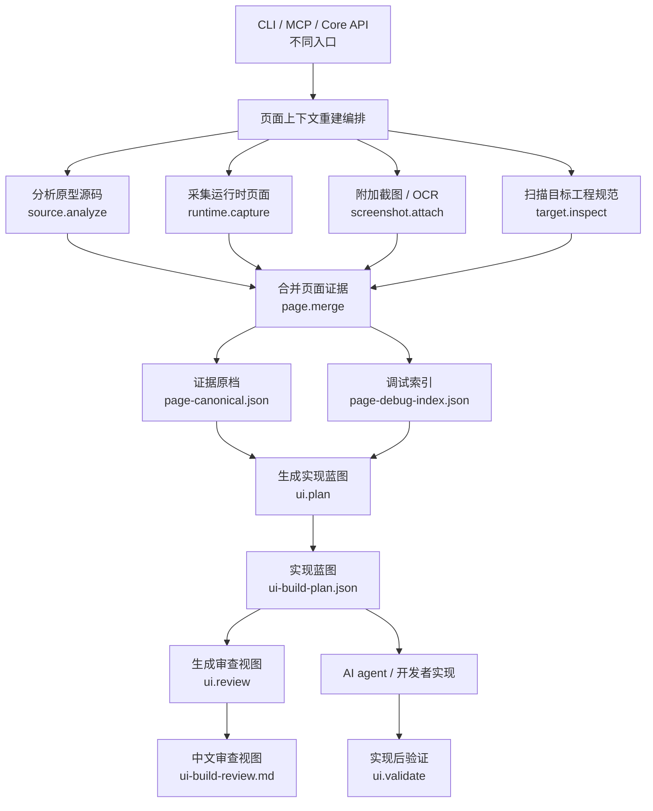
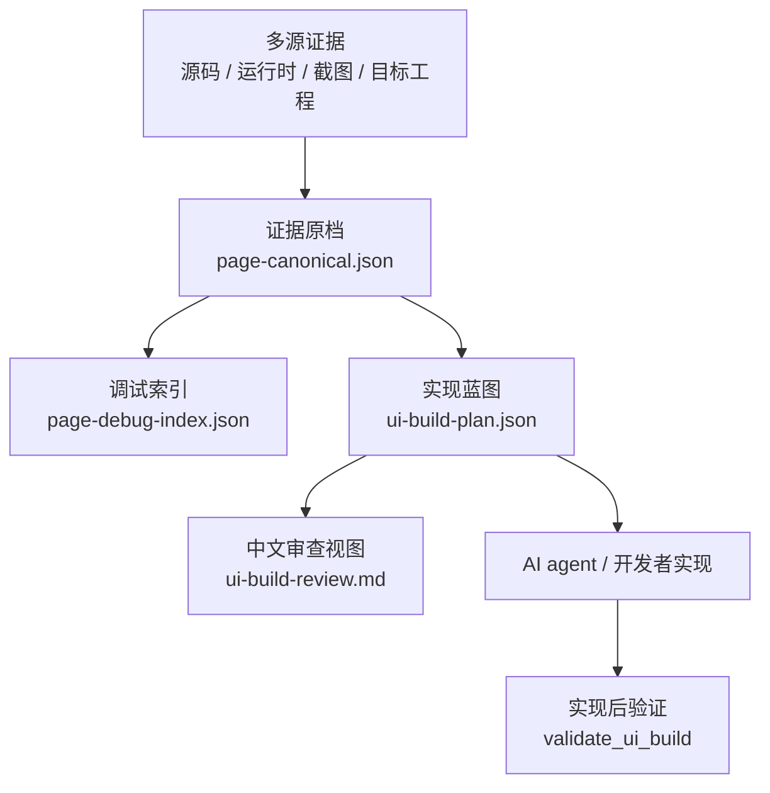

# 架构说明

ProtoBridge 采用 capability-first 架构。CLI、MCP 和 core API 只是入口；真正的产品逻辑沉淀在 core capabilities、source adapters、target adapters、planning 和 validation 中。


## 交付链路



解释 ProtoBridge 存在的意义，传统链路的关键问题是静态稿和人工理解之间的信息损耗；ProtoBridge 试图把交互原型、源码证据、运行时证据和目标工程规范提前整理成可审查产物，让实现和验证都有证据依据。

## 证据到蓝图



架构的核心设计 ProtoBridge 不让某一种证据统治全部字段。source semantics 进入实现契约，runtime/screenshot facts 进入视觉还原计划，target conventions 进入目标工程画像，最终合并为 `ui-build-plan.json`。

## Capability 编排



对应 core 的 capability-first 结构。CLI、MCP 和 Core API 只负责入口适配；source、runtime、screenshot、target、merge、plan、review、validate 才是可复用能力。

## 产物流转



对应产物链。
- `page-canonical.json` 保留完整证据和 provenance；
- `ui-build-plan.json` 是实现蓝图；
- `ui-build-review.md` 是从 plan 渲染出来的中文审查视图；
- validation 应回到 plan 和 target diff 做实现后检查。

## 核心设计

ProtoBridge 不做一对一代码翻译。它做的是证据归一和契约生成。

| 设计点 | 含义 |
| --- | --- |
| Capability-first | source、runtime、target、plan、review、validate 都是可复用能力。 |
| Evidence preserving | `page-canonical.json` 作为证据原档，保留 facts、provenance、mismatches 和 manual confirmations。 |
| Contract centered | `ui-build-plan.json` 是实现蓝图，并承载实现者默认必须读取的高价值证据。 |
| Target-grounded | 工程表达来自 target repo 扫描，不来自 ProtoBridge 默认偏好。 |
| Profile-enhanced | 项目增强集中在 restoration profile 中，只提供候选、别名、词表和 token 映射，不伪造 target evidence。 |
| Visual separated | runtime/screenshot 只负责视觉事实，不决定架构拆分。 |
| Review projected | `ui-build-review.md` 是审查视图，可以折叠噪音，但不改变实现蓝图。 |

## 包边界

```text
packages/
├── core/
├── cli/
└── mcp-server/
```

- `packages/core`：capabilities、workflow 编排、source/snapshot/target 实现、artifact writers 和共享类型。
- `packages/cli`：命令解析、config 读取、终端输出，以及调用 core。
- `packages/mcp-server`：MCP stdio 协议、tools、resources、prompts、session state，以及调用 core。

入口包只做输入输出适配。共享行为应进入 `packages/core`。

## Capability 数据流

| Capability | 输入 | 输出 |
| --- | --- | --- |
| `source.analyze` | source root、route、Vue SFC path | source facts：页面身份、sections、state space、interactions、assets、style intent。 |
| `runtime.capture` | URL、viewport | runtime facts：visible nodes、bbox、computed style、assets、interactions、screenshots。 |
| `screenshot.attach` | screenshot path、OCR text/boxes | screenshot facts 和 OCR evidence。 |
| `target.inspect` | Flutter target root | target facts：modules、routes、theme、components、assets、examples、architecture profile evidence。 |
| `page.merge` | source/runtime/screenshot/target facts | `page-canonical.json`、`page-debug-index.json`。 |
| `ui.plan` | canonical page、target facts、source-aware implementation draft | `ui-build-plan.json`。 |
| `ui.review` | UI plan | `ui-build-review.md`。 |
| `ui.validate` | target diff、plan expectations | validation result。 |

Source-aware planner、migration planner 和 widget blueprint 是 `implementationContract` 的内部语义来源，用于生成 source semantics、文件/Widget 拆分和状态边界建议。

## 契约模型

`ui-build-plan.json` 是实现契约，核心结构是：

```text
ui-build-plan.json
├── targetConventions
│   └── architectureProfile
├── implementationContract
│   ├── sourceSemantics
│   ├── fileTree
│   ├── widgetTree
│   ├── stateStrategy
│   ├── controllerBoundaries
│   ├── widgetContracts
│   └── targetBindings
├── visualPlan
├── componentMappings
├── themeMappings
├── i18nPlan
├── interactionPlan
└── validationHints
```

冲突规则：

1. Source semantics 负责逻辑架构：业务区块、状态意图、Widget contract、哪些不要直译。
2. Target conventions 负责工程表达：当前 target repo 到底使用什么 state/routing/i18n/theme/component/file organization 模式。
3. Runtime/screenshot 负责视觉事实：bbox、可见文案、section 顺序、computed style 和截图证据。
4. Normalizer 只把抽象角色绑定到 target architecture profile 已识别的模式；target architecture profile unknown 时保留抽象建议并输出 warnings/manual questions。

## Restoration profile

Restoration profile 是 source / target 之外的项目增强层。配置字段叫 `profile`，代码和产物中使用 `RestorationProfile` / `restorationProfile`，避免和 target 扫描出的 `architectureProfile` 混淆。

解析规则：

1. 显式配置 `"youfi"` 等已注册 id 时强制启用对应 profile。
2. 显式配置 `"generic"` 或 `false` 时禁用业务增强。
3. 配置 `"auto"` 或不配置时，按 `target.root` 的目录名推断，例如 `../youfi` -> `youfi`。
4. 推断不到已注册 profile 时回退 `generic`。

profile 可以提供 module aliases、target symbols、role symbols、pattern symbols、usage symbols、theme tokens 和 source lexicon。它的职责是提高候选质量和召回，不是替代证据：target symbol 要成为高置信组件、theme token 要成为高置信映射、route/i18n/theme 要成为实现建议，都必须被 target repo 扫描或 target conventions 证明。

## Target conventions

Target detector 读取 target root 中的 `pubspec.yaml`、Dart 文件和可用的 target 文档，结合相似示例、模块结构和符号使用，归纳 architecture profile。

字段形状固定，但字段值必须来自证据：

- `state.pattern`
- `routing.pattern`
- `i18n.pattern`
- `theme.patterns`
- `components.detectedSymbols`
- `fileOrganization.pattern`
- `documentation.files / architectureHints / conflicts`

GetX、flutter_bloc、Riverpod、Provider、Navigator、go_router、context.t、AppLocalizations、themeService、context.pbColors、CommonAppBar 等都不是通用默认值。它们可以由 restoration profile 纳入候选池，但只有被扫描到时才能以高置信方式影响 contract。

真实代码扫描仍是最高优先级证据；README、AGENT、CLAUDE、Cursor rules 和 `docs/**/*.md` 等文档证据只作为补充。如果文档与 Dart 扫描冲突，产物会保留冲突提示，但不会用文档覆盖代码事实。

`visualPlan.nodeAudits` 会把 page-canonical 中的代表性节点细节提升到 plan：重复卡片、列表项、按钮、chip、tab、appbar action 和 bottom action 会包含行结构、文本顺序、关键 computed style、控件 padding/radius/height、assetRefs 和 absence hints。它的目的不是推荐 target asset，而是让实现者不必深挖 canonical 才能拿到高风险细节证据。

节点审查遵循保真优先：`ui-build-plan.json` 可以标注 priority、noiseLevel、displayInReview、coverageReason 和 implementationSummary，但这些字段只帮助实现者和 reviewer 排序阅读，不应有损删除真实 UI 证据。额外重复卡片/列表项可以保留在 plan 中并设置 `displayInReview=false`；重复 wrapper、全页容器、已被父卡片覆盖的从属控件等会记录在 `visualPlan.nodeAuditSummary.suppressed`，用于解释为什么 `ui-build-review.md` 不展开它们。

`visualPlan.dynamicTextHints` 与 `i18nPlan.texts[*].dynamic` 会标出列表数量、金额、百分比、日期、数量等动态值。实现时这些值应从 target UI model 派生并格式化，不能因为它们出现在原型文本中就写成固定翻译 key。

## Projection artifacts

默认 projection 只有两类：

- `ui-build-plan.json`：实现蓝图。
- `ui-build-review.md`：审查视图。

`page-canonical.json` 是证据原档，用于追溯来源、排查冲突和补查细节；`page-debug-index.json` 是调试索引，方便从截图/文本快速定位到证据；`ui-build-plan.json` 是实现蓝图，是 agent 默认执行的主文档；`ui-build-review.md` 是审查视图，方便人快速阅读实现蓝图。planner 的职责不是复制 canonical 的全部字段，而是把实现阶段最容易被漏读、最容易造成还原偏差的证据提升成稳定契约，让 agent 不必先深挖 canonical 才能知道重复项行结构、控件尺寸、absence hints 和动态值边界。

## Core 目录

```text
packages/core/src/
├── capabilities/
├── workflows/capability-first/
├── profile/
├── source/
├── snapshot/
├── target/
├── artifacts/
├── shared/
└── types/
```

- `capabilities`：共享能力 facade。
- `workflows/capability-first`：围绕 capabilities 的统一编排。
- `profile`：restoration profile，集中维护项目增强，例如模块别名、项目组件候选、业务词表和设计 token 映射。
- `source`：source adapters，例如 Vue prototype analysis。
- `snapshot`：browser capture、OCR attachment 和 evidence enrichment。
- `target`：Flutter conventions、examples、planning 和 validation。
- `artifacts`：JSON 和 Markdown 写出。
- `types`：共享数据契约。

## 公开 API

推荐 package subpaths：

- `@proto-bridge/core/workflows/capability-first`
- `@proto-bridge/core/capabilities`
- `@proto-bridge/core/target/flutter-app`
- `@proto-bridge/core/source/vue3-prototype`
- `@proto-bridge/core/snapshot`
- `@proto-bridge/core/artifacts`
- `@proto-bridge/core/shared`
