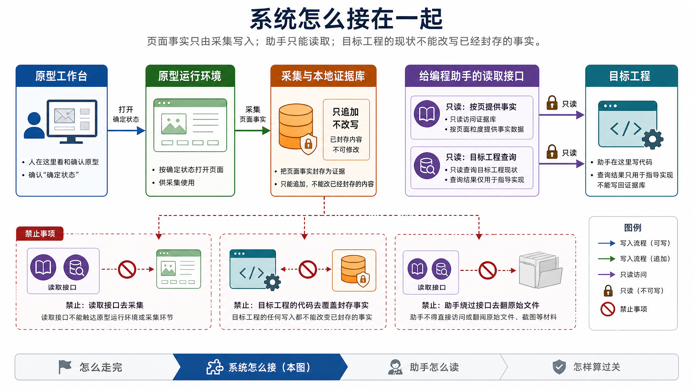

# 系统架构

ProtoBridge 采用 Core-owned semantics：所有对象、状态、引用和执行规则在 Core 中定义，PBWork、CLI、Local Service 和 MCP 只适配各自的进程与 IO。



页面事实只由采集写入本地证据库，且只追加、不改已经封存的内容。给编程助手的 MCP 只读证据库，也只读查询目标工程；查询结果不能写回 Evidence。禁止：MCP 去采集、目标工程代码覆盖封存事实、助手绕过接口翻原始文件。助手怎么读见 [Agent 消费指南](../guides/agent-consumption.md)。

## 实现视图

工作台与 Runtime 同在浏览器中，经 Local Service 和 Capture Protocol 接到 Node 侧的 Store：

```text
┌──────────────── PBWork browser ────────────────┐
│ Workbench UI ── Selection / Review             │
│      │                                         │
│      └── iframe ── Instrumented Runtime        │
└───────────────┬───────────────────────┬────────┘
                │ authenticated HTTP    │ Runtime protocol
                ▼                       ▼
          Local Service            Core Capture + Playwright
                │                       │
                └──────────┬────────────┘
                           ▼
                  Immutable Local Store
                           │
          ┌────────────────┴────────────────┐
          ▼                                 ▼
     Producer CLI                    Consumer MCP
                                             │
                                             ▼
                                   Coding Agent + Target
```

## 进程边界

| 边界 | 运行环境 | 所有权 |
| --- | --- | --- |
| Core | Node | Contract、Capture、Store、引用解析、Handoff、Target 只读查询 |
| PBWork Workbench | Browser | 人机交互、画布、Inspector、采集控制和 Review 展示 |
| PBWork Runtime | Browser iframe/独立页面 | Authored manifest、状态准备、语义快照、Action/Scenario |
| Local Service | Node loopback server | Session、Origin、安全输入、Core/Store/JobHost 适配 |
| CLI | Node process | 自动化 Producer 和生命周期命令 |
| MCP | stdio server | 固定 Evidence Reader、Target 查询和验证 |
| Target repository | 独立目录 | Agent 实现对象；不需要 PB 配置 |

## 包边界

```text
packages/core/src/v2/
  contracts/          executable schemas and vocabulary
  capture/            selection, preflight, matrix, driver, job, handoff
  runtime-contract/   browser-safe capture protocol
  service-contract/   PBWork ↔ Local Service protocol
  store/              immutable local persistence
  resolver/           reference reachability and activation

packages/core/src/target/
  public facades (query, validation, claims, readiness, authority, review)
packages/core/src/target/flutter-app/
  Flutter adapter implementation, isolated from Evidence capture

packages/local-service/
packages/cli/
packages/mcp-server/
apps/pbwork/
```

`src/v2`、`@proto-bridge/core/v2` 和 Runtime `/api/v2` 表示持久对象与协议的 major namespace。公共产品入口只有 Evidence 工作流。

## 依赖方向

- Core 不依赖 CLI、MCP、Local Service 或 PBWork。
- CLI 和 Local Service 依赖 Core Capture/Store。
- MCP 依赖 Core Contract、Read Model 和 Target query，但不依赖 Producer UI。
- PBWork 依赖浏览器安全的 Runtime/Service Contract，不重新实现 Store。
- Target query 不依赖 Capture 输入，也不允许返回值进入 Evidence revision。

## 两套浏览器协议

PBWork 有两个不同协议，不能混用：

- **Workbench Bridge**：父工作台与 iframe 间同步 route、inspect、highlight、comment 和主题上下文；消息只在当前 runtimeId 内有效。
- **Capture Protocol**：Core/Playwright 调用 Runtime 的 describe、prepare、readiness、semantic snapshot、reset 和 scenario；返回值受 Core Schema 校验。

Workbench 选中的临时 DOM handle 可以帮助创建 Fragment Draft，但持久 Fragment 只能使用 `screenId + pbId + optional pbKey`。

## 可靠性边界

- Local Service 只监听 loopback，校验 Origin，session token 只经 Authorization header 传递。
- Store 单 writer，原子提交不可变对象，失败时旧 active Snapshot 不变。
- Snapshot 可达性决定 revision 和 Blob 是否允许读取。
- MCP 只接受逻辑 ID，不暴露 Store 布局。
- Target 工具受明确 Target root 和路径边界约束。

对象模型见 [Evidence 模型](./evidence-model.md)，各模块实现见 [ProtoBridge 实现](./proto-bridge.md)和 [PBWork 架构](./pbwork.md)。
