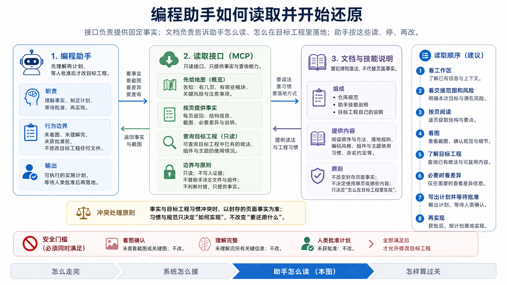
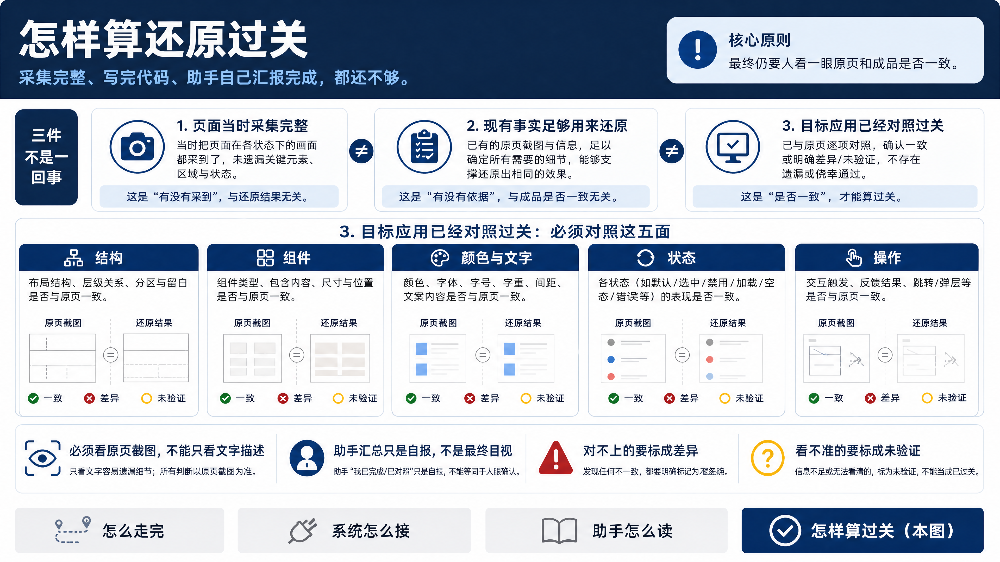

# Agent 消费指南

本指南适用于通过 ProtoBridge MCP 读取 Handoff 并修改目标仓库的 Coding Agent。

Handoff 是固定 Evidence 索引，不是实现计划。Agent 必须使用 Handoff 指定的 Workspace、Snapshot、Staleness Report 和 revision，不能改读 active/latest，也不能直接解析 Store 目录。



三方分工：MCP 只读提供固定事实和目标工程查询；仓库规范、Skill 和目标工程文档告诉助手怎么读、怎么落地；助手先理解、写计划、等人批准后再改代码。页面事实与目标工程习惯冲突时，以封存事实为准，习惯只决定怎么实现。没看截图、没理解完、人没批准计划，不能改目标工程。

怎样算过关见下文 [怎样算过关](#怎样算过关)。端到端阶段见 [产品工作流](../product/workflow.md)。

## MCP 配置

构建仓库后，MCP server 的等价启动命令为：

```bash
node /absolute/path/to/proto-bridge/packages/mcp-server/dist/index.js \
  --store-root /absolute/path/to/.proto-bridge/store \
  --workspace pbwork-local
```

也可以使用 `PB_STORE_ROOT` 和 `PB_WORKSPACE_ID`。Store 与 Workspace 必须和 Producer 创建 Handoff 时一致。

MCP 客户端应把上述命令登记为一个 stdio server。Agent 不应通过 shell 遍历 Store 代替 MCP。

## 强制读取顺序

图中的建议顺序对应下列 Tool 调用。权威实现纪律以 `proto-bridge://guides/handoff-consumer` 为准。

1. 读取资源 `proto-bridge://guides/handoff-consumer`。
2. 调用 `inspect_evidence_workspace`，校验 Workspace、projection contract version 和 capabilities。能力缺失时停止，不回退旧链路。
3. 调用 `read_handoff_index`，在编辑前原样报告 `mandatoryRisks` 的全部风险，并固定 Screen 顺序、Case/Scenario 范围与 Screenshot digest 分组。
4. 每个实现范围内的 Screen 调用一次 `read_screen_packet`。用 `canonicalBrief`、baseline Structure 与 state 理解主滚动边界、主 section、状态矩阵和固定业务数据；主滚动看 `canonicalBrief.primaryScroll` 与 `baseline.structure.scrollContainers`（packet 的 compact regions **不含** per-region `scrollOwner`）。Evidence Region 用于定位与验收，不是目标侧组件边界、列表项边界或文件边界。
5. 每份不同 Screenshot 内容使用 digest group 的 `representativeBlobId` 调用 `read_evidence_screenshot`，确认 MCP ImageContent，并记录覆盖的全部 Case。相同 digest 不重复注入；metadata、base64 文本和相似 Variant 不能替代 Screenshot。
6. 每个 Screen 在编辑前调用 `inspect_target_readiness`，记录 resolver coverage、component/token candidate/conflict/unresolved、五维 machine authority 和 blockers。用 `implementationInventory` 的 `regionId`/`caseId` 批量解析组件和 Token。缺少 machine authority 的维度在最终结论中保持未验证或说明人工依据，不要求向目标工程加入实验性 Runtime Harness。`read_implementation_plan` / `read_implementation_tranche` 仅诊断或 Review 辅助，不是默认实施路径。
7. 非 baseline 或包含状态/场景差异的 Case 调用 `read_case_delta`。Delta 使用语义 ID patch；需要来源时再定向调用 `read_evidence_detail`。
8. 每个 Screen 在编辑前用简短散文概括 Evidence 理解：主结构与滚动边界、组件与 Token 落点意向、状态与交互覆盖，并附实现计划（预计修改文件、验证方式、剩余风险）。这是给人纠偏的白话摘要，不是清单或评分表。然后必须暂停，等待用户明确批准；未获批准前不得修改目标工程，也不得执行会改变目标工程状态的命令。Deliver 提示词与此门禁一致，见 [快速上手](./getting-started.md)。
9. 用户批准后，阅读目标仓库自己的 AGENT、README、架构、测试、公共 API 和既有实现。Target adapter 只发现和归一化这些上下文；内置 fallback 不能覆盖真实目标文档。
10. Agent 自行决定文件、组件、状态、路由和 Token，但不得发明证据未支持的容器形态、文案、交互或状态；优先复用 Evidence/Source 固定业务数据；布局敏感 prop 缺失时对照 Screenshot，仍不确定则披露为剩余风险。
11. continuation 只能续读同一规范化查询直到 `complete=true`。完成后不得重启；不得为“读全”轮询所有投影或在 selector 之间循环。一次针对性展开仍不能解决时，记录未知或风险。
12. 完成实现并运行目标原生验证；实施后复查使用 `read_reconstruction_obligations` 按 Screen/维度分页，不读取完整 Acceptance Contract，也不把 obligation 顺序当作编码顺序。调用 `summarize_reconstruction_review` 汇总已处理 Case、已查看 Screenshot、已重放 Scenario、已知偏差和未验证事项。

整包 Snapshot、原始 Case/revision/fragment、Catalog、Issue、Staleness、`read_agent_handoff` 与 `read_acceptance_contract` 已从 MCP 表面移除；不得回退到旧整包读取路径。

也可以使用 MCP Prompt `consume_evidence_handoff` 创建同一读取任务；Prompt 不放宽上述规则。

## Evidence Tools

| Tool | 用途 |
| --- | --- |
| `inspect_evidence_workspace` | 确认 Workspace、能力、契约版本、构建与进程身份、Store generation |
| `read_handoff_index` | 默认入口：固定 refs、风险、Screen/Case/Scenario 摘要和 digest 分组 |
| `read_screen_packet` | 单 Screen 的 baseline、canonicalBrief、inventory、Case/Scenario 和 Screenshot 分组 |
| `read_implementation_plan` | 诊断：Region tranche 索引与 obligation 计数（非默认实施路径） |
| `read_implementation_tranche` | 诊断：展开单个 tranche 的 obligations（非默认实施路径） |
| `read_case_delta` | 指定 Case 相对 baseline 的语义 patch（regionId/caseId） |
| `read_evidence_detail` | 按需读取单 Screen 的指定投影；可按稳定逻辑 continuation 续读 |
| `read_reconstruction_obligations` | 按 Screen 和维度分页读取稳定、去重的五维还原义务 |
| `read_evidence_screenshot` | 将代表 Screenshot 作为真正的 MCP ImageContent 返回 |
| `summarize_reconstruction_review` | 汇总范围覆盖、视觉阅读、场景重放、偏差和未验证事项，不计算分数 |

## Target Tools

| Tool | 用途 |
| --- | --- |
| `read_target_conventions` | 读取目标工程政策入口、架构和约定摘要 |
| `resolve_target_components` | 批量解析开放 component ID，并校验声明、symbol/import/签名/usage |
| `resolve_target_tokens` | 批量解析开放 token ID，并校验 accessor/定义/usage |
| `find_target_examples` | 查找可复用模式；Treatment 必须排除 Control 和 candidate output |
| `validate_target_changes` | 验证变更范围、文件与实际采用的 resolved mapping |
| `inspect_target_readiness` | 编辑前报告 resolver coverage、machine authority、实施 blockers 和未验证边界 |

## 怎样算过关

采集完整、事实足够用来还原、目标应用已经对照过关，不是同一件事。只有第三件算还原过关。



对照要对上结构、组件、颜色与文字、状态和操作。必须看原页截图，不能只看文字描述。对不上的标成差异；看不准的标成未验证，不能当成已经过关。助手汇总只是自报，最终仍要人看原页和成品是否一致。

`read_reconstruction_obligations` 从固定 Handoff 的 Acceptance Contract 投影稳定、跨 Case 去重的 structure、components、tokens、states 和 interactions 义务。组件与 Token 结合 resolver、实际采用代码和 `validate_target_changes`；结构、状态与交互结合固定 Evidence、目标代码和实际测试。没有可靠验证依据时必须保持 `unverified`。

`summarize_reconstruction_review` 汇总已处理 Case、已查看 Screenshot、已重放 Scenario、偏差和未验证事项，不计算还原分数。它的 `validationAuthority` 是 `consumer-reported-review`，不能被描述成独立 Runtime 或最终视觉验收。官方 Flutter MCP Runtime Review 的保留实验实现不在默认 MCP Tool 表面，见 [Roadmap](../roadmap/flutter-mcp-target-review.md)。

一次性人工五维对照记录使用 [验收模板](../acceptance/README.md)，不替代本节判据，也不驱动 Agent 按验收文档改代码。

Target 结果是实现上下文，不是原型事实。真实目标文档/公开代码优先于 adapter fallback；机器 Contract 与政策冲突时必须保留 conflict。它不能写回 Evidence，也不能覆盖 unknown 或 conflict。

Evidence Contract 可以服务任意技术栈；当前 Target tools 的公共门面下只实现 Flutter adapter（`packages/core/src/target/flutter-app`）。非 Flutter 目标在对应 Adapter 落地前仍可消费固定 Evidence，但不能宣称已完成 PB Target query/validation 闭环。component/token occurrence 的文件形态由当前 adapter 解释（Flutter：`lib/**/*.dart`）。

Component / Token 落点以 `read_screen_packet` 的 `implementationInventory` 为准，再调用 `inspect_target_readiness` / `resolve_target_*`。Catalog revision 仍由 Producer 固定在 Snapshot 上，Consumer 不得读取当前源码目录补造旧 Snapshot 的目录事实。

## 必须报告的风险

- `partial-coverage`
- `stale-evidence`
- `required-unknown`
- `unresolved-conflict`
- `evidence-level-limitation`
- `manual-promotion`

Producer 对风险的确认只允许生成 Handoff，不代表 Consumer 可以省略风险，也不改变 Evidence 内容。

## 硬失败

以下情况必须停止：

- Workspace 不匹配；
- 缺少 `handoff-index`、`screen-implementation-packet`、`case-delta`、`evidence-detail`、`reconstruction-obligations` 或 `image-content-screenshot` 能力；
- 固定 Snapshot、revision、Staleness Report 或 Handoff 不存在；
- revision 不能由 Handoff Snapshot 到达；
- Schema major 不受支持；
- Debug/Trace 未经显式请求；
- Target 路径越界或目标仓库无法验证；
- 发明 Screenshot / Fragment 未支持的视觉结构、文案或交互，却不披露偏差。

不得通过切换 active/latest、拼接 Store 文件路径、忽略风险、重新解释旧对象或退回已移除的整包读取工具恢复。

## 完成报告

Agent 最终至少报告：

- 使用的 Handoff、Snapshot 和 revision；
- 编辑前发现的 mandatory risks；
- 实际修改的目标文件；
- 使用了哪些目标工程既有模式；
- 运行的原生测试和结果；
- 适用 adapter 的变更校验结果（若存在）；
- 相对 Evidence 的已知偏差；
- 尚未解决的 Evidence 或实现风险。

这里的完成报告是范围与验证事实摘要，不是还原度评分。组件或 Token Evidence 无法逐项映射时可以继续结合 Screenshot 和目标规范实施，但五维 summary 必须将对应 obligation 标为 `deviation` 或 `unverified`，不能用空 observations 隐去；不要为了填满映射表而弱化最终视觉。
