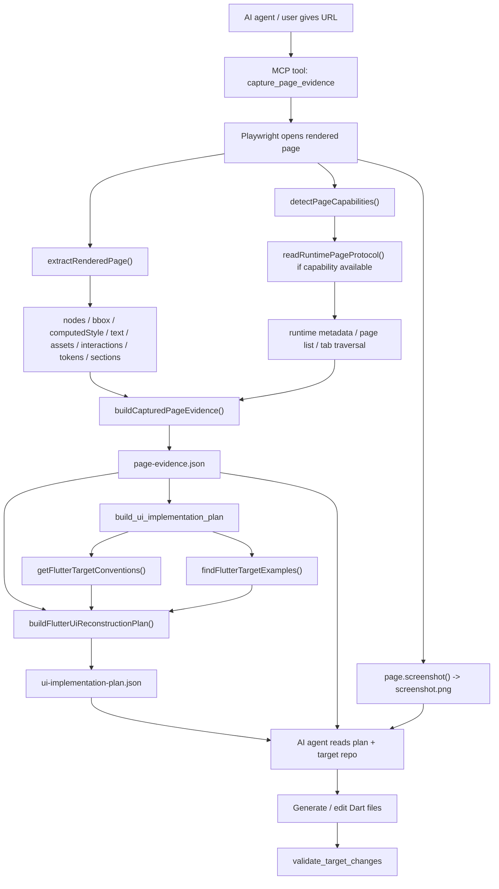

# MCP UI Reconstruction 工作流

本文档专门解释 ProtoBridge 的 MCP 模式是如何从 `URL`、运行态页面、截图、OCR 和 target 工程约束，一步步生成：

- `screenshot.png`
- `page-evidence.json`
- `ui-implementation-plan.json`
- 最终供 AI coding agent 实现 Dart 页面

如果你想追代码，请把本文档和这些文件一起看：

- `packages/mcp-server/src/tools/registry.ts`
- `packages/core/src/workflows/ui-reconstruction/*`
- `packages/core/src/snapshot/browser-capture/*`
- `packages/core/src/snapshot/enrichers/*`
- `packages/core/src/target/flutter-app/*`

## 1. 一句话结论

ProtoBridge MCP 不是“把 HTML 或截图直接编译成 Flutter”。

它的真实工作方式是：

1. 用 Playwright 打开 `URL`，得到浏览器运行后的页面。
2. 从运行后的 DOM 中抽取 node、bbox、文本、computed style、资源和交互。
3. 把这些事实归一化为 `PageEvidence`。
4. 结合 YouFi target conventions、相似页面、theme token 规则，生成 `ui-implementation-plan.json`。
5. AI agent 再根据这些 JSON 和 target 工程上下文生成 Dart。

因此：

- `node` 主要来自 **rendered DOM**，不是来自截图本身。
- `字体/颜色/位置` 主要来自 **computed style + bbox**。
- `Row/Column/Widget` 不是 MCP 直接生成的代码，而是 MCP 输出证据与建议，AI agent 再落成 Flutter。

## 2. 输入模式与边界

### 2.1 当前主输入

当前 MCP 工作流的主输入是 `URL`。

入口工具：

- `capture_page_evidence`
- `build_ui_implementation_plan`

对应代码：

- `packages/mcp-server/src/tools/capture-page-evidence.ts`
- `packages/mcp-server/src/tools/build-ui-implementation-plan.ts`
- `packages/core/src/workflows/ui-reconstruction/capture-page-evidence.ts`
- `packages/core/src/workflows/ui-reconstruction/build-ui-implementation-plan.ts`

### 2.2 MCP 自带截图的作用

MCP 自带的 `screenshot.png` 是在 capture URL 时由 Playwright 生成的副产物，也是视觉基准证据。

它的作用是：

- 给人看
- 给 AI agent 做视觉对照
- 给 review markdown 做基准
- 在 OCR 存在时作为 OCR 的输入来源

但它 **不是当前 node tree 的直接来源**。

截图生成代码：

- `packages/core/src/snapshot/browser-capture/rendered-page-evidence.ts`

### 2.3 用户提供截图的作用

当前仓库里，用户额外提供截图时，主要支持的是 **OCR evidence 持久化**，不是“从图片直接反推完整 DOM/node tree”。

对应工具与代码：

- MCP tool：`ocr_screenshot`
- `packages/mcp-server/src/tools/ocr-screenshot.ts`
- `packages/core/src/workflows/ui-reconstruction/ocr-screenshot.ts`
- `packages/core/src/snapshot/ocr/external-ocr.ts`

当前真实边界：

- `URL + rendered page`：可以生成完整 `nodes + sections + tokens + assets + interactions`
- `截图 + OCR`：只能补充文字证据，不能替代完整 DOM 抽取
- `纯截图`：当前不能直接生成和 URL capture 同等级的 node tree

这点非常重要：如果问题是“HTML 里的 div 怎么变成 Row/Column”，答案只能来自 URL capture 流程，不能来自纯图片 OCR。

## 3. 端到端流程图

## 4. MCP 入口层

### 4.1 tool 注册与调度

MCP 工具注册在：

- `packages/mcp-server/src/tools/registry.ts`

当前 UI reconstruction 相关工具：

- `capture_page_evidence`
- `build_ui_implementation_plan`
- `ocr_screenshot`
- `export_review_markdown`
- `get_target_conventions`
- `find_target_examples`
- `validate_target_changes`

`registry.ts` 负责：

- 描述 tool 名称与参数 schema
- 根据 `tools/call` 里的 `name` 路由到具体实现

### 4.2 官方 prompt

MCP 提供给 agent 的官方 prompt 在：

- `packages/mcp-server/src/prompts/index.ts`

这里定义了 `reconstruct_url_ui`，明确要求 agent：

1. 先 `capture_page_evidence`
2. 再 `build_ui_implementation_plan`
3. 根据 plan 与 target 工程实现 Dart
4. 最后执行 `validate_target_changes`

这个 prompt 不是代码生成器，而是 agent 的工作说明书。

## 5. URL Capture：页面是怎么被打开和截图的

真正的 URL capture 入口在：

- `packages/core/src/snapshot/browser-capture/rendered-page-evidence.ts`

核心流程：

1. 计算 viewport 和输出目录
2. 启动 Playwright Chromium
3. `page.goto(url, { waitUntil: 'networkidle' })`
4. 检测 capability
5. 如果需要，读取 runtime metadata
6. `page.screenshot({ fullPage: true })`
7. 执行 `extractRenderedPage(page, viewport)`
8. 执行 `buildCapturedPageEvidence(...)`
9. 写出 `page-evidence.json`

关键函数：

- `captureRenderedPageEvidence()`

相关代码：

- `packages/core/src/workflows/ui-reconstruction/capture-page-evidence.ts`
- `packages/core/src/snapshot/browser-capture/rendered-page-evidence.ts`
- `packages/mcp-server/src/tools/capture-page-evidence.ts`

## 6. Node 节点是怎么生成的

### 6.1 真正生成 nodes 的地方

node tree 的核心逻辑在：

- `packages/core/src/snapshot/browser-capture/extract-rendered-page.ts`

关键函数：

- `extractRenderedPage()`
- 内部 `serialize(element, parentId?)`

### 6.2 遍历方式

`extractRenderedPage()` 在浏览器上下文里执行 `page.evaluate(...)`，从 `document.body` 开始递归遍历 DOM。

每个可见节点会被序列化成一个 `PageSnapshotNode`，包含：

- `id`
- `parentId`
- `role`
- `tag`
- `text`
- `bbox`
- `computedStyle`
- `cssVarRefs`
- `children`
- `evidence`

对应类型：

- `packages/core/src/types/evidence.ts`

### 6.3 可见性过滤

节点不是无脑全收，会先过 `isVisible()`：

- 跳过 `SCRIPT / STYLE / NOSCRIPT / META / LINK`
- `display:none` 跳过
- `visibility:hidden` 跳过
- `opacity:0` 跳过
- `width <= 0` 或 `height <= 0` 跳过

所以 `page-evidence.json` 里的 nodes 不是原始 DOM dump，而是“可见 UI 证据模型”。

### 6.4 文本是怎么来的

文本不是只看 `textContent`。

`directText()` 会尝试：

1. 直接子文本节点
2. `::before`
3. `::after`
4. `aria-label`
5. `title`

因此有些视觉文字即便不在普通 text node 中，也可能被采到。

### 6.5 role 是怎么推断的

role 推断函数：

- `inferRole()`

规则主要看：

- `tagName`
- `role` attribute
- `className`
- `id`
- `position`
- `bbox`
- 是否像 card
- 是否有文本

典型映射规则：

| 页面特征 | 推断 role |
| --- | --- |
| `button` / `role=button` / `a` | `button` |
| `img` / `picture` | `image` |
| `svg` / class 含 `icon` | `icon` |
| class/id/role 含 `tab` | `tab-bar` |
| `ul/ol` 或 class 含 `list` | `list` |
| `li` 或 class 含 `item` | `list-item` |
| 有背景且有圆角/阴影、尺寸合理 | `card` |
| `position: fixed/sticky` 且靠顶部 | `app-bar` |
| `position: fixed/sticky` 且靠底部 | `bottom-bar` |
| `section/main` 或大块容器 | `section` |
| 有文本但不命中其他规则 | `text` |
| 以上都不命中 | `unknown` |

这里要特别注意：

- `div` 本身不会直接被标成 `Row` 或 `Column`
- `div` 只会先被标成 `section / card / tab-bar / unknown / text` 等证据 role

## 7. 字体、颜色、位置是怎么抽出来的

### 7.1 位置：bbox

每个节点的位置信息来自 `getBoundingClientRect()`，写成：

- `x`
- `y`
- `width`
- `height`

对应函数：

- `bboxOf(rect)`

这就是后面布局对齐的几何基础。

### 7.2 样式：computedStyle

每个节点都会记录一份 `computedStyle`，包括：

- `display`
- `position`
- `flexDirection`
- `alignItems`
- `justifyContent`
- `gap`
- `padding`
- `margin`
- `color`
- `backgroundColor`
- `fontFamily`
- `fontSize`
- `fontWeight`
- `lineHeight`
- `borderRadius`
- `border`
- `boxShadow`
- `overflow`

这就是后面“字体、颜色、间距、布局建议”的主要来源。

### 7.3 token 抽取

抽取时不会只保留节点级样式，还会额外把视觉 token 归纳到 `tokens`：

- color
- typography
- spacing
- radius
- border
- shadow

关键逻辑：

- `addToken()`
- `cssVarForValue()`
- `cssVarRefs()`

输出类型：

- `VisualTokenEvidence`

这让 planner 可以做两种事情：

1. 用 node 自身的 `computedStyle` 看具体样式
2. 用全局 `tokens` 看重复出现的视觉模式

### 7.4 字体是怎么抽的

字体 token 的原始格式是：

`fontSize/lineHeight/fontWeight/fontFamily`

例如：

- `13px/16px/400/-apple-system, "SF Pro", Inter, sans-serif`
- `34px/46px/700/-apple-system, "SF Pro", Inter, sans-serif`

它来自：

- `addToken('typography', 'font', ...)`

### 7.5 颜色是怎么抽的

颜色会分别记录：

- `color`
- `backgroundColor`

原始值通常是：

- `rgb(...)`
- `rgba(...)`

如果能匹配 CSS variable，也会带上 `cssVar` / `cssVarRefs`。

### 7.6 资源与交互

资源：

- `img.src`
- `background-image`
- `inline svg`

交互：

- button / a / role=button
- `cursor:pointer`
- `onclick`
- input / textarea / select

相关函数：

- `maybeAddAsset()`
- `maybeAddInteraction()`

## 8. visual sections 是怎么生成的

除了 node tree，ProtoBridge 还会从 nodes 中再抽一层 `visualSections`。

代码：

- `packages/core/src/snapshot/browser-capture/extract-rendered-page.ts`

做法是：

1. 先选出 section-like role：
   - `app-bar`
   - `tab-bar`
   - `section`
   - `card`
   - `list`
   - `bottom-bar`
   - `modal`
2. 给每个 section 记录：
   - `id`
   - `role`
   - `title`
   - `bbox`
   - `nodeIds`
   - `evidence`

这层数据不是代码，但它对后面的 Widget 拆分非常关键。

## 9. PageEvidence 是怎么组装出来的

node、sections、tokens 只是原始抽取结果。真正写入 `page-evidence.json` 前，还会经历一次归一化和增强。

主入口：

- `packages/core/src/snapshot/browser-capture/build-page-evidence.ts`

关键函数：

- `buildCapturedPageEvidence()`

这里做了几件事：

1. 先用 `buildGenericDomEvidence()` 组装基础 evidence
2. 再通过 `mergePageEvidence()` 合并增强证据
3. 增强来源包括：
   - `buildAnnotatedRuntimeEvidence()`
   - `buildPageListEvidence()`
   - `buildTabTraversalEvidence()`
   - `buildAssetExtractionEvidence()`
   - `buildOcrEvidence()`

对应代码：

- `packages/core/src/shared/evidence/merge.ts`
- `packages/core/src/shared/evidence/normalize.ts`
- `packages/core/src/snapshot/enrichers/*`

### 9.1 runtime metadata / page list / tab traversal

如果页面支持 runtime metadata 或 page list，ProtoBridge 会先探测 capability，再读取 runtime payload。

相关代码：

- `packages/core/src/snapshot/capabilities/detect-page-capabilities.ts`
- `packages/core/src/snapshot/browser-capture/runtime-page-protocol.ts`
- `packages/core/src/shared/protocols/runtime-page.ts`

这些增强信息常用于：

- 页面路由识别
- tab 状态补充
- page list 补充
- 警告与能力标注

### 9.2 OCR 在 evidence 中的位置

OCR 不是 node 抽取主路径，而是 evidence 的补充层。

当前设计是：

- DOM 看得到的内容，以 DOM 为准
- OCR 只用于补充 DOM 没采到的文本线索

所以纯截图 OCR 目前不能完全替代 URL capture。

## 10. 从 PageEvidence 到 ui-implementation-plan.json

这一步的 workflow 入口：

- `packages/core/src/workflows/ui-reconstruction/build-ui-implementation-plan.ts`

它内部调用：

- `buildFlutterUiReconstructionPlan()`

具体实现：

- `packages/core/src/target/flutter-app/planning/ui-reconstruction-planner.ts`

### 10.1 先读 target 工程约束

planner 不会只看 evidence，还会先读取 YouFi target 工程。

相关函数：

- `getFlutterTargetConventions()`
- `findFlutterTargetExamples()`

对应代码：

- `packages/core/src/target/flutter-app/conventions.ts`
- `packages/core/src/target/flutter-app/examples.ts`

这里会提供：

- 现有 modules
- routes 文件
- translation 文件
- asset 目录
- reusable components
- 相似页面与片段

### 10.2 page / module / pattern 推断

planner 会先推断：

- `moduleName`
- `pageName`
- `pattern`

对应函数：

- `inferModule()`
- `inferPageName()`
- `inferPattern()`

这决定：

- 计划落到哪个模块
- 目标文件名是什么
- 应该偏向 detail/list/form/dashboard 哪类结构

### 10.3 Widget tree 是怎么来的

planner 不直接生成 Flutter 代码，但会先生成 `widgetTree`。

做法：

1. 根节点固定是 `Page`
2. 遍历 `evidence.sections`
3. 每个 section 生成一个 Widget plan
4. `buildHint` 里写入：
   - section role
   - bbox
   - layout hints

代码：

- `buildWidgetTree()`
- `buildSectionHint()`

### 10.4 componentMappings：组件是怎么映射的

`componentMappings` 的输入不是 HTML tag，而是 **node role**。

关键函数：

- `buildComponentMappings()`
- `bestComponentForRole()`

当前映射逻辑大致是：

| evidence role | 目标组件角色 |
| --- | --- |
| `app-bar` | `app-bar` |
| `button` | `button` |
| `image` / `icon` | `image` |
| `modal` | `sheet` |
| `list` | `refresh` |
| `bottom-bar` | `button` |

因此：

- `div` 不会因为它是 `div` 就映射到某个 Flutter 组件
- 它必须先在证据层被理解成某个 `role`
- 然后这个 `role` 再被映射到 YouFi 组件角色

### 10.5 themeMappings：字体和颜色怎么映射到 themeService

真正负责字体/颜色 token 映射的地方：

- `packages/core/src/target/flutter-app/theme-mapping.ts`

在当前实现里，planner 会为 token 生成：

- `kind`
- `source`
- `value`
- `nodeIds`
- `target`
- `candidateTargets`
- `matchedBy`
- `confidence`
- `reason`

其中：

- typography 通过 `resolveFlutterTypographyTarget()` 反查 `themeService.textStyles.*`
- color 通过 `resolveFlutterColorTarget()` 反查 `themeService.colors.*`

这一步是“从 evidence 到 theme token”的关键桥梁。

### 10.6 布局信息怎么进入 plan

ProtoBridge 当前不会直接在 plan 中输出“这里一定是 Flutter `Row`”。

它输出的是布局证据与 hint：

- `bbox`
- `display`
- `flexDirection`
- `alignItems`
- `justifyContent`
- `gap`
- `padding`
- `margin`
- `descendants`

这些信息由 `buildSectionHint()` 写进 `widgetTree.buildHint`。

所以布局不是丢失了，而是以“实现提示”的形式进入 plan。

## 11. HTML 里的 div 是怎么变成 Row / Column / Flutter 组件的

这是最容易误解的地方。

### 11.1 ProtoBridge 不做 deterministic div -> Row/Column 翻译

当前仓库里没有一个函数叫“把 div 直接翻成 Row/Column”。

真实机制是三段式：

1. **证据层**
   从 DOM 中抽出：
   - role
   - bbox
   - computedStyle
   - parent/child

2. **planning 层**
   把这些事实变成：
   - widgetTree
   - componentMappings
   - themeMappings
   - buildHint
   - similarExamples

3. **agent 实现层**
   AI agent 根据这些 JSON 与 target 工程上下文，选择：
   - `Row`
   - `Column`
   - `Stack`
   - `Wrap`
   - local widget
   - CommonAppBar / button / image 组件

### 11.2 Agent 通常依据什么判断 Row/Column

典型依据是：

| evidence / plan 信号 | Agent 常见 Flutter 决策 |
| --- | --- |
| `display:flex` + `flexDirection:row` | 更像 `Row` |
| `display:flex` + `flexDirection:column` | 更像 `Column` |
| 多个横向子节点 + bbox 横向排列 | 更像 `Row` |
| 多个纵向区块 + section 顺序明显 | 更像 `Column` |
| 节点有重叠或绝对定位 | 可能是 `Stack` |
| 只是 role=button | 可能是 `GestureDetector` / `InkWell` / Common button |

ProtoBridge 提供的是“足够强的证据”，不是最终代码。

## 12. AI agent 是怎么根据 JSON 生成 Dart 的

### 12.1 agent 的主要输入

AI agent 在 MCP 流程中通常会同时读取：

- `page-evidence.json`
- `ui-implementation-plan.json`
- `screenshot.png`
- target conventions
- similar examples

对应工具：

- `capture_page_evidence`
- `build_ui_implementation_plan`
- `get_target_conventions`
- `find_target_examples`

### 12.2 JSON 在 agent 侧的职责分工

`page-evidence.json` 负责回答：

- 页面上到底有哪些 node
- 每个 node 的 bbox / computedStyle / text / 资源 / 交互是什么
- 哪些视觉 token 真正在页面里出现过

`ui-implementation-plan.json` 负责回答：

- 该落到哪个模块
- 文件应该怎么拆
- section/widget 应该怎么命名
- 哪些 target 组件可以复用
- 字体/颜色应优先匹配哪些 theme token
- 哪些地方需要 TODO 或人工确认

### 12.3 为什么 ProtoBridge 不直接写 Dart

原因不是“做不到”，而是职责边界不同。

ProtoBridge MCP 的职责是：

- 产出结构化证据
- 产出 target-aware plan
- 提供 conventions / examples / validation

真正写 Dart 的职责属于 agent，因为它还需要：

- 在目标仓库里查相似实现
- 跨文件编辑
- 调整 imports / bindings / routes
- 跑格式化和静态检查
- 修复首次生成后的错误

相关说明：

- `packages/mcp-server/src/prompts/index.ts`
- `packages/core/src/target/flutter-app/validation/index.ts`
- `README.md`

## 13. review 与 validation 在链路中的位置

### 13.1 review markdown

如果需要人工审查，可以导出：

- `ui-review.md`

对应代码：

- `packages/core/src/workflows/ui-reconstruction/render-ui-review-markdown.ts`
- `packages/mcp-server/src/tools/export-review-markdown.ts`

### 13.2 validate_target_changes

当 agent 生成 Dart 后，可以用：

- `validate_target_changes`

它主要检查：

- 改动范围
- TODO / placeholder
- hard-coded Color
- hard-coded fontSize
- navigation 等明显风险

对应代码：

- `packages/core/src/target/flutter-app/validation/index.ts`
- `packages/mcp-server/src/tools/validate-target-changes.ts`

注意：validation 不是 screenshot diff，它是结构化静态检查。

## 14. 文件职责索引

### 14.1 MCP 入口

- `packages/mcp-server/src/tools/registry.ts`
- `packages/mcp-server/src/prompts/index.ts`
- `packages/mcp-server/src/resources/index.ts`

### 14.2 URL capture 与 screenshot

- `packages/mcp-server/src/tools/capture-page-evidence.ts`
- `packages/core/src/workflows/ui-reconstruction/capture-page-evidence.ts`
- `packages/core/src/snapshot/browser-capture/rendered-page-evidence.ts`

### 14.3 node / bbox / style / token / assets / interactions

- `packages/core/src/snapshot/browser-capture/extract-rendered-page.ts`
- `packages/core/src/types/evidence.ts`

### 14.4 PageEvidence 组装与增强

- `packages/core/src/snapshot/browser-capture/build-page-evidence.ts`
- `packages/core/src/shared/evidence/merge.ts`
- `packages/core/src/shared/evidence/normalize.ts`
- `packages/core/src/snapshot/enrichers/*`

### 14.5 OCR

- `packages/mcp-server/src/tools/ocr-screenshot.ts`
- `packages/core/src/workflows/ui-reconstruction/ocr-screenshot.ts`
- `packages/core/src/snapshot/ocr/external-ocr.ts`

### 14.6 target conventions / examples / plan

- `packages/core/src/target/flutter-app/conventions.ts`
- `packages/core/src/target/flutter-app/examples.ts`
- `packages/core/src/target/flutter-app/planning/ui-reconstruction-planner.ts`
- `packages/core/src/target/flutter-app/theme-mapping.ts`
- `packages/core/src/types/planning.ts`

### 14.7 review / validation

- `packages/core/src/workflows/ui-reconstruction/render-ui-review-markdown.ts`
- `packages/core/src/target/flutter-app/validation/index.ts`
- `packages/mcp-server/src/tools/validate-target-changes.ts`

## 15. 当前局限

1. 当前完整 node tree 只能来自 URL capture 的 rendered DOM，不能只靠截图直接反推。
2. `div -> Row/Column` 不是 deterministic compiler 规则，而是 evidence + planning + agent 决策。
3. validation 目前不是视觉 diff，只能做结构化静态检查。
4. OCR 当前是补充证据，不是页面结构主来源。
5. component mapping 现在是 role-based heuristic，不是完整语义编译器。

## 16. 推荐阅读顺序

如果你要顺着代码读一遍，建议按这个顺序：

1. `packages/mcp-server/src/tools/registry.ts`
2. `packages/mcp-server/src/tools/capture-page-evidence.ts`
3. `packages/core/src/snapshot/browser-capture/rendered-page-evidence.ts`
4. `packages/core/src/snapshot/browser-capture/extract-rendered-page.ts`
5. `packages/core/src/snapshot/browser-capture/build-page-evidence.ts`
6. `packages/core/src/target/flutter-app/planning/ui-reconstruction-planner.ts`
7. `packages/core/src/target/flutter-app/theme-mapping.ts`
8. `packages/mcp-server/src/prompts/index.ts`
9. `packages/core/src/target/flutter-app/validation/index.ts`

这样读下来，会最清楚：

- node 从哪来
- 字体/颜色/位置从哪来
- div 为什么不会直接变成 Flutter
- agent 为什么必须参与最后一步 Dart 生成
