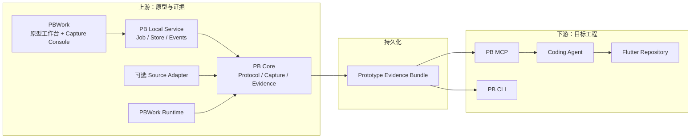

# ProtoBridge / PBWork V2 重构计划

> 状态：Review 完成，待实施（V2.1 完整终态）
> 目标分支：`dev`
> 性质：破坏性重构，不兼容现有 Artifact、CLI / MCP 页面工作流
> 更新时间：2026-07-27

> 本计划描述唯一完整终态，不发布功能缩水、V1/V2 混合或长期双轨产品。实施阶段只用于安排依赖和提交，不改变 Definition of Done；V2 全部验收通过前不切换正式入口，切换时一次性删除 V1 入口与旧 Artifact。

## 1. 决策摘要

本轮重构基于以下已确认决策：

1. PB 与 PBWork 近期定位为本地、单用户开发工具，不建设多人云平台、账号体系和远程权限系统。
2. PBWork 是上游原型生产与证据采集控制面；目标 Flutter 工程中的 Agent 主要通过 MCP 消费已经生成的证据。
3. 允许彻底放弃旧四件套及其兼容层：
   - `page-canonical.json`
   - `ui-build-plan.json`
   - `ui-build-review.md`
   - `screenshots/full-page.png` 这一固定页面级组织方式
4. 近期不建设 PBWork 内完整 Agent 对话系统；先建设 Selection Handoff 与 MCP 交接闭环。
5. PB 的核心职责从“替 Agent 规划 Flutter”调整为：

   > 高可信地采集、组织和暴露原型事实、状态、组件、视觉证据与页面关系。

6. Flutter target 扫描从页面证据主链中移除，保留为目标工程中的独立、按需检索能力。
7. `data-pb-*` 与 PBWork Runtime Contract 成为最高优先级语义来源；class / tag / 几何推断只作为兼容降级。

### 1.1 角色与责任

| 角色 | 负责 | 不负责 |
| --- | --- | --- |
| 原型作者 | Prototype / Screen / Variant、业务 region、action、fixture、关键节点 ID | Capture 实现、Evidence 合并、target 决策 |
| DS 维护者 | Component Contract、slot、state、event、token binding；组件自动输出语义属性 | 页面业务 action、目标组件映射 |
| Capture 操作者 | Selection、启动 / 取消 / 重试 Job、确认 Coverage 与 Issue | 手工修补 Evidence、替 Agent 决定 target |
| PB Core | Contract 校验、确定性采集、事实级 provenance、Coverage、Store | 创造未声明业务语义、修改 Source / Target |
| PB 维护者 | Schema、Runtime Protocol、Adapter、lint、兼容性与发布 | 为单个业务原型手工补证据 |
| 下游 Agent | 读取 Bundle、读取目标仓库、实现与验证 | 把 source component 当成 target component、回写 Bundle 事实 |

写权限按运行模式控制：

- Producer：PBWork、CLI 和 producer-mode MCP 可以创建 Capture Job 与 Bundle。
- Consumer：目标工程 MCP 默认只读 Evidence；target 查询与验证只作用于目标仓库。
- `capture_selection` 只在 producer mode 暴露，不能因下游 Agent 连接了 Consumer MCP 而隐式获得上游写权限。

### 1.2 规范层级

以下内容是实现时的单一权威：

1. 本计划中的 V2 Contract、身份、状态机、目录和命令契约；
2. V2 JSON Schema / Zod Schema；
3. 由 Schema 生成或校验的 TypeScript 类型；
4. CLI / MCP / PBWork 投影。

不得在 CLI、MCP、PBWork 或 Adapter 中各自发明第二套 ID、Case、Issue、Coverage 或状态枚举。

## 2. 重构目标

### 2.1 产品目标

PBWork 负责回答：

- 有哪些 Prototype、Screen、Variant、Theme 和 Device？
- 用户这次希望采集一个页面、一组页面、整个原型，还是一个局部组件？
- 哪些状态已经采集，哪些缺失、失败或不稳定？
- 页面之间如何跳转？
- 页面使用了哪些共享 Shell、组件、Token 和资源？
- 当前证据能证明什么，不能证明什么？

PB Core 负责回答：

- 如何读取显式 Runtime Contract 和 `data-pb-*`？
- 如何在有源码时补充源码语义与依赖闭包？
- 如何确定性地执行 Screen × Variant × Theme × Device 采集矩阵？
- 如何合并不同来源的证据并保留 provenance？
- 如何写入可增量更新、可按需读取的 Evidence Bundle？

目标工程中的 Agent 负责回答：

- 应在 Flutter 工程的哪个模块、路由和文件中实现？
- 使用目标工程的哪个状态模式和公共组件？
- PBWork 组件与目标组件是否真正等价？
- 如何把原型行为实现成生产代码？

### 2.2 工程目标

- 单一 Core 能力被 PBWork、CLI、MCP 和本地服务共同复用。
- 采集结果持久化，不依赖 MCP 进程内内存。
- 支持 Prototype / Screen / Variant / Fragment 四种粒度。
- 支持批量采集、失败隔离、增量重跑和证据复用。
- 原始 DOM 与调试数据不进入 Agent 默认上下文。
- 所有结论具有来源、置信度和可追溯引用。
- 没有证据时输出 `unknown`，不制造确定性结论。

### 2.3 重构规模判断

V2 对不同部分的影响不相同。

| 区域 | 重构程度 | 判断 |
| --- | --- | --- |
| PB 产品定位 | 颠覆性 | 从 Flutter 实现规划器改为原型证据系统 |
| PB Core 主链 | 接近重做 | 输入、编排、类型、合并、存储和输出模型全部变化 |
| Artifact | 完全重做 | 旧四件套删除，改为 Prototype Evidence Bundle |
| CLI | 完全重做 | 从单页 `generate` 改为 discover / capture / inspect / serve |
| MCP | 完全重做 | 从重建单页上下文改为发现 Bundle 和按需读取证据 |
| Target Flutter | 大幅收缩 | 从生成主链移出，只保留按需查询和验证 |
| Playwright 使用方式 | 大幅重做 | 从单页截图升级为确定性批量采集执行器 |
| PBWork 工作台 | 增量扩展 | 保留现有原型、DS、Runtime、Inspector 和导航，增加协议与 Capture Console |
| PBWork 业务原型 | 基本保留 | 补显式标记、Action、Scenario 和稳定性协议，不重写页面 |

因此可以把本轮理解为：

> PB 基本重做；PBWork 保留主体，在现有工作台上接入新的证据生产和采集控制能力。

### 2.4 V1 / V2 核心对比

| 维度 | V1 | V2 |
| --- | --- | --- |
| 产品定位 | 为 Flutter Agent 生成页面级上下文和实现计划 | 为任意实现 Agent 生产高可信原型证据 |
| 核心对象 | 单个 Page | Prototype / Screen / Variant / Fragment |
| 典型入口 | 在目标工程执行 CLI `generate` | 在 PBWork 或上游 CLI 选择范围并 capture |
| 采集次数 | 每个页面、每个任务重复运行 | 上游采集一次，多个目标工程和 Agent 复用 |
| Source | 页面逻辑主输入 | 可选增强证据；PBWork Runtime 可自描述 |
| Runtime | 当前 URL 的默认可见态 | Screen × Variant × Theme × Device 状态矩阵 |
| Playwright | 单页导航、截图、DOM 遍历 | Job 编排、稳定等待、Context 隔离、Scenario、批量截图、失败 Trace |
| Target | capture 时自动扫描并参与 Plan | 与 capture 解耦，Agent 在目标工程按需查询 |
| 输出 | 四件套大 JSON / Markdown / 单截图 | 可增量、可索引、可按片段读取的 Evidence Bundle |
| Agent 消费 | 读取大 Plan，再按需回查 Canonical | 先发现 Bundle，再读取所需 Screen / Variant / Fragment |
| 组件命中 | source 与 target 候选混合 | PB 只证明 source component；target 由 Agent 查询 |
| Theme | runtime style + target theme 猜测 | source semantic token + runtime value；target mapping 后置 |
| 页面关系 | 单页为主，关联弱 | Prototype Manifest + Navigation Graph |
| 状态覆盖 | registry 有清单，通常只采 default | Selection 明确决定采哪些 Variant，并输出 coverage |
| 错误策略 | 启发式尽量生成 Plan | 证据不足时 `unknown` / issue / unsupported |

### 2.5 使用链路对比

V1：

```text
进入 Flutter 工程
→ CLI 输入一个 PBWork URL
→ source + runtime + target 一起扫描
→ 生成四件套
→ Agent 读取 Plan / Canonical
→ Agent 实现
```

V2：

```text
在 PBWork 选择 Prototype / Screen / Variant / Fragment
→ PB Local Service 创建 Capture Job
→ Playwright 执行确定性采集矩阵
→ 写入持久化 Evidence Bundle
→ 目标工程 Agent 通过 MCP 发现 Bundle
→ 按需读取 Screen / Variant / Fragment
→ Agent 自己读取目标工程并实现
```

V2 的关键变化不是把原命令换个名字，而是把“采集原型”和“实现目标工程”拆成两个生命周期：

```text
上游证据生产：低频、集中、可复用
下游工程实现：多次、按需、由 Agent 负责
```

### 2.6 PBWork 保留与新增

PBWork 现有以下部分继续作为 V2 基础，不应重写：

- Prototype / Screen / Variant registry；
- 账本星球等业务原型；
- 设计系统 Token、Theme、Component Contract；
- Runtime URL 和路由；
- Workbench 三栏结构；
- 画布、设备框、Inspector、Highlight、Comment Target；
- Runtime Bridge 的消息和上下文校验基础；
- 生命周期、导航树和 Prototype Overview；
- 现有 unit / e2e 测试。

PBWork 主要新增：

- Runtime Protocol V2 的 Manifest / Contract / Stability 输出；
- 对 `data-pb-component`、`data-pb-slot`、`data-pb-action` 的支持；
- Capture Console 页面；
- Selection Store；
- Capture Job 状态与事件订阅；
- Evidence / Coverage / Issue 浏览；
- Bundle 和 Agent Handoff 操作。

PBWork 业务页面只在证据表达不足时补标记或 Scenario，不因 PB Core 重构而重新制作原型。

## 3. 非目标

本轮不做：

- Vue → Dart、HTML → Widget 或 CSS → Flutter 的自动代码翻译。
- 自动决定 Flutter 文件树、路由、状态框架或目标组件。
- PBWork 多人协作、远端数据库、账号、权限和云端 Job。
- PBWork 内完整 Agent 聊天、模型供应商接入和会话管理。
- 对任意网站进行无边界自动点击或业务流程爬取。
- 对旧四件套、旧 pageId 或旧 MCP resource URI 提供兼容读取。
- 自动迁移已有 `output/` 目录。

## 4. 目标架构



### 4.1 包边界

目标目录：

```text
packages/
├── core/
│   └── src/
│       ├── contracts/           # V2 中立类型与 Schema
│       ├── runtime-protocol/    # Runtime Contract 读取与校验
│       ├── selection/           # CaptureSelection 解析
│       ├── capture/             # Playwright 编排
│       ├── evidence/            # 归一、合并、覆盖率
│       ├── store/               # Bundle 读写接口
│       ├── source/              # 可选 Source Adapter
├── local-service/
│   └── src/
│       ├── server/
│       ├── jobs/
│       ├── events/
│       └── store/
├── cli/
├── mcp-server/
└── target-flutter/              # 可选 Flutter 查询 / 验证 adapter，不进入 Evidence Core

apps/
└── pbwork/
    └── src/
        ├── workbench/
        ├── capture-console/
        ├── runtime/
        ├── design-system/
        └── prototypes/
```

约束：

- 产品逻辑进入 `core`。
- `local-service` 只负责本地 HTTP、任务生命周期、并发和事件推送。
- CLI、MCP 和 PBWork 不复制 capture / evidence 逻辑。
- PBWork 浏览器端不直接 import Node、文件系统或 Playwright。
- Flutter target 查询迁移到 `packages/target-flutter`，不得被 capture workflow 自动调用或被 Evidence Core import。

## 5. 能力等级与降级边界

### 5.1 Evidence Level

```ts
type EvidenceLevel =
  | "instrumented-source-runtime"
  | "instrumented-runtime"
  | "generic-runtime"
  | "screenshot-only";
```

| Level | 输入 | 可证明 | 不可证明 |
| --- | --- | --- | --- |
| instrumented-source-runtime | PBWork Runtime Contract + Source | 页面、状态、组件、Token、视觉、Source 条件、依赖和动作 | 目标工程实现方式 |
| instrumented-runtime | PBWork Runtime Contract，无 Source | Manifest、Variant、显式组件、Token、状态摘要、截图和页面关系 | 内部计算、未声明业务逻辑、源码依赖 |
| generic-runtime | 普通 URL，无协议 | 可见 DOM、ARIA、截图、样式、可见控件 | 隐藏状态、业务动作含义、完整导航图 |
| screenshot-only | 图片 / OCR | 像素、文字和粗略布局 | 组件身份、真实状态、交互和业务逻辑 |

### 5.2 降级原则

- 不允许把 generic runtime 的 DOM click 自动提升为业务动作。
- 不允许从截图推断隐藏 Sheet、Error、Loading 或导航。
- 不允许因名称相似自动绑定 target route / component / token。
- 每个 Bundle 必须声明 `evidenceLevel`。
- 每个 Screen / Variant 必须声明缺失证据和不支持的结论。

## 6. 显式语义协议

### 6.1 按事实类型裁决

不存在适用于所有字段的一条全局优先级。不同证据只裁决其有权证明的事实：

| 事实 | 权威顺序 |
| --- | --- |
| Screen / Variant / Component / Action 身份 | Runtime Contract / Registry > `data-pb-*` 引用 > unknown |
| 业务逻辑、未渲染分支、action 条件 | 显式 Contract > Source binding > unknown；ARIA / screenshot 无权证明 |
| 当前可见状态、bbox、文本、computed style | Runtime observed > semantic DOM > geometry heuristic |
| 最终视觉 | Screenshot + runtime computed value；Source 只解释绑定，不覆盖像素事实 |
| Accessibility | ARIA / semantic HTML；`data-pb-role` 不冒充 ARIA |
| Navigation | declared Contract / registered Scenario / source binding / runtime observed 分别保留 provenance，不以一次 click 冒充完整图 |

同一事实出现冲突时不做静默覆盖：保留所有 EvidenceValue，选出 `effective` 事实并生成 `SOURCE_RUNTIME_CONFLICT`。Screenshot 只裁决视觉，不裁决业务语义。

### 6.2 身份与 `data-pb-*` 规范

所有 ID 使用小写 ASCII，语义段使用 kebab-case。基础语法：

```text
segment       = [a-z][a-z0-9]*(?:-[a-z0-9]+)*
qualified-id  = segment(?: "." segment)*
```

单个 ID 最长 160 字符，禁止空白、斜杠、反斜杠、`..`、URL 编码路径和运行时递增序号。原始 ID 只作为数据，不直接作为文件路径；Store 使用安全 slug + digest。

| 标识 | 作用域 | 格式 / 示例 |
| --- | --- | --- |
| `prototypeId` | Workspace 全局 | `ledger-planet` |
| `screenId` | Workspace 全局 | `{prototypeId}.{screenSlug}` |
| `variantId` | Screen 内 | `default`、`filter-sheet` |
| `pbId` | Screen Contract 内 | `{screenId}.{semantic-path}`；重复实例另带 `pbKey` |
| `componentId` | Component Registry 全局 | `button`、`date-range-sheet` |
| `actionId` | Screen 内 | `open-filter-sheet`；引用时与 `screenId` 组成全限定 ID |
| `scenarioId` | Screen 内 | `apply-date-range` |
| `themeId` / `deviceId` | Workspace 配置内 | `light` / `phone-390x844` |

V2 支持：

| 属性 | 必要性 | 含义 |
| --- | --- | --- |
| `data-pb-id` | Screen 根、业务 region、action trigger、overlay 根、可单独交接的 fragment 必需 | Screen 内稳定语义节点 ID |
| `data-pb-role` | 上述关键节点必需 | V2 闭集中的跨技术栈语义角色，不等同于 ARIA role |
| `data-pb-shell` | Overlay 根必需 | `sheet / dialog / modal / drawer / popover / toast` |
| `data-pb-component` | 已注册 DS 组件根必需 | Component Contract ID |
| `data-pb-slot` | Contract 声明的复杂组件 part 必需 | 必须属于该 Component Contract 的 `slots` |
| `data-pb-action` | 业务 action trigger 必需 | Screen 内 Action Contract ID；字符串本身不承担 kind 推断 |
| `data-pb-key` | 需要进入 Evidence 的重复实例必需 | fixture / 业务数据中的稳定键；不得使用数组下标 |

示例：

```html
<section
  data-pb-id="ledger-planet.ledger-list.summary"
  data-pb-role="summary"
  data-pb-component="result-summary"
>
```

```html
<button
  data-pb-id="ledger-planet.ledger-list.filters.open"
  data-pb-role="button"
  data-pb-action="open-filter-sheet"
>
```

规则：

- 非重复节点在同一可见 DOM 中 `data-pb-id` 必须唯一。重复节点允许共享模板 `data-pb-id`，但必须同时有 `data-pb-key`；二元组必须唯一。
- 重复项的 Evidence Node Ref 为 `{pbId, pbKey}`；`data-pb-key` 在同一语义父节点内唯一，敏感业务主键先由 Runtime Contract 映射成稳定非敏感键。
- `componentId`、slot、role、shell 和 action 必须能在对应 Registry / Contract 中解析；未知值在 PBWork instrumented runtime 中是 Contract Error，不降级为 heuristic。
- Action 的 `kind / target / precondition / outcome` 来自 Action Contract，禁止从 `actionId` 文本猜测。
- 状态值不批量写进 DOM；通过 Runtime Contract 返回。
- Source Adapter 必须解析显式属性。
- Runtime capture 必须优先读取显式属性。
- class / tag 推断必须记录 `provenance=heuristic`。
- DS 组件负责自动输出 `data-pb-component`、内置 role 与 slot；页面作者只传稳定 `data-pb-id` 并注册业务 action / region。
- Registry validation、Vue template lint 和 Runtime preflight 三处共同校验；缺失关键标记阻止 instrumented capture，不能静默生成低质量 Bundle。
- ID 重命名视为删除旧身份并创建新身份：旧 Case 只留在历史 Run，active Manifest 不再引用；如需追踪迁移，由 Registry 显式声明 `aliases`，Core 不按相似名称自动关联。

Fragment 不是另一套人工 ID。它是 `{screenId, rootPbId, pbKey?}` 指向的语义子树；需要跨 Variant 交接时再附带 `caseId`。

### 6.3 Role 与扩展治理

V2 只保留跨技术栈语义：

```text
page
app-bar
bottom-bar
navigation
section
summary
card
list
scroll-list
list-item
filter
search
form
field
tab-bar
tab
tab-panel
tab-viewport
chart
empty-state
loading-state
error-state
sheet
dialog
drawer
toast
button
icon
image
text
unknown
```

Role 不是 Widget 类型，不能直接生成目标 Widget 树。

Role 词表属于 `semanticVocabularyVersion`。新增 role 必须同时更新 Schema、文档、lint、Runtime snapshot 和 Core normalizer；业务方不能通过自由字符串扩词。ARIA role 单独保存在 accessibility evidence，不覆盖 `data-pb-role`。`data-pb-shell` 描述 Overlay 行为容器，`data-pb-role` 描述其结构角色，二者不得互相替代。

## 7. Runtime Protocol V2

### 7.1 目标

PBWork Runtime 应成为可自描述 Runtime。即使没有源码，PB 也能发现：

- Prototype / Screen / Variant；
- 当前主题、设备和状态；
- 组件与 Token Contract；
- 页面关系；
- Runtime 是否稳定；
- 当前节点的显式语义。

### 7.2 暴露方式与接口

PBWork Workbench Bridge 与 PB Runtime Protocol 是两个独立协议：

- Workbench Bridge：仅用于 PBWork 壳与 iframe 的 `postMessage`、选择、高亮和导航同步。
- Runtime Protocol：挂载在纯 Runtime 页的 `window.__PROTO_BRIDGE_V2__`，由 Playwright 在同一 Page 中调用；不要求 Workbench iframe，不通过 MCP 进程内状态转发。

Runtime 暴露单一、可版本协商、只返回可 JSON 序列化值的 `invoke` 边界，避免 Core 依赖页面内部函数对象：

```ts
interface ProtoBridgeRuntimeV2 {
  version: 2;
  protocolRevision: string;
  invoke(request: RuntimeRequestV2): Promise<RuntimeResponseV2>;
}
```

`RuntimeRequestV2` 至少包含：

```ts
type RuntimeRequestV2 =
  | { kind: "describe" }
  | { kind: "prototype-manifest"; prototypeId: string }
  | { kind: "screen-contract"; screenId: string }
  | { kind: "navigation-graph"; prototypeId: string }
  | { kind: "prepare-case"; input: RuntimeCaseInput }
  | { kind: "wait-until-stable"; caseId: string; timeoutMs: number }
  | { kind: "semantic-snapshot"; caseId: string }
  | { kind: "execute-scenario"; caseId: string; scenarioId: string }
  | { kind: "reset-case"; caseId: string };
```

`prepare-case` 是确定性采集的唯一状态入口。它必须：

1. 导航到 canonical Runtime URL；
2. 应用 Variant fixture、Theme 和声明的业务 query；
3. 清理前一个 Case 的临时状态；
4. 禁止主题 session、localStorage 或历史偏好覆盖 Case 输入；
5. 返回实际生效的完整维度、fixture digest、runtime revision 和 canonical URL；
6. 任一维度不一致时失败，不允许静默回退。

Capture Context 使用独立 BrowserContext；`reset-case` 负责同一 Context 内的 Scenario checkpoint 清理，但不能替代 Context 隔离。

```ts
type RuntimeCapabilityV2 =
  | "prototype-manifest"
  | "screen-contract"
  | "variant-manifest"
  | "navigation-graph"
  | "semantic-snapshot"
  | "component-contracts"
  | "token-bindings"
  | "stability"
  | "scenario-execution";
```

### 7.3 Stability Contract

```ts
type RuntimeReadyState = {
  ready: boolean;
  caseId: string;
  screenId: string;
  variantId: string;
  themeId: string;
  deviceId: string;
  fixtureDigest?: string;
  runtimeRevision: string;
  pending: Array<
    | "route"
    | "data"
    | "font"
    | "animation"
    | "layout"
    | "scenario"
  >;
  warnings: string[];
  stableAt?: string;
};
```

`ready=true` 只有在返回维度与 Capture Case 完全一致、pending 为空且连续稳定帧通过时成立。Runtime Protocol payload 默认上限 256 KiB；超过上限返回 typed ref 或明确错误，不做无标记截断。

采集不能只依赖 `networkidle`。推荐流程：

```text
goto
→ Runtime ready
→ document.fonts.ready
→ waitUntilStable
→ 禁用动画 / caret
→ 等待连续稳定帧
→ screenshot + semantic snapshot
```

## 8. CaptureSelection

### 8.1 Contract

```ts
type CaptureSelection = {
  prototypeId: string;
  screens:
    | { mode: "all" }
    | { mode: "include"; ids: string[] };
  variants:
    | { mode: "default" }
    | { mode: "critical" }
    | { mode: "all" }
    | { mode: "include"; refs: Array<{ screenId: string; variantId: string }> };
  fragments?: Array<{
    screenId: string;
    roots: Array<{ rootPbId: string; pbKey?: string }>;
  }>;
  themes?: string[];
  devices?: string[];
  source?: {
    enabled: boolean;
    root?: string;
    adapter?: string;
  };
  capture?: {
    screenshots: Array<"viewport" | "full-page" | "fragments">;
    trace: "off" | "on-failure";
    concurrency?: number;
  };
};
```

Selection resolver 必须输出不可变的 `ResolvedSelection`，其中每个 Capture Case 都具有完整维度：

```ts
type CaptureCaseKey = {
  screenId: string;
  variantId: string;
  themeId: string;
  deviceId: string;
  scenarioId?: string;
  checkpointId?: string;
};

type ResolvedCaptureCase = CaptureCaseKey & {
  caseId: string; // 对规范化 CaptureCaseKey 计算摘要
  canonicalRuntimeUrl?: string;
  fragmentRoots: Array<{ rootPbId: string; pbKey?: string }>;
};
```

`variantId` 只在 Screen 内唯一，因此所有跨 Screen 输入必须携带 `screenId`。Case 排序固定为 screen / variant / theme / device / scenario / checkpoint 字典序，同一 Selection 在相同 Manifest 上必须产生相同 Case 集和 digest。

缺省规则固定：

- Prototype 未指定 screens：`all`；
- 未指定 variants：`critical`；
- 未指定 themes：Prototype `defaultThemeId`；
- 未指定 devices：Workspace 默认 Device；
- 未指定 screenshots：`viewport`；
- Fragment 只在其 rootPbId / pbKey 存在的 Case 采集；缺失生成 Case issue，不回退 CSS selector；
- 展开后超过 `maxCasesPerJob` 直接拒绝并返回预计 Case / 截图 / 容量，不静默截断。

### 8.2 `critical` 规则

`critical` 默认包含：

- default；
- loading；
- empty；
- error；
- 所有 sheet / dialog / drawer 打开态；
- validation-error；
- registry 标记 `critical=true` 的业务 Variant。

规则必须来自 Variant Manifest，不通过字符串无限猜测。字符串识别只用于旧 registry 的一次性过渡改造。

### 8.3 选择粒度

| 粒度 | 示例 |
| --- | --- |
| Prototype | 账本星球全部页面 |
| Screen group | 记账：首页、流水、详情、编辑、分析 |
| Screens | ledger-list + record-detail |
| Variant | ledger-list/filter-sheet |
| Fragment | ledger-list 的 filters 或 record-row |

## 9. Evidence Bundle V2

### 9.1 生命周期与目录

V2 明确区分：

- Bundle：一个 Prototype 在一个 Workspace 中的长期证据集合；可由多次 Run 原子更新。
- Run：一次不可变 CaptureSelection 的执行记录。
- Case：一个完整 Screen × Variant × Theme × Device × Scenario Checkpoint。
- Blob：按内容摘要寻址的大对象，包括截图、压缩 snapshot 和 trace。

Bundle Manifest 是当前有效证据索引；历史 Run 不被覆盖。增量采集通过新 Run 更新 active Case ref，不修改旧 Run。

```text
.proto-bridge/
└── evidence/
    └── <bundleId>/
        ├── manifest.json
        ├── catalog/
        │   ├── prototype.json
        │   ├── navigation.json
        │   ├── tokens.json
        │   ├── components.json
        │   ├── assets.json
        │   └── screens/<screenKey>/contract.json
        ├── cases/<caseId>/evidence.json
        ├── runs/<captureRunId>/
        │   ├── selection.json
        │   ├── cases.json
        │   ├── coverage.json
        │   ├── issues.json
        │   └── capture-log.jsonl
        ├── blobs/<sha256>.<ext>
        └── debug/<captureRunId>/
            ├── raw-dom/
            ├── raw-source/
            └── traces/
```

`catalog/components.json` 与 `catalog/tokens.json` 只保存稳定 Contract。随 Theme / Variant 改变的 resolved token、props、state 和组件实例进入 Case Evidence，禁止写进共享文件形成最后写入者覆盖。

### 9.2 Bundle Identity

```ts
type BundleIdentity = {
  bundleId: string;
  schemaVersion: 2;
  schemaRevision: string;
  workspaceId: string;
  prototypeId: string;
  createdAt: string;
  updatedAt: string;
};
```

`schemaVersion` 是不兼容主版本；`schemaRevision` 使用 semver 描述 V2 内演进。Reader 必须拒绝未知 major；minor 新字段必须可忽略，删除/改义字段必须提升 major。Writer 只写当前 revision，不在 Store 内就地改写历史 Run。

```ts
type CaptureRunManifest = {
  captureRunId: string;
  bundleId: string;
  retryOf?: string;
  selectionDigest: string;
  status: "completed" | "partial" | "failed" | "cancelled" | "interrupted";
  sourceRevision?: string;
  runtimeRevision?: string;
  prototypeManifestDigest: string;
  captureEngineVersion: string;
  environment: CaptureEnvironment;
  caseRefs: string[];
  coverageRef: string;
  issueRef: string;
  createdAt: string;
  completedAt?: string;
};
```

Run 完成后不可变；重试创建新 Run，并通过 `retryOf` 关联原 Run。取消或失败 Run 仍保留已完成 Case 与 Issue，但只有事务提交成功的 Case 才能成为 Bundle active ref。

建议：

- `bundleId` 为创建时生成的稳定随机 ID；`workspaceId + prototypeId` 默认只能有一个 active Bundle，显式 fork 除外。
- 每次采集生成 `captureRunId`。
- 同一 Bundle 可以增量补充 Variant。
- `selectionDigest` 属于 Run，不属于 Bundle。
- 每个 Run 记录 source revision、runtime revision、manifest digest、capture engine version 和环境摘要。
- Case 的 `inputDigest` 覆盖 CaseKey、fixture、source/runtime revision、Contract、设备、locale/timezone/clock、网络策略和采集配置，用于复用与 stale 判断。

### 9.3 Manifest

```ts
type EvidenceManifest = BundleIdentity & {
  semanticVocabularyVersion: string;
  activeRunId: string;
  runRefs: string[];
  levelSummary: Record<EvidenceLevel, number>;
  catalog: {
    prototype: string;
    tokens?: string;
    components?: string;
    assets?: string;
    navigation?: string;
  };
  screens: Array<{
    screenId: string;
    contractRef: string;
    cases: Array<{
      caseId: string;
      key: CaptureCaseKey;
      status: "captured" | "failed" | "skipped" | "unsupported";
      evidenceRef?: string;
      screenshotRefs: string[];
      inputDigest: string;
      stale: boolean;
    }>;
  }>;
};
```

Evidence Level 属于 Case 和事实，不再只挂在 Bundle 顶层。`levelSummary` 只是索引摘要；同一 Bundle 可以同时包含 instrumented、source-only 补充或 screenshot-only Case，不因某个低等级 Case 把其它事实整体降级。

### 9.4 Screen Contract

只保留实现 Agent真正需要的原型事实：

```ts
type ScreenContract = {
  screenId: string;
  title?: EvidenceValue<string>;
  route?: EvidenceValue<string>;
  groups: string[];
  regions: Array<EvidenceValue<SemanticRegion>>;
  states: Array<EvidenceValue<StateContract>>;
  actions: Array<EvidenceValue<ActionContract>>;
  overlays: Array<EvidenceValue<OverlayContract>>;
  dependencies: Array<EvidenceValue<DependencyRef>>;
  unknowns: UnknownFact[];
};
```

关键事实使用统一包装：

```ts
type EvidenceValue<T> = {
  value: T;
  source:
    | "runtime-contract"
    | "runtime-observed"
    | "source"
    | "aria"
    | "screenshot"
    | "heuristic";
  confidence: "explicit" | "observed" | "inferred";
  refs: EvidenceRef[];
};
```

Screen title / route 在 generic-runtime 和 screenshot-only 中可以缺失，缺失时进入 `unknowns`，不得用占位字符串伪装已知。

不得包含：

- 自动生成的 Flutter Widget 名称；
- 目标文件树；
- 自动选定的 target component；
- 目标 state / routing / i18n 框架；
- 无 source / runtime 证据的业务问题清单。

### 9.5 Case Evidence

```ts
type CaseEvidence = {
  caseId: string;
  screenId: string;
  variantId: string;
  themeId: string;
  deviceId: string;
  viewport: Viewport;
  visibleRegions: RegionEvidence[];
  elements: ElementEvidence[];
  activeStates: StateValue[];
  visibleOverlays: OverlayEvidence[];
  screenshots: ScreenshotRef[];
  differencesFromDefault?: VariantDifference[];
  issues: EvidenceIssueRef[];
  provenance: ProvenanceEntry[];
  evidenceLevel: EvidenceLevel;
  inputDigest: string;
  runtimeRevision?: string;
  sourceRevision?: string;
};
```

`differencesFromDefault` 只能与相同 Theme、Device、fixture 基线的 default Case 比较；不存在同维度基线时省略并记录 unknown。

### 9.6 Raw / Debug 边界

默认 Agent resource 不返回：

- 全量 DOM；
- 所有 computed style；
- 浏览器内部 class；
- 数百个 click/tap；
- 完整 Source Code；
- Trace ZIP。

这些内容只通过 debug ref 按需读取。

V2 不再持久化一份与机器 Contract 重复的 Review Markdown。人类视图由 PBWork Evidence Inspector 和 `pb inspect --format text|markdown` 从同一 Bundle 投影；Agent 通过 MCP 读取同一 refs，避免“人类文档”和 JSON 再次漂移。

### 9.7 V2 产物及作用

V2 不再有一份要求 Agent整体读取的“大总表”。产物按职责拆分：

| 产物 | 面向谁 | 作用 | 默认是否给 Agent |
| --- | --- | --- | --- |
| `manifest.json` | PBWork、CLI、MCP、Agent | Bundle 总入口；列出 Screen、Variant、引用和证据等级 | 是，首先读取 |
| `runs/*/selection.json` | PBWork、CLI | 一次不可变用户选择，保证任务可重放 | 通常不需要 |
| `runs/*/coverage.json` | PBWork、维护者、Agent | 本 Run 选择、完成、缺失与质量门槛 | 是，开始实现前读取摘要 |
| `runs/*/issues.json` | PBWork、维护者 | 本 Run 的失败、冲突、不稳定、unsupported 和 unknown | 有相关问题时读取 |
| `catalog/tokens.json` | Agent | semantic token Contract，不含随 Case 变化的最终值 | 按页面引用读取 |
| `catalog/components.json` | Agent | Component Contract、props schema、slots、states | 按页面引用读取 |
| `catalog/assets.json` | Agent | 资源元数据与 Blob / Source refs | 按页面引用读取 |
| `catalog/navigation.json` | Agent | 带 provenance 的 Prototype 页面图 | 多页面实现时读取 |
| `catalog/screens/*/contract.json` | Agent | 页面业务区块、状态、动作、Overlay 和依赖 | 实现该 Screen 时必读 |
| `cases/*/evidence.json` | Agent | 完整 Case 维度下的可见事实、组件实例、resolved token 和截图 refs | 实现对应状态时必读 |
| `blobs/*` | 人和 Agent | 截图、资产和按 ref 读取的大对象 | 按需 |
| `debug/*` | PB 维护者 | raw DOM/source/trace | 否 |

### 9.8 产物读取顺序

单页面默认态实现：

```text
manifest
→ coverage 摘要
→ screen contract
→匹配 Theme / Device 的 default Case evidence
→ viewport / full-page screenshot
```

带多态和 Overlay 的页面：

```text
manifest
→ screen contract
→ default evidence
→ selected Case evidence
→ Overlay / Fragment evidence
→相关 shared component / token
```

多页面或整个 Prototype：

```text
manifest
→ coverage
→ catalog/navigation
→ catalog/components / tokens
→按实现批次读取各 Screen Contract
→按 Screen 读取关键 Variant
```

出现证据冲突或采集异常时才进入：

```text
issues
→ source refs
→ debug raw DOM / source / trace
```

这套顺序保证 Agent 不需要为了一个 Screen 默认加载整个 Prototype 的所有节点和样式。

## 10. Coverage 与质量模型

### 10.1 Coverage

```ts
type CoverageReport = {
  captureRunId: string;
  selected: {
    screens: number;
    cases: number;
    fragments: number;
  };
  discovered: {
    screens: number;
    variants: number;
  };
  captured: {
    screens: number;
    cases: number;
    fragments: number;
  };
  requiredSemanticNodes: number;
  validSemanticNodes: number;
  explicitSemanticCoverage: number;
  heuristicFallbackRate: number;
  traceableFactRate: number;
  sourceOnlyStates: number;
  failedCases: number;
  unstableCases: number;
};
```

指标口径固定如下，禁止由各入口自行计算：

- `explicitSemanticCoverage = validSemanticNodes / requiredSemanticNodes`。分母来自 Screen / Component / Action Contract 声明的必需节点，不以“已经标记的节点”作分母，避免通过少标记提高覆盖率。
- `heuristicFallbackRate = 被 Agent-facing Contract 引用的 heuristic facts / 全部 Agent-facing facts`。debug DOM 节点不进入分母。
- `traceableFactRate = refs 非空的 Agent-facing facts / 全部 Agent-facing facts`。
- Coverage 同时输出 Case 明细，不只输出计数；失败、跳过和 unsupported 不合并。

instrumented PBWork 的发布门槛：

- required semantic contract 100% 有效；
- traceable fact rate 100%；
- heuristic fallback rate 不高于 5%，且 action / navigation / component identity 为 0% heuristic；
- selected Case 100% captured 或由操作者显式接受 unsupported；普通 failure 不得被“部分成功”掩盖。

### 10.2 Issue 分类

```ts
type EvidenceIssueCode =
  | "RUNTIME_NOT_READY"
  | "VARIANT_NOT_REACHABLE"
  | "SCREEN_CONTRACT_MISSING"
  | "SOURCE_DEPENDENCY_UNRESOLVED"
  | "EXPLICIT_ROLE_MISSING"
  | "OVERLAY_NOT_VISIBLE"
  | "SCREENSHOT_FAILED"
  | "LAYOUT_UNSTABLE"
  | "SOURCE_RUNTIME_CONFLICT"
  | "ACTION_UNRESOLVED"
  | "TOKEN_BINDING_UNRESOLVED"
  | "GENERIC_RUNTIME_LIMITATION"
  | "SCREENSHOT_ONLY_LIMITATION";
```

同时覆盖以下基础设施类 Issue：`CASE_DIMENSION_MISMATCH`、`SEMANTIC_CONTRACT_INVALID`、`DUPLICATE_PB_ID`、`STORE_LOCKED`、`STORE_TRANSACTION_INTERRUPTED`、`BLOB_REF_INVALID`、`CAPACITY_LIMIT_EXCEEDED`、`RUNTIME_ORIGIN_REJECTED`。Issue code 是稳定机器枚举，自由文本不能替代 code。

Issue 必须包含：

- severity；
- screen / variant / pbId；
- evidence refs；
- 可重试性；
- 建议下一动作。

## 11. Source Adapter V2

### 11.1 职责

Source Adapter 是增强能力，负责：

- route → Screen Source；
- SFC / component 依赖闭包；
- 条件、循环和计算逻辑；
- Variant 读取逻辑；
- 业务 action 的函数定义；
- fixture / mock / options；
- 未渲染分支；
- Source location refs。

### 11.2 递归边界

依赖分析必须：

- 从 Screen 入口递归本地组件；
- 识别 DS 组件并转为 contract ref，不重复解析其内部 DOM；
- 识别共享 Shell；
- 识别 mock / fixture / navigation helper；
- 限制深度和文件数量；
- 检测循环依赖；
- 记录未解析 import；
- 不把所有依赖源码全文复制到 Screen Contract。

### 11.3 Source Ref

```ts
type SourceRef = {
  repositoryId?: string;
  revision?: string;
  path: string;
  symbol?: string;
  line?: number;
  digest?: string;
};
```

`path` 始终为 repository-relative POSIX path。Bundle 默认不保存绝对 `repositoryRoot`，防止泄漏机器目录并避免换机器后失效；Producer 配置维护 `repositoryId → local root` 映射。

## 12. 业务动作与可点击区域

### 12.1 分离模型

```ts
type ActionContract = {
  actionId: string;
  kind:
    | "navigate"
    | "open-overlay"
    | "close-overlay"
    | "apply"
    | "reset"
    | "select"
    | "input"
    | "refresh"
    | "load-more"
    | "submit"
    | "unknown";
  triggerPbId?: string;
  target?: string;
  preconditions: StatePredicate[];
  outcomes: ActionOutcome[];
  sourceRef?: SourceRef;
  runtimeObserved: boolean;
};
```

DOM 的 clickable 只属于 `ElementEvidence.interactivity`，除非满足以下之一，否则不得进入 `ActionContract`：

- 存在 `data-pb-action`；
- Runtime Contract 明确注册；
- Source Analyzer 找到明确 action binding；
- 已注册 Capture Scenario 明确引用。

### 12.2 Overlay

Overlay Contract 必须包含：

- 稳定 overlay ID；
- shell kind；
- 打开 action；
- 关闭 action；
- 状态 owner；
- 可达 Variant；
- 控件与 option refs；
- 运行态视觉证据；
- Source-only 原因。

Navigation Graph 的每条 edge 必须包含 `edgeId / fromScreenId / actionId / toScreenId / navigationKind / provenance / refs`。Declared、Source 和 Runtime observed edge 可合并展示，但 observed 不能自动升级为完整业务导航 Contract。

触发条件必须保留赋值方向，禁止把关闭动作识别成打开条件。

## 13. Token 与组件证据

### 13.1 Token 三层

```ts
type TokenEvidence = {
  tokenId?: string;        // semantic token
  bindingSlot?: string;    // title / background / radius
  resolvedValue: string;   // runtime value
  cssVariable?: string;
  componentId?: string;
  pbIds: string[];
  source: "contract" | "runtime" | "css-variable" | "heuristic";
};
```

Token Contract 与 resolved value 分层：semantic token、binding slot 属于 Catalog；具体 `resolvedValue / cssVariable / pbIds` 属于 Case。值相等只能产生 `value-match`，不能升级为显式 binding。

### 13.2 Component Contract

PB 记录 Source Component，不选择 Target Component：

```ts
type ComponentEvidence = {
  componentId: string;
  role: string;
  props: Record<string, unknown>;
  slots: string[];
  states: string[];
  tokenBindings: TokenEvidence[];
  instances: string[];
};
```

Catalog 中的 Component 只保存 Contract。`props / states / instances / resolved tokenBindings` 属于 Case Evidence；敏感 props 必须按 Schema 标注并在 Runtime Protocol 返回前遮蔽。

### 13.3 Target 映射

Target 映射只通过目标工程中的按需查询：

```text
read_target_context
find_target_examples
```

输出只能是候选及其代码证据，不写回 Evidence Bundle，不成为 source component contract 的一部分。

## 14. Playwright Capture Orchestrator

### 14.1 重构重点

Playwright 的“升级”首先指使用方式升级，不是依赖版本升级。

V1 把 Playwright 主要当作：

```text
打开一个 URL
→等待 networkidle
→截一张全页图
→遍历一次 DOM
→关闭 Browser
```

V2 要把 Playwright 用成：

```text
可复用 Browser
→隔离 BrowserContext
→执行 Selection 生成的 Capture Matrix
→控制时间、设备、主题、网络和动画
→等待 PBWork Runtime 明确稳定
→执行注册 Scenario
→按 checkpoint 采集语义节点、页面和局部截图
→失败时保留 Trace
→输出 case 级状态、日志和覆盖率
```

| 能力 | V1 用法 | V2 用法 |
| --- | --- | --- |
| Browser | 每页启动 / 关闭 | Job 内复用 |
| Context | 未形成任务模型 | 每个独立 case 隔离 |
| 页面完成 | `networkidle` | Runtime readiness + font + layout stability |
| 时间 | 使用机器当前时间 | Clock / fixed time |
| 动画 | 自然运行 | capture 前禁用或收敛 |
| 网络 | 页面自行请求 | fixture 优先，可选 route / HAR |
| 状态 | 主要靠 URL 默认态 | Variant Manifest + Scenario |
| 定位 | 全 DOM 遍历 | `data-pb-*` / role / locator |
| 截图 | 单张 full-page | viewport / full-page / overlay / fragment |
| 错误 | warning | case failure + issue + retry + trace |
| 批量 | 外部循环或手工逐页 | 矩阵、并发上限、进度、取消 |
| 调试 | 看日志和结果截图 | Trace、console、request failure、DOM snapshot |

版本升级可以进行，但只在当前版本缺少所需能力或测试表明新版能提升稳定性时实施。不能把“升级 Playwright 版本”当作完成本节的交付结果。

### 14.2 当前问题

当前实现存在：

- 两套相近 capture 路径；
- 单 URL / 单页面执行；
- 每次启动和关闭 Chromium；
- 主要依赖 `networkidle`；
- 只采集默认可见状态；
- 以 DOM 全遍历和几何启发式为主；
- 无批量任务、失败隔离、增量缓存；
- 无固定时间、随机性和动画策略。

V2 删除旧 capture facade，保留一套 orchestrator。

### 14.3 生命周期

```text
Capture Job
→ resolve selection
→ discover manifest
→ build capture matrix
→ start/reuse Browser
→ create isolated BrowserContext
→ set clock/locale/timezone/theme/device
→ install mocks/init scripts
→ navigate
→ wait Runtime readiness
→ capture checkpoint
→ close Context
→ merge/write evidence
→ update coverage
```

### 14.4 确定性

每个 capture case 应固定：

- viewport / device scale；
- locale；
- timezone；
- color scheme；
- reduced motion；
- 系统时间；
- 随机数 seed；
- fixture / network；
- 字体加载；
- 动画；
- caret；
- 滚动位置。

确定性环境写入 Case Environment。随机性优先由 fixture 消除；只允许对 `Math.random` 使用声明 seed，不替换 Web Crypto。外部网络默认禁止，只有 Selection 显式选择已登记 HAR / route policy 才允许；未登记请求导致 Case issue。Ledger Planet 当前会话主题偏好在 capture mode 下必须禁用，Case 的 `themeId` 是唯一权威。

### 14.5 并发

- 一个 Job 默认复用一个 Browser。
- 每个独立 case 使用隔离 BrowserContext。
- 默认并发 2，最大并发通过配置限制。
- 有共享状态或 Scenario 链的 case 必须串行。
- 单个 case 失败不得终止整个 Selection。
- 失败 case 可独立重试。

### 14.6 Screenshot

支持：

- viewport；
- full-page；
- fragment / locator；
- overlay；
- 需要时的 scroll segment。

ScreenshotRef 的 `logicalName` 必须包含 Screen / Variant / Theme / Device / kind，实际 Blob 文件名使用内容摘要；不使用只有 `full-page.png` 的固定单文件模型。

### 14.7 Semantic Snapshot

对 instrumented runtime：

- 优先定位 `[data-pb-id]`；
- 读取 role / component / slot / action；
- 读取 Component Contract 和 Token Binding；
- 按语义节点采集 computed style；
- 避免采集无意义的每一层 wrapper。

对 generic runtime：

- 读取 ARIA / semantic HTML；
- 保留可见控件；
- 使用 class / tag / geometry fallback；
- 明确 Evidence Level 限制。

### 14.8 Scenario

不做盲目点击爬虫。只执行显式 Scenario：

```ts
type CaptureScenario = {
  id: string;
  screenId: string;
  startVariantId: string;
  steps: ScenarioStep[];
  checkpoints: CaptureCheckpoint[];
};
```

Variant 是可直接准备的稳定初态；Scenario 是从该初态执行的显式动作序列；Checkpoint 才生成独立 Case Evidence。Scenario 每个 step 必须引用 Action Contract 或稳定 `pbId`、具有超时、前置断言和失败策略。禁止 CSS selector 成为正式 Scenario Contract。每次 Scenario 从新的隔离 Context 或已验证 reset 后开始，不继承上一个 Scenario 的临时状态。

支持 step：

```text
click-action
fill
select
swipe
scroll
wait
assert-state
capture
```

### 14.9 Trace 与网络

- 成功任务默认不保留 trace。
- 失败、超时、不稳定任务保留 trace。
- 记录 console error、page error、failed request。
- PBWork fixture 优先于网络拦截。
- 外部 Runtime 可选 route/HAR 固定响应。

### 14.10 版本策略

当前依赖为 `^1.49.1`。版本处理原则：

1. 先列出 V2 需要的 Playwright API，并核对当前版本是否支持。
2. 当前版本能满足的能力直接开始使用，不等待升级。
3. Clock、ARIA snapshot、Trace 或稳定性能力需要新版时再升级。
4. 版本升级必须单独提交并跑现有 PBWork e2e。
5. 依赖升级不与 Runtime Protocol 或 Artifact 重构混在同一提交。
6. 验收看 capture 能力和稳定性，不看版本号。

参考：

- https://playwright.dev/docs/api/class-browsercontext
- https://playwright.dev/docs/clock
- https://playwright.dev/docs/trace-viewer
- https://playwright.dev/docs/mock
- https://playwright.dev/docs/api/class-testproject

## 15. PB Local Service

### 15.1 职责

- 本地 loopback HTTP 服务；
- Capture Job 生命周期；
- 并发队列；
- 事件推送；
- Bundle Store；
- PBWork Runtime 地址管理；
- 健康检查；
- 不执行用户传入的任意 shell。

### 15.2 API Contract

```text
GET  /api/v2/status
GET  /api/v2/prototypes
GET  /api/v2/bundles
GET  /api/v2/bundles/:bundleId
GET  /api/v2/bundles/:bundleId/runs/:captureRunId
GET  /api/v2/bundles/:bundleId/cases/:caseId
GET  /api/v2/bundles/:bundleId/blobs/:sha256
POST /api/v2/capture-jobs
GET  /api/v2/capture-jobs/:jobId
POST /api/v2/capture-jobs/:jobId/cancel
POST /api/v2/capture-jobs/:jobId/retry
GET  /api/v2/events
```

### 15.3 Job

```ts
type CaptureJob = {
  jobId: string;
  selection: CaptureSelection;
  status:
    | "queued"
    | "discovering"
    | "capturing"
    | "writing"
    | "completed"
    | "partial"
    | "failed"
    | "interrupted"
    | "cancelled";
  progress: {
    total: number;
    completed: number;
    failed: number;
    current?: CaptureCaseRef;
  };
  bundleId?: string;
  issues: EvidenceIssueRef[];
};
```

Job 状态持久化到 Run。Service 重启时 `queued` 可恢复，`discovering/capturing/writing` 统一转为 `interrupted` issue，只有显式 retry 才继续；不得假装原 Job 仍在运行。事件使用 SSE `id`，客户端可用 `Last-Event-ID` 补读，最终状态以 Job GET 和落盘 Run 为准。

### 15.4 安全边界

- 默认只监听 `127.0.0.1`。
- PBWork 使用同源代理或严格允许的 loopback origin。
- 服务启动生成 session nonce。
- 写入仅允许配置的 Evidence Store。
- 不允许客户端提交任意 artifact 绝对路径。
- Source root 必须由本地配置或启动参数声明。
- 限制请求大小、Job 数量、并发和日志大小。
- 不得返回私有 Source 全文，除非调用显式 debug API。
- 所有写入先进入 Bundle 内事务目录，Schema、refs、容量和 digest 校验成功后以原子 rename 提交。
- 每个 Bundle 使用跨进程写锁；锁包含 owner、PID、startedAt 和 lease。过期锁必须经过进程存活检查才能回收。
- Manifest 最后写入；崩溃后旧 Manifest 始终指向完整 Case 集。
- Producer API 使用启动时生成的 bearer session token、严格 Origin allowlist 和 CORS；nonce 不能单独承担授权。
- SSE、日志和错误不得包含 session token、Source 全文、绝对 Source 路径或敏感 query。
- Runtime URL 仅允许 `http:` / `https:`。Producer 配置维护 origin allowlist；PBWork API 不能提交未登记 origin。CLI 对临时 generic URL 要求显式输入，并阻止 `file:`、`data:`、`javascript:`、凭据 URL和重定向到未允许 origin。
- Source / Store 路径在 realpath 后做 containment，拒绝 symlink escape。
- Blob GET 校验引用归属和摘要，设置固定 content type、`nosniff` 与下载大小上限。

### 15.5 容量、压缩与保留

按需读取解决 Agent 上下文，不等于解决磁盘容量。Store 必须实现：

- screenshot、asset、raw snapshot 和 trace 使用 SHA-256 内容寻址去重；
- JSON 大于阈值时 gzip 存入 Blob，Catalog / Case 索引保持小型 JSON；
- viewport 是默认截图；full-page、fragment、overlay 由 Selection 决定，不为每个 Case 无条件生成全部类型；
- screenshot 生成缩略图供 PBWork 列表使用，原图不内嵌 JSON；
- successful trace 不保存；failure trace 按配置的天数或总容量清理；
- debug raw DOM/source 有独立容量上限和保留期；
- Store 配置 `maxBundleBytes / maxDebugBytes / maxRuns / retentionDays`；
- `pb inspect storage` 展示占用，`pb clean --dry-run` 预览后才允许清理非 active Run、过期 debug 和无引用 Blob；
- 清理不得删除 Manifest、active Case 或被 active Run 引用的 Blob。

## 16. PBWork Capture Console

### 16.1 改造边界

PBWork 不属于“基本重做”的部分。V2 对 PBWork 的策略是保留工作台主体并扩展连接能力。

直接保留：

```text
App / Router / Pinia
Workbench Layout
Prototype Navigation Tree
Prototype Overview / Gallery
Phone Canvas / Device Frame
Inspector / Highlight / Comment Target
Design System Token / Theme / Components / Contracts
Prototype Registry
所有业务原型与现有 Variant
现有 Runtime Route
```

需要扩展：

```text
Runtime Bridge
  + Protocol V2 capabilities
  + Manifest / Contract / Stability
  + Action / Scenario

Workbench
  + Capture Console
  + Selection Store
  + Job Event Store
  + Evidence Inspector
  + Bundle / Handoff

业务原型
  +缺失的 data-pb-role / component / slot / action
  +必要 Capture Scenario
  +可确定性 fixture / ready signal
```

需要接入但不放进 PBWork 浏览器端：

```text
PB Local Service
Playwright Capture Orchestrator
Filesystem Evidence Store
Source Adapter
```

因此 PBWork 的主要工作量来自新增面板、状态、协议接入和少量原型标注，不来自重写现有页面、设计系统或工作台壳。

### 16.2 PBWork 入口

本计划不规定 PBWork 一级 / 二级导航、侧边栏或信息架构。Capture Console、Evidence Inspector 和 Handoff 通过 PBWork 导航进入，并保留当前 Prototype / Screen 上下文即可；具体导航属于 PBWork 小改设计，不作为 PB Core 重构契约或验收阻塞项。

### 16.3 Capture 页面

布局：

```text
左：Selection
  Prototype
  Screen Group
  Screen
  Variant
  Theme
  Device
  Fragment

中：Capture Matrix
  queued / running / captured / failed / stale
  screenshot thumbnails

右：Evidence Inspector
  coverage
  issues
  semantic regions
  component/token refs
  source/runtime provenance
```

### 16.4 操作

- 采集当前 Screen；
- 采集当前 Variant；
- 采集 critical Variants；
- 采集选择集；
- 取消；
- 重试失败；
- 重新采集 stale；
- 打开 screenshot；
- 打开 fragment evidence；
- 复制 bundle ID；
- 复制 Agent Handoff；
- 通过 MCP 暴露当前 Selection。

### 16.5 不做

- 浏览器任意文件编辑；
- 自由 shell；
- 内置 LLM Chat；
- 自动写 Flutter；
- 绕过 Agent 修改 target。

## 17. Agent Handoff

### 17.1 Contract

```ts
type AgentHandoff = {
  bundleId: string;
  prototypeId: string;
  selection: {
    screenIds: string[];
    variantIds?: string[];
    fragments?: Array<{ rootPbId: string; pbKey?: string }>;
  };
  intent?: string;
  recommendedResources: string[];
  unknowns: UnknownFact[];
};
```

### 17.2 使用

PBWork 生成：

```text
使用 ProtoBridge MCP 读取 bundle=<bundleId>。
实现 screen=<screenId>，优先读取：
- manifest
- screen contract
- selected Case evidence
- selected fragment evidence
目标工程规范由你在当前仓库读取；不要把 PB source component 当作 target component。
```

完整 Agent 对话系统不属于 V2；V2 终态只提供 Selection Handoff 与 MCP 交接。

## 18. CLI V2

V2 CLI 主可执行名固定为 `pb`，发布包为 `@proto-bridge/cli`，不保留 `proto-bridge generate` 别名。不同输入通过同一 `capture` Contract 表达，不为 URL、截图和 Fragment 另造工作流。

### 18.1 命令

```bash
pb init
pb serve
pb inspect prototypes
pb inspect bundles
pb capture --prototype ledger-planet --variants critical
pb capture --prototype ledger-planet --screens ledger-list,record-detail --variants all
pb capture --screen ledger-planet.ledger-list --fragment ledger-planet.ledger-list.filters
pb capture --url https://example.test/page --screen-id external.example
pb capture --screenshot /path/to/page.png --prototype external --screen external.example
pb inspect --bundle <bundleId>
pb inspect --bundle <bundleId> --screen ledger-planet.ledger-list
pb inspect --bundle <bundleId> --case <caseId>
pb clean --dry-run
pb doctor
```

顶层命令固定为 `init / serve / capture / inspect / clean / doctor`。`capture` 输入模式互斥：

1. `--prototype`：instrumented Prototype，可附 screens / variants / themes / devices / fragments；
2. `--screen`：Prototype 模式的单 Screen 缩写，必须能解析 prototype；
3. `--url + --screen-id`：generic runtime；
4. `--screenshot + --prototype + --screen`：screenshot-only。

复杂 Selection 使用 `--selection <json>` 传入完整 Schema；flags 只是同一 Contract 的投影。`--bundle` 表示向既有 Bundle 新增不可变 Run。

### 18.2 命令作用

| 命令 | 作用 | 是否启动浏览器 | 主要输出 |
| --- | --- | --- | --- |
| `pb init` | 在当前原型工作区创建 V2 配置和 `.proto-bridge` 目录约定 | 否 | 配置文件、gitignore 提示 |
| `pb serve` | 启动 Local Service，为 PBWork 提供 Job、Store 和事件 API | 按任务启动 | 服务地址、session、store 状态 |
| `pb inspect prototypes` | 从 Runtime Protocol 或 Source Registry 发现 Prototype / Screen / Variant | 可能短暂启动 | 发现清单 |
| `pb inspect bundles` | 查看本地 Evidence Store 已有 Bundle、更新时间和 coverage | 否 | Bundle 列表 |
| `pb capture --prototype` | 创建 Prototype 或多 Screen CaptureSelection | 是 | Bundle / capture run / coverage |
| `pb capture --screen` | 采集单个 Screen、Variant 或 Fragment | 是 | Screen / Case evidence |
| `pb capture --url` | 对没有 PBWork Manifest 的普通 Runtime URL 做 generic-runtime 采集 | 是 | generic Evidence Bundle |
| `pb capture --screenshot` | 将外部截图作为 screenshot-only Case 接入 Bundle | 否 | screenshot-only Bundle / Case |
| `pb inspect --bundle` | 人类在终端查看 Manifest、Coverage、Issue 和引用 | 否 | 终端摘要或 JSON |
| `pb clean` | 按 retention 清理过期 debug、非 active Run 和无引用 Blob；默认先 dry-run | 否 | 清理计划 / 结果 |
| `pb doctor` | 检查 Node、Playwright Browser、Runtime、Source Root、Store 和端口 | 可能 | 诊断报告 |

### 18.3 配置 Contract

V2 配置只描述原型工作区、Runtime、Source、Store 和 capture 默认值，不包含 Flutter target：

```json
{
  "schemaVersion": 2,
  "mode": "producer",
  "workspace": {
    "id": "pbwork-local",
    "root": "./apps/pbwork"
  },
  "runtime": {
    "baseUrl": "http://127.0.0.1:5173",
    "protocol": "proto-bridge-v2",
    "allowedOrigins": ["http://127.0.0.1:5173"]
  },
  "source": {
    "enabled": true,
    "adapter": "vue3-prototype",
    "root": "./apps/pbwork"
  },
  "store": {
    "root": "./.proto-bridge/evidence",
    "maxBundleBytes": 1073741824,
    "maxDebugBytes": 268435456,
    "maxRuns": 50,
    "retentionDays": 30
  },
  "service": {
    "host": "127.0.0.1",
    "port": 4317,
    "allowedWorkbenchOrigins": ["http://127.0.0.1:5173"]
  },
  "capture": {
    "concurrency": 2,
    "maxCasesPerJob": 250,
    "trace": "on-failure",
    "screenshots": ["viewport"],
    "defaultDeviceId": "phone-390x844",
    "devices": {
      "phone-390x844": {
        "viewport": { "width": 390, "height": 844 },
        "deviceScaleFactor": 1
      }
    },
    "locale": "zh-CN",
    "timezone": "Asia/Shanghai",
    "fixedTime": "2026-01-15T08:00:00.000Z",
    "network": "deny-unregistered"
  }
}
```

Consumer MCP 在目标工程有自己的配置，只需要知道 Evidence Store、只读模式和可选 target adapter：

```json
{
  "schemaVersion": 2,
  "mode": "consumer",
  "store": {
    "root": "/path/to/proto-bridge/.proto-bridge/evidence"
  },
  "target": {
    "adapter": "flutter-app",
    "root": "."
  }
}
```

### 18.4 CLI 使用示例

#### 场景 A：启动 PBWork GUI 采集

```bash
pnpm pbwork
pb serve
```

之后在 PBWork Capture Console 中：

```text
选择 ledger-planet
→选择 ledger-list
→Variants 选择 all
→点击 Capture
→查看 9 个 case 进度
→完成后复制 bundleId
```

#### 场景 B：不用 GUI，采集整个 Prototype 的关键状态

```bash
pb capture \
  --prototype ledger-planet \
  --variants critical
```

执行结果应报告：

```text
bundleId
captureRunId
selected screens / variants
captured / failed / skipped
coverage path
manifest path
```

#### 场景 C：只重采一个失败 Variant

```bash
pb capture \
  --bundle <bundleId> \
  --screen ledger-planet.ledger-list \
  --variants filter-sheet
```

该命令增量更新原 Bundle，不重写其他 Screen 和共享证据。

#### 场景 D：采集一个组件或控件组

```bash
pb capture \
  --screen ledger-planet.ledger-list \
  --variant default \
  --fragment ledger-planet.ledger-list.filters
```

输出包括：

- Fragment element evidence；
- Fragment screenshot；
- 父级 Screen / Variant ref；
- 相关 component / token refs。

#### 场景 E：没有源码，只有 PBWork Runtime

```bash
pb capture \
  --prototype ledger-planet \
  --variants critical \
  --no-source
```

对应 Case 标记，Bundle 更新 `levelSummary`：

```text
evidenceLevel=instrumented-runtime
```

仍可从 Runtime Protocol 取得 Manifest、Component、Token、状态和页面关系，但 Source 条件与依赖保持 unknown。

#### 场景 F：普通外部 URL

```bash
pb capture \
  --url https://example.test/account \
  --screen-id external.account
```

对应 Case 标记，Bundle 更新 `levelSummary`：

```text
evidenceLevel=generic-runtime
```

只证明可见 DOM、ARIA、视觉和可见控件，不产生隐藏状态与业务关系。

#### 场景 G：只有截图

```bash
pb capture \
  --screenshot /path/to/account.png \
  --prototype external \
  --screen external.account \
  --variant default
```

对应 Case 标记，Bundle 更新 `levelSummary`：

```text
evidenceLevel=screenshot-only
```

### 18.5 CLI 输出与退出码

命令成功时不打印大段 Evidence JSON，只打印摘要、refs 和下一动作。完整数据写入 Store。

退出码：

| Code | 含义 |
| --- | --- |
| 0 | 完成 |
| 1 | 参数或配置错误 |
| 2 | Runtime / Source 不可用 |
| 3 | Capture 部分失败，Bundle 已生成 |
| 4 | Capture 全部失败 |
| 5 | Store 写入失败 |
| 6 | Protocol 不兼容 |

`partial` 不是静默成功：CLI 返回非零退出码，但保留已成功的 case 和 Bundle。

### 18.6 删除

删除旧入口和概念：

- `generate`
- 页面级 timestamp output
- `buildPlan`
- `buildReview`
- `targetModule`
- CLI generate 阶段 target scan
- 旧 page-centric summary

### 18.7 CLI 与 Service

- `pb serve` 启动 Local Service。
- `pb capture` 在服务存在且 token / workspace 匹配时提交 Job。
- 无服务时 CLI 嵌入同一个 `JobHost`，任务完成后退出；这不是第二套 capture 实现。
- CLI 与 Service 共享 Selection resolver、Job state machine、Orchestrator 和 Store transaction。
- 只有 Run 为 `completed` 时返回 0；partial 返回 3 并列出失败 Case。

## 19. MCP V2

### 19.1 Tools

完整工具集：

```text
discover_prototypes
discover_bundles
capture_selection
read_evidence
read_target_context
find_target_examples
validate_target_changes
```

工具按 MCP mode 暴露：

| Mode | Tools |
| --- | --- |
| `producer` | `discover_prototypes`、`discover_bundles`、`capture_selection`、`read_evidence` |
| `consumer` | `discover_bundles`、`read_evidence`，以及配置 target adapter 后的三个 target tools |

不存在默认同时拥有 Producer 写权限和 Target 工作区能力的隐式模式；确需两者时配置两个命名不同的 MCP server。

`read_evidence` 通过 discriminator 精确读取：

```ts
type ReadEvidenceInput =
  | { kind: "manifest"; bundleId: string }
  | { kind: "run"; bundleId: string; captureRunId: string }
  | { kind: "coverage"; bundleId: string; captureRunId?: string }
  | { kind: "screen"; bundleId: string; screenId: string }
  | { kind: "case"; bundleId: string; caseId: string }
  | { kind: "fragment"; bundleId: string; caseId: string; fragmentRef: string }
  | { kind: "issue"; bundleId: string; issueId: string }
  | { kind: "debug"; bundleId: string; ref: string };
```

### 19.2 Resources

```text
proto-bridge://bundles/{bundleId}/manifest
proto-bridge://bundles/{bundleId}/coverage
proto-bridge://bundles/{bundleId}/screens/{screenId}
proto-bridge://bundles/{bundleId}/runs/{captureRunId}
proto-bridge://bundles/{bundleId}/cases/{caseId}
proto-bridge://bundles/{bundleId}/cases/{caseId}/fragments/{fragmentRef}
proto-bridge://bundles/{bundleId}/blobs/{sha256}
```

### 19.3 MCP 原则

- 默认返回小型结构化摘要和 refs。
- 截图使用 image resource。
- raw DOM / trace 只在 debug 请求时读取。
- MCP 重启不影响 Bundle。
- MCP 配置指向 Evidence Store，不依赖创建 Bundle 的进程。
- `capture_selection` 是写 artifact 的 Job 操作，但不修改 Source / Target。
- target 工具只在目标工程 Agent 明确需要时调用。

### 19.4 删除

删除：

- `reconstruct_page_context`
- 旧 page resources
- `implement_from_existing_plan`
- `canonicalReadPolicy`
- 旧 workflow guide
- MCP 进程内 `context.pages` 作为主要存储

### 19.5 目标工程 Agent 使用示例

Agent 不需要在 Flutter 工程重新 capture。推荐步骤：

```text
1. discover_bundles(prototypeId=ledger-planet)
2. read_evidence(kind=manifest, bundleId=...)
3. read_evidence(kind=coverage, bundleId=...)
4. read_evidence(kind=screen, screenId=ledger-planet.ledger-list)
5. 从 manifest 选择完整维度匹配的 default caseId
6. read_evidence(kind=case, caseId=...)
7. 按任务读取 filter-sheet / date-sheet Case 或 fragment
8. Agent 直接读取 Flutter 工程规范和现有代码
9. 必要时 read_target_context / find_target_examples
10. 实现并运行 Flutter 检查
11. validate_target_changes
```

单页面默认态任务只需要读取 manifest、Screen Contract、匹配 Theme / Device 的 default Case 和截图。

整个账本星球任务先读取 manifest、coverage、navigation 和 Catalog component/token，再按开发批次读取 Screen，不一次加载所有 Case。

MCP 返回的重点是：

- 已证明的页面事实；
- 引用位置；
- 截图资源；
- 证据缺口；
- 下一步应读取的 ref。

MCP 不返回：

- 自动生成的 Dart；
- 强制 Widget Tree；
- 自动选定的 Flutter route/module/component；
- 与当前任务无关的全量 raw DOM。

## 20. Target 能力

V2 Evidence Core 保持 target-neutral。Flutter 能力移入独立 `packages/target-flutter` adapter；MCP consumer 按配置加载。这样“任意实现 Agent 可消费 Evidence”与“近期保留 Flutter 查询/验证”同时成立，Flutter 规则不进入 Evidence Contract、Capture Orchestrator 或通用 Core。

### 20.1 保留

- 读取目标工程文档；
- 识别路由、主题、状态、i18n 和组件使用证据；
- 按 role / symbol / pattern 查找相似示例；
- 验证 target git 变更范围；
- 返回文件与行号。

### 20.2 调整

- 不在 capture 时扫描 target。
- 不写进 Evidence Bundle。
- 不生成 Widget Tree。
- 不生成 target file tree。
- 不根据 source 名称自动选择 route / module。
- 不阻塞原型证据生成。
- 不从 target 查询结果反向写入 Bundle。

### 20.3 调用方式

Agent 顺序：

```text
read Evidence Bundle
→理解页面事实
→读取目标工程规范
→按 role / capability 查找目标示例
→实现
→验证 target changes
```

## 21. 删除旧链路

V2 不做双轨兼容。新契约可运行后删除：

### 21.1 Core

- `ui.plan`
- `ui.review`
- 旧 page merge contract
- 旧 planner types
- Flutter reconstruction planner
- Widget blueprint / naming strategy
- 旧 artifact writer
- 旧 page-centric workflow
- 重复 capture facade

需要逐项确认是否仍被 target query 或测试依赖，不能直接按目录整体删除。

### 21.2 CLI

- `generate`
- 旧 config overrides
- 旧 review 输出
- 旧帮助文本

### 21.3 MCP

- 旧 tools / prompts / resources
- pageId session store
- 旧 artifact contracts

### 21.4 Docs

重写：

- `README.md`
- `AGENT.md`
- `docs/overview.md`
- `docs/artifacts.md`
- `docs/usage.md`
- `docs/conventions.md`
- `skills/proto-bridge/skill.md`

PBWork 生产者文档同步 Runtime V2、`data-pb-*` 和 Capture Console。

## 22. 实施阶段

### Phase 0：建立 V2 基线

目标：

- 建立新类型、Schema 和测试目录；
- 冻结旧功能，不再修旧 Planner 的非阻断问题；
- 确定删除清单。

任务：

1. 新建 `core/src/contracts/v2`。
2. 定义 Evidence Level、Manifest、Selection、Screen、Variant、Issue、Coverage。
3. 使用 JSON Schema 或 Zod 建立运行时校验。
4. 建立 `tests/fixtures/v2`。
5. 建立账本星球 golden manifest fixture。
6. 标记旧入口待删，不加兼容 adapter。
7. 固化 ID grammar、semantic vocabulary、Bundle / Run / Case / Blob identity。
8. 固化事实级 `EvidenceValue`、ref、unknown 和 issue 关系。

验收：

- 所有 V2 contract 可独立序列化和校验；
- 契约中不存在 Flutter Widget / file tree；
- invalid selection 和 invalid manifest 有明确错误。

### Phase 1：Playwright 能力基线

目标：

- 明确当前 Playwright 用法与 V2 所需能力的差距；
- 为确定性、隔离、Trace、Scenario 和批量采集建立可测试基线；
- 版本升级只是满足能力的手段。

任务：

1. 盘点当前两套 capture 路径和实际使用的 Playwright API。
2. 为 Clock、Context isolation、动画控制、fragment screenshot、Trace 建立 spike 测试。
3. 核对当前版本是否支持 V2 所需 API。
4. 仅在能力缺失或稳定性需要时升级 `playwright` 与 `@playwright/test`。
5. 跑 PBWork unit / e2e 并记录升级前后差异。
6. 为 Browser 复用和 Context 生命周期建立最小 fixture。

验收：

- 原有 PBWork e2e 全部通过；
- 固定时钟测试通过；
- 两个 BrowserContext 状态不互相污染；
- fragment screenshot 可稳定生成；
- 失败 trace 可打开；
- 形成一份明确的 Playwright 用法清单，而不是只完成版本号更新。

### Phase 2：Runtime Protocol V2

目标：

- PBWork Runtime 成为自描述 Runtime。

任务：

1. 扩展 Runtime Bridge version。
2. 暴露 Prototype Manifest。
3. 暴露 Screen / Variant Contract。
4. 暴露 Navigation Graph。
5. 暴露 Component / Token Binding。
6. 实现 `waitUntilStable`。
7. 为 Ledger Planet 补齐 action / role / shell / component 标记。
8. 建立协议版本和 payload 限制。
9. 实现独立 `window.__PROTO_BRIDGE_V2__.invoke`，不得复用 Workbench Bridge 充当 Core 通道。
10. 实现 `prepare-case / reset-case` 与完整维度回执。
11. 在 capture mode 禁止 localStorage / session theme 覆盖 Case。
12. 增加 template lint、Runtime preflight 和重复 `pbId / data-pb-key` 检查。

验收：

- 仅通过 Runtime URL 可发现账本星球 18 Screens / 54 Variants；
- ledger-list 9 Variants 可发现；
- DateRangeSheet contract 可读取；
- 导航到 record-detail 有 flow edge；
- Runtime ready 能区分 pending font / layout / data。

### Phase 3：Selection 与 Capture Orchestrator

目标：

- 从单页面采集升级到选择集。

任务：

1. 实现 Selection resolver。
2. 生成 Capture Matrix。
3. 合并旧 capture 实现。
4. 实现 Browser 复用和 Context 隔离。
5. 实现固定时间 / locale / timezone / motion。
6. 实现 Runtime readiness。
7. 实现 viewport / full-page / fragment screenshot。
8. 实现失败隔离和 bounded concurrency。
9. 实现 on-failure trace。
10. 实现 capture case 级缓存。

验收：

- ledger-list 9 Variant 一次任务完成；
- 单个 Variant 失败后其余继续；
- 可仅重试失败 Variant；
- 可只采 filters fragment；
- 重复运行默认态结果稳定；
- 不产生 83 个业务 tap。

### Phase 4：Evidence Store 与 Bundle Writer

目标：

- 完成 Artifact V2。

任务：

1. 实现 Bundle Store interface。
2. 实现 filesystem store。
3. 写 manifest / selection / coverage / issues。
4. 写 shared / screens / variants / debug。
5. 实现 digest 和 stale 判断。
6. 实现增量写入。
7. 实现按 ref 读取。
8. 新增 V2 writer；旧 writer 在 Phase 8 正式切换时删除。
9. 实现 Run 不可变、active Case 原子切换和跨进程 Bundle 锁。
10. 实现 Blob 内容寻址、压缩、引用计数和 retention。
11. 实现 crash recovery、orphan transaction / blob 检查。

验收：

- 同一 Bundle 可以补采 Variant；
- 补采不复制共享 Token / Component；
- MCP / CLI 可在进程重启后读取；
- 默认 Screen Contract 体积受控；
- raw DOM 只在 debug。

### Phase 5：Local Service

目标：

- 为 PBWork 提供安全的本地任务控制面。

任务：

1. 新建 package。
2. 实现 status / bundles / jobs / events。
3. 实现 Job queue。
4. 实现取消、失败重试和进度。
5. 实现 loopback / nonce / path containment。
6. 实现服务日志。
7. CLI 增加 `serve`。

验收：

- PBWork 能创建 Job 并实时看到进度；
- 取消会关闭对应 Context；
- 客户端不能提交任意输出路径；
- 服务重启后 Bundle 保留；
- 进行中的 Job 有明确恢复/失败状态。

### Phase 6：PBWork Capture Console

目标：

- 非 CLI 用户可以完成全部采集。

任务：

1. 增加 Capture route / view。
2. Selection tree。
3. Capture matrix。
4. screenshot grid。
5. coverage / issue inspector。
6. 重试 / stale / cancel。
7. fragment selection。
8. bundle / handoff 操作。

验收：

- 用户能在 UI 选择 ledger-list 全部 Variant；
- 能选择整个 Ledger Planet；
- 能只选 filters fragment；
- 失败原因和 evidence level 可见；
- 可复制 MCP handoff。

### Phase 7：CLI / MCP V2

目标：

- 三个入口完全切换到 Bundle。

任务：

1. 实现 CLI V2 命令。
2. 实现 MCP discovery。
3. 实现 `capture_selection`。
4. 实现 discriminator `read_evidence`。
5. 实现 Bundle resources。
6. 拆分 target tools。
7. 更新 prompts。
8. 完成 V2 CLI / MCP 替代实现；旧入口在 Phase 8 正式切换时删除。
9. 实现 producer / consumer MCP mode 与工具暴露检查。
10. 实现完整 `pb init / serve / capture / inspect / clean / doctor` 命令契约。
11. 将 Flutter target 查询 / 验证迁移到独立 `packages/target-flutter` adapter，并由 consumer MCP 按配置加载。

验收：

- CLI / PBWork / MCP 对同一 Selection 产生同一契约；
- MCP 能只读一个 Variant；
- MCP 重启后 Bundle 仍存在；
- target scan 不在 capture trace 中；
- 旧四件套不再生成。

### Phase 8：删除旧实现与文档收口

目标：

- 仓库只保留 V2 产品模型。

任务：

1. 删除旧 planner / review / page artifacts。
2. 删除无调用代码与旧类型。
3. 删除旧 e2e fixture。
4. 更新根文档和 skills。
5. 更新发布包导出。
6. 重新建立端到端测试矩阵。
7. 在同一次正式切换中替换 CLI binary、MCP tool/resource、配置和文档。
8. 迁移并验证当前 Registry 中全部 Prototype / Screen / Variant；不能只完成 Ledger Planet 后让既有 Field Service / Project 退化为 heuristic。
9. 所有发布包统一升至 `0.2.0`，发布说明明确 V1 Artifact / CLI / MCP 不兼容；V2 配置使用 schemaVersion 2，`pb init` 遇到已有 V1 配置时拒绝覆盖并打印新配置要求。

验收：

- 代码和文档不再出现旧四件套作为当前能力；
- 没有死入口；
- 类型检查、单测、CLI/MCP/PBWork e2e 全部通过；
- 包 dry-run 只包含 V2 文件。

### 22.9 阶段依赖与发布纪律

依赖顺序：

```text
Contract / Identity
→ Runtime Protocol + Authoring Validation
→ Selection / Case Orchestrator
→ Transactional Store
→ Local Service
→ PBWork Capture / Evidence / Handoff
→ CLI + MCP + Target Adapter
→ 全量原型采集验收
→ V1 一次性删除与正式切换
```

阶段完成不等于可发布产品。`dev` 分支允许内部依赖尚未全部接通，但：

- 不发布 V2 preview 包给正式工作流；
- 不让正式 CLI / MCP 同时暴露 V1 与 V2；
- 不提供把 V1 Artifact 包装成 V2 的伪兼容层；
- 不在 V2 未全量通过时删除正式可用的 V1；
- 最终发布只有一个完整 V2 产品面，不存在需要用户理解的过渡态。

## 23. 推荐提交顺序

每个提交保持单一目的：

1. `docs: add proto-bridge v2 contracts and architecture`
2. `test(capture): establish playwright capability baseline`
3. `feat(runtime): expose proto-bridge protocol v2`
4. `feat(core): add capture selection contracts`
5. `feat(core): add deterministic capture orchestrator`
6. `feat(core): add evidence bundle store`
7. `feat(service): add local capture job service`
8. `feat(pbwork): add capture console`
9. `feat(cli): replace generate with bundle capture commands`
10. `feat(mcp): expose bundle discovery and evidence reads`
11. `refactor(target): detach flutter inspection from capture`
12. `refactor!: remove legacy artifacts and planners`
13. `docs: finalize v2 product documentation`

不要在早期提交里同时删除全部旧实现。应先让 V2 vertical slice 可运行，再一次性删除旧链。

## 24. 内部 Vertical Slice（不构成发布）

第一条内部集成切片只做 ledger-list，用于尽早验证跨包依赖；它不是缩水产品、对外预览或完成标准，不能替代后续 18 Screens / 54 Variants、完整 CLI / MCP 和删除旧链验收：

```text
PBWork Manifest
→ Select ledger-list / all variants
→ Local Service Job
→ Playwright capture 9 variants
→ Evidence Bundle
→ PBWork coverage view
→ MCP read screen / filter-sheet / date-sheet
```

验收线：

```text
9 / 9 Variant 可发现
9 / 9 Variant 有 runtime evidence
9 / 9 关键 Variant 有截图
2 / 2 Sheet 有完整组件与控件契约
0 个反向 overlay trigger
0 个虚构业务 Widget
业务 Action 与 DOM clickable 分离
ledger-list → record-detail 有 Navigation Edge
Target 信息不进入 Bundle
```

完成 vertical slice 后再扩展到账本星球 18 Screens / 54 Variants。

## 25. 测试矩阵

### 25.1 Contract

- Schema valid / invalid；
- ID grammar、作用域、rename alias；
- role / shell / component / slot / action vocabulary；
- 重复 pbId + pbKey composite uniqueness；
- Selection resolve；
- CaseKey 完整维度与稳定 caseId；
- Manifest refs；
- digest 稳定性；
- unknown / issue；
- evidence level 降级。

### 25.2 Runtime

- Protocol handshake；
- version mismatch；
- manifest；
- variant；
- component / token；
- readiness；
- prepare-case 回执维度一致；
- reset-case 与 Scenario 隔离；
- capture mode 不受 theme session / localStorage 影响；
- semantic lint / preflight 阻断；
- payload size；
- stale runtime。

### 25.3 Capture

- deterministic screenshot；
- fixed clock；
- context isolation；
- animation disabled；
- font ready；
- fragment locator；
- overlay；
- failure trace；
- cancel；
- retry；
- concurrency。

### 25.4 Store

- create；
- incremental update；
- stale；
- interrupted write；
- ref read；
- missing ref；
- path containment。
- Bundle lock / stale lease；
- atomic commit / crash recovery；
- Blob digest / dedup / ref integrity；
- compression / capacity / retention / protected clean；

### 25.5 PBWork

- Selection tree；
- matrix；
- job progress；
- retry；
- issue view；
- handoff。

### 25.6 CLI / MCP

- discover；
- capture；
- persistent read；
- screenshot resource；
- target query independent；
- process restart。
- producer / consumer tool isolation；
- CLI flags 与 Selection JSON 等价；
- Case / Run / Blob resource URI；
- partial exit code 与 failed Case 输出。

## 26. 质量指标

V2 稳定前持续记录：

| 指标 | 意义 |
| --- | --- |
| Screen discovery coverage | Prototype 页面目录完整性 |
| Variant discovery coverage | 状态目录完整性 |
| Selected capture coverage | 用户选择实际完成度 |
| Explicit semantic coverage | `data-pb-*` / Runtime Contract 覆盖 |
| Heuristic fallback rate | class / tag / geometry 依赖程度 |
| Source-only states | 未得到运行态验证的状态数量 |
| Navigation edge coverage | 页面关系完整度 |
| Capture retry rate | 稳定性 |
| Screenshot instability | 重复采集差异 |
| Average case duration | 批量效率 |
| Default Agent payload size | MCP 消费效率 |
| Traceable fact rate | 结论可追溯程度 |

## 27. 风险与应对

### 27.1 PBWork 与 PB 耦合过深

风险：

- Core 只对 PBWork 可用。

应对：

- Runtime Protocol 是显式 adapter；
- 保留 generic runtime；
- V2 Contract 不出现 Vue / Vuetify 类型。

### 27.2 属性标记增加原型开发成本

风险：

- 页面作者需要手写大量 `data-pb-*`。

应对：

- DS 组件自动输出 component / role / slot；
- Screen 作者只负责业务 section、action 和稳定 ID；
- lint / registry validation 提示缺失；
- 不要求每个 DOM wrapper 标记。

### 27.3 批量采集时间过长

应对：

- 增量 digest；
- bounded parallel；
- 只采 selected / critical；
- shared evidence 复用；
- 失败独立重试。

### 27.4 Runtime 稳定条件不准确

应对：

- PBWork 显式 `waitUntilStable`；
- 固定时间、动画和 fixture；
- 记录 unstable issue；
- 保留失败 trace。

### 27.5 Local Service 安全面扩大

应对：

- loopback；
- nonce；
- 固定 store/source root；
- 无任意 shell；
- 无任意路径；
- 限制 payload / job / concurrency；
- Source 修改能力继续独立，不与 capture API 混合。

### 27.6 删除旧链后短期不可用

应对：

- 先完成 ledger-list vertical slice；
- 在同一 `dev` 分支验证 V2；
- V2 可运行后再删除旧链；
- 不维护双轨兼容，但保证删除发生在替代能力可用之后。

## 28. Definition of Done

V2 重构完成必须满足：

1. PBWork 可以创建 Prototype / Screen / Variant / Fragment Selection。
2. Local Service 可以执行批量 Capture Job。
3. Playwright 采集具备确定性、隔离、重试和失败 trace。
4. Evidence Bundle 持久化且可增量更新。
5. MCP 可以按 Bundle / Screen / Variant / Fragment 读取证据。
6. Agent 不需要读取大体积单页 JSON。
7. Target 查询与 capture 完全解耦。
8. 旧四件套、旧 Planner、旧 pageId 工作流被删除。
9. ledger-list vertical slice 达到全部验收线。
10. Ledger Planet 18 Screens / 54 Variants 可发现并可选择采集。
11. CLI、MCP、PBWork 共享相同 Core 和 Evidence Store。
12. 根文档、产品文档、skills 与代码一致。
13. Case identity 覆盖 Theme / Device / Scenario checkpoint，不存在覆盖写入。
14. Bundle 更新具有跨进程锁、事务写入、崩溃恢复和无引用 Blob 清理。
15. Runtime Protocol 可独立于 Workbench Bridge prepare / verify / reset Case。
16. PBWork instrumented capture 的必需语义 Contract 100% 有效，Action / Navigation / Component identity 0% heuristic。
17. Producer / Consumer MCP 权限隔离通过测试。
18. Store 容量、压缩、retention、dry-run clean 与 active ref 保护通过测试。
19. V1 CLI、MCP、Artifact、Planner 和相关死代码在同一正式切换中完全删除。
20. 当前 PBWork Registry 中所有既有 Prototype / Screen / Variant 均通过 Runtime Protocol discovery、semantic preflight 和选择采集；Ledger Planet 18 / 54 是深度质量基准，不是唯一被迁移的原型。
21. instrumented-source-runtime、instrumented-runtime、generic-runtime、screenshot-only 四种 Evidence Level 均有 CLI、Store、MCP 和故障路径 E2E。
22. Flutter target adapter 的 context、example search 和 change validation 在独立包中达到 V1 等价或更高覆盖，且 capture trace 中不存在 target scan。

## 29. 已闭合的 Review 决策

| 问题 | 决策 |
| --- | --- |
| PBWork 是否承担控制面 | 是；经 PBWork 导航进入，但本计划不规定导航 IA |
| Artifact 身份 | Bundle / immutable Run / full-dimension Case / content-addressed Blob |
| Runtime 如何被 Core 调用 | 独立 window Runtime Protocol；不复用 Workbench Bridge |
| 如何进入状态 | `prepare-case` 是唯一入口，完整维度回执并可 reset |
| `data-pb-*` 如何治理 | 固定 grammar、作用域、词表、重复项 key、lint、preflight 和阻断门槛 |
| 人 / Agent / 维护者职责 | Producer / Consumer 与六类角色责任固定 |
| 产物是否过大 | Blob 去重、压缩、按需截图、容量上限、retention、受保护 clean |
| Theme / Device 是否覆盖 | 不会；全部进入 CaseKey、目录和 MCP ref |
| provenance 粒度 | 关键事实使用 `EvidenceValue<T>`，不是文件级笼统 provenance |
| Target 是否解耦 | Flutter adapter 移出 Evidence Core，不写 Bundle |
| CLI 是否分期定义 | 不分期；完整命令契约一次定义，实施任务按依赖拆分 |
| MCP 是否分期定义 | 不分期；完整 producer / consumer 工具与权限一次定义 |
| 旧链删除 | 完整 V2 验收后一次性切换，不发布用户可见双轨或过渡态 |

## 30. 工作量与收益判断

### 30.1 完整工作量

本计划不是一周级重构。它包含 Contract、Runtime、Source、Playwright、Store、Service、PBWork、CLI、MCP、Target adapter、迁移删除和全量测试。按单人持续投入估算：

| 工作包 | 估算 |
| --- | --- |
| Contract、Schema、ID / provenance / issue | 2–3 天 |
| Runtime Protocol、标注、lint、fixture / stability | 4–6 天 |
| Selection、Scenario、Playwright Orchestrator | 4–6 天 |
| Transactional Store、Blob、增量、retention | 3–5 天 |
| Local Service、Job、SSE、安全与恢复 | 3–4 天 |
| PBWork Capture / Evidence / Handoff | 4–6 天 |
| CLI、MCP、target adapter 完整切换 | 3–5 天 |
| 全量迁移、删除、文档和回归 | 3–5 天 |
| 合计 | 26–40 个开发日 |

AI 可以加快类型、样板和测试编写，但无法消除协议联调、浏览器稳定性、全量原型修标和回归成本。合理预期是 5–8 周单人，或在并行且边界固定时缩短日历时间。

### 30.2 收益

V1 已能形成闭环，所以 V2 的价值不是“从不可用变成可用”，而是：

- 将低质量推导从默认主链移除；
- 把单页默认态提升为完整原型和多状态证据；
- 让证据可复用、可增量、可追溯和可度量；
- 显著降低 Agent 实现前的信息缺失和实现后的人工返工；
- 让 PB 的职责稳定为 evidence system，而不是继续扩张成脆弱 Planner。

若 PB 只偶尔处理单页，完整 V2 投资偏大；若 PBWork 将持续生产多页面、多 Variant 原型，并反复交给多个 Agent / target 工程使用，V2 的长期价值高，且继续修 V1 的边际收益会快速下降。

最终 Go 条件不是“代码写完”，而是全量验收中同时证明：

- 关键事实准确率和 traceable fact rate 达到质量门槛；
- heuristic fallback 显著下降；
- 全 Prototype 的 Case 可发现、可重跑、不会覆盖；
- Agent 默认读取量受控；
- 与 V1 同类任务相比，人工补充、误实现和返工明显减少。
