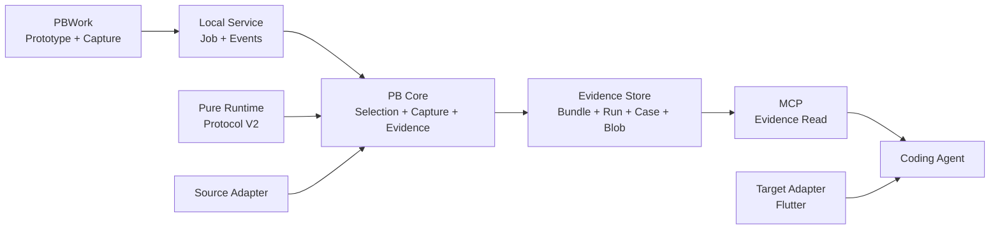

# ProtoBridge / PBWork V2 重构计划

> 状态：Review 完成，待实施
> 目标分支：`dev`
> 性质：破坏性重构；不兼容 V1 Artifact、CLI 和 MCP 页面工作流
> 更新时间：2026-07-27

本文件是 V2 的决策与交付入口，回答为什么重构、完整终态是什么、如何实施以及何时完成。

精确类型与协议见 [PB V2 Contract 规范](./pb-v2-contracts.md)。
代码落点、CLI / MCP、测试和切换步骤见 [PB V2 实施规格](./pb-v2-implementation.md)。

## 1. 结论

V1 能形成页面还原闭环，但 PB 同时承担证据采集、Flutter 规划、target 扫描和大产物生成，导致：

- 主要对象仍是单页，无法准确表达完整 Prototype、Screen、Variant 和 Fragment；
- 默认态之外的状态、Overlay 和页面关系缺少可靠运行态证据；
- `class / tag / geometry` 启发式产生大量低质量推导；
- source component、runtime fact 和 target candidate 容易混在一起；
- Agent 需要读取大 JSON，仍难判断哪些是事实、哪些是建议。

V2 将 PB 定位为原型证据系统：

> 高可信地发现、采集、组织和暴露 Prototype 的页面、状态、组件、视觉、动作和页面关系。

PB 不再替实现 Agent 规划 Flutter 文件树、Widget Tree、路由、状态框架或目标组件。

## 2. 完整终态

```text
PBWork / Prototype Source
  → Runtime Protocol + data-pb-* Contract
  → CaptureSelection
  → deterministic Capture Job
  → Evidence Bundle
  → MCP 按 Bundle / Screen / Case / Fragment 读取
  → Coding Agent 读取目标仓库并实现
```

上游证据生产和下游目标实现是两个生命周期：

- 上游集中采集，证据持久化、可增量更新、可被多个任务复用；
- 下游 Agent 按需读取证据，自行理解目标工程并实现；
- target 查询结果不写入 Evidence Bundle。

### 2.1 系统职责边界

PBWork 和原型源码声明 Prototype、Screen、Variant、Component、Token、Action 等原型事实。

PB Core 负责校验、采集、组织和持久化 Evidence，不创造未声明业务语义，也不在 Capture 中修改 Source 或 Target。

Coding Agent 读取 Evidence 和目标仓库，自行完成目标实现与验证。

V2 不建设人物角色、账号、RBAC 或权限切换。PBWork、CLI、MCP 的能力由配置和已连接的能力自动决定。

### 2.2 核心对象

| 对象 | 含义 |
| --- | --- |
| Prototype | 一组有关联的 Screen、Variant、Flow 和共享 Contract |
| Screen | 稳定页面身份和业务结构 |
| Variant | Screen 内可直接复现的稳定业务状态 |
| Scenario | 从稳定初态执行的显式动作序列 |
| Case | Screen × Variant × Theme × Device × Scenario Checkpoint |
| Fragment | Case 中以稳定语义节点为根的局部证据 |
| Bundle | 一个 Prototype 的长期证据集合 |
| Run | 一次不可变 CaptureSelection 的执行记录 |
| Blob | 截图、Trace、压缩 Snapshot 等内容寻址大对象 |

## 3. 已确认决策

1. PB 与 PBWork 近期是本地、单用户工具。
2. PBWork 是原型生产和采集控制面；具体导航信息架构不属于本计划。
3. `data-pb-*` 和 Runtime Contract 是 instrumented runtime 的语义权威。
4. ARIA、semantic HTML、Source、Runtime 和 Screenshot 只证明各自有权证明的事实。
5. class、tag、geometry 只用于 generic runtime 降级，不能自动升级成业务语义。
6. Capture 使用完整 Case 身份，Theme / Device / Scenario 不会覆盖同一 Variant。
7. Bundle、Run、Case、Blob 分离；Run 不可变，Bundle 以事务方式更新 active Case。
8. 所有 Agent-facing 关键事实具有 provenance、confidence 和 refs。
9. Target Flutter 扫描从 Capture 主链移除，作为独立 adapter 按需查询。
10. V2 完成前不切换正式入口；完成后一次性删除 V1，不发布用户可见双轨或过渡产品。

## 4. 目标架构



包边界：

```text
packages/
├── core/             # Contract、Selection、Capture、Evidence、Store interface
├── local-service/    # HTTP、Job、Events、并发和安全边界
├── cli/              # 命令入口
├── mcp-server/       # Evidence 与可选 target tools
└── target-flutter/   # 独立 Flutter 查询与验证 adapter

apps/
└── pbwork/           # Prototype、Runtime Protocol、Capture Console
```

## 5. 质量原则

### 5.1 事实裁决

| 事实 | 权威来源 |
| --- | --- |
| Screen / Variant / Component / Action 身份 | Runtime Contract / Registry / `data-pb-*` |
| 业务逻辑、未渲染状态和 action 条件 | 显式 Contract / Source |
| 当前可见状态、文本、bbox 和 computed style | Runtime observation |
| 最终视觉 | Screenshot + runtime computed value |
| Accessibility | ARIA / semantic HTML |
| Navigation | declared、source、scenario、runtime observed 分别保留 provenance |

冲突不静默覆盖；保留双方 Evidence 并生成结构化 Issue。Screenshot 只裁决视觉，不裁决业务语义。

### 5.2 Instrumented PBWork 门槛

- required semantic contract 100% 有效；
- traceable fact rate 100%；
- heuristic fallback rate 不高于 5%；
- Action、Navigation 和 Component identity 为 0% heuristic；
- selected Case 全部 captured，或明确标记 unsupported；
- 失败、跳过和 unsupported 分开统计。

### 5.3 Evidence Level

| Level | 可证明 |
| --- | --- |
| instrumented-source-runtime | Contract、Source 逻辑、Runtime、视觉、组件和 Token |
| instrumented-runtime | Runtime Contract、显式语义、当前状态和视觉 |
| generic-runtime | 可见 DOM、ARIA、控件、样式和 Screenshot |
| screenshot-only | 像素、文字和粗略布局 |

低等级证据不能推断隐藏状态、完整业务动作或目标工程实现。

## 6. 产品范围

### 6.1 必做

- Prototype / Screen / Variant / Fragment Selection；
- Runtime Protocol discovery、prepare、stable、snapshot、scenario、reset；
- 稳定 ID、Action、Component、Slot、Token 和 Navigation Contract；
- Screen × Variant × Theme × Device 确定性采集；
- Browser 复用、Context 隔离、失败重试、取消和 Trace；
- Bundle / Run / Case / Blob 持久化；
- 增量采集、stale 判断、事务写入和崩溃恢复；
- PBWork Capture、Coverage、Issue、Evidence 和 Handoff；
- 完整 CLI；
- MCP 按需发现和读取证据；
- 独立 Flutter target 查询和验证；
- 全部现有 PBWork Prototype / Screen / Variant 迁移；
- V1 Artifact、Planner、CLI 和 MCP 删除。

### 6.2 不做

- Vue / HTML / CSS 到 Dart 的自动翻译；
- 自动选择目标文件、路由、状态框架、组件或 Token；
- 无边界自动点击爬虫；
- PBWork 内 Agent Chat；
- 多人云平台、账号、角色权限、远程 Job 和审批；
- V1 Artifact 兼容读取或旧 output 自动迁移；
- Capture 阶段修改 Source 或 Target。

商业化后只有在出现多人远程 Workspace、共享 Store、并发 Job、审批审计或不同写权限时，才单独设计身份与 RBAC。

## 7. 完整工作包

| 工作包 | 主要交付 | 依赖 |
| --- | --- | --- |
| W1 Contract | ID、Schema、Evidence、Issue、Coverage | 无 |
| W2 Runtime | Protocol、prepare/reset、semantic preflight | W1 |
| W3 Capture | Selection、Case Matrix、Scenario、Playwright | W1、W2 |
| W4 Store | Bundle、Run、Case、Blob、事务和 retention | W1、W3 |
| W5 Service | Job、SSE、取消、恢复和安全 | W3、W4 |
| W6 PBWork | Capture Console、Evidence、Coverage、Handoff | W2、W5 |
| W7 CLI / MCP | 完整命令、resources、按配置暴露能力 | W4、W5 |
| W8 Target | Flutter adapter 独立迁移 | W1 |
| W9 Migration | 全部原型修标、V1 删除、文档和发布 | W1–W8 |

实施细节、测试组和代码落点见 [实施规格](./pb-v2-implementation.md)。

## 8. 发布纪律

```text
Contract
→ Runtime
→ Capture
→ Store
→ Service
→ PBWork
→ CLI / MCP / Target
→ 全量 Prototype 验收
→ V1 一次性删除
→ 正式切换
```

- 内部工作包和 vertical slice 只用于验证依赖，不构成对外产品；
- V2 未达到完整 DoD 前，正式 V1 保持可用；
- 不提供 V1 到 V2 的伪兼容 adapter；
- 正式入口不会同时暴露 V1 和 V2；
- 切换提交同时更新 binary、config、MCP、文档和 package exports；
- 所有发布包统一升至 `0.2.0`。

## 9. Definition of Done

V2 完成必须同时满足：

1. PBWork 可选择并采集 Prototype、Screen、Variant 和 Fragment。
2. Runtime 可发现、准备、验证和重置完整 Case。
3. Case identity 覆盖 Theme、Device、Scenario 和 Checkpoint，不存在覆盖写入。
4. Playwright 具备确定性、隔离、取消、重试和 failure trace。
5. Bundle 持久化、增量更新且进程重启后可读。
6. Store 具备锁、事务、崩溃恢复、Blob 去重、容量和安全清理。
7. MCP 可按 Bundle、Screen、Case、Fragment 和 Blob 读取证据。
8. Agent 默认读取小型索引和按需 refs，不加载整个 Prototype。
9. Target 查询与 Capture 完全解耦，target 事实不进入 Bundle。
10. instrumented PBWork 达到本计划 §5.2 的质量门槛。
11. Ledger Planet 18 Screens / 54 Variants 达到深度验收。
12. 当前 Registry 中其他既有 Prototype / Screen / Variant 不退化。
13. 四种 Evidence Level 均有 CLI、Store、MCP 和故障路径 E2E。
14. PBWork、CLI、MCP 共享同一 Selection、Job 和 Store Contract。
15. Flutter target adapter 达到 V1 等价或更高查询和验证覆盖。
16. 旧四件套、Planner、pageId workflow、旧 CLI / MCP 和死代码全部删除。
17. README、AGENT、产品文档、producer 文档和 skills 与 V2 一致。
18. 与 V1 同类任务相比，人工补充、误实现和返工显著减少。

## 10. 工作量与收益

| 工作包 | 估算 |
| --- | --- |
| Contract | 2–3 天 |
| Runtime、标注和 lint | 4–6 天 |
| Capture Orchestrator | 4–6 天 |
| Store | 3–5 天 |
| Local Service | 3–4 天 |
| PBWork | 4–6 天 |
| CLI、MCP、Target | 3–5 天 |
| 全量迁移、删除和回归 | 3–5 天 |
| 合计 | 26–40 个开发日 |

单人合理预期为 5–8 周。AI 能加速 Schema、类型、样板和测试编写，但不能消除浏览器稳定性、协议联调、全量修标和回归成本。

V1 已经可用，因此 V2 的价值不是“从无到有”，而是：

- 将低质量推导移出主链；
- 覆盖完整 Prototype 和多状态证据；
- 让证据可复用、可追溯、可度量；
- 降低 Agent 实现前的信息缺失和实现后的人工返工；
- 阻止 PB 再次扩张成脆弱的目标工程 Planner。

若 PBWork 持续服务多页面、多 Variant 和多个实现任务，完整 V2 的长期价值高；是否正式发布，以 DoD 和 V1/V2 对比结果决定，而不是以代码完成量决定。
