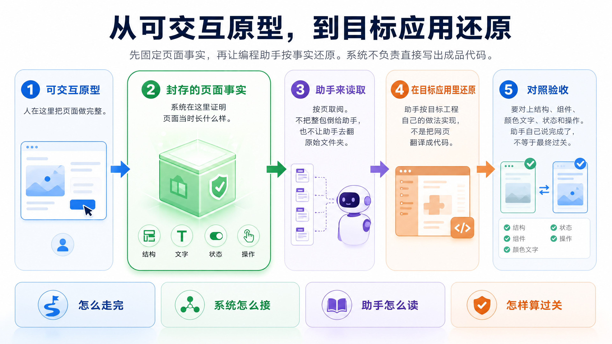

# 产品总览

ProtoBridge（PB）让编程助手通过 MCP，按固定 Evidence 在目标工程里还原可交互原型。PB 从遵循 Authoring Contract 的 Runtime 采集结构、状态、交互和截图，保存为不可变 Evidence；助手结合目标仓库自身规范决定文件、组件、路由、状态管理和具体代码。

先固定页面事实，再让助手按事实还原。系统不负责直接写出成品代码。后文分别展开[怎么走完](./workflow.md)、[系统怎么接](../architecture/overview.md)、[助手怎么读](../guides/agent-consumption.md)和[怎样算过关](../guides/agent-consumption.md#怎样算过关)。

PBWork 的原型、设计基础、组件和工作壳均是代码资产。产品、设计和开发人员通过 Cursor、Codex 等 Coding Agent 使用同一套仓库 Skill、Contract 和 CI 维护这些资产；当前产品不建设独立的可视化编辑器或面向作者的聊天入口。

## 产品边界

PB 负责：

- 确定性定位原型 Screen、Variant 和语义 Fragment；
- 采集可见结构、文本、状态、交互检查点和截图；
- 保留 provenance、unknown、conflict、Coverage、Issue 和限制；
- 将一次采集保存为不可变 Run、Evidence revision 和 Snapshot；
- 生成固定 Workspace、Snapshot、revision 和风险的 Agent Handoff；
- 让 Agent 通过 MCP 读取固定 Evidence；
- 独立读取和验证目标仓库，但不把 Target 事实写入 Evidence。

PB 不负责：

- 自动把 DOM、Vue 或截图翻译成生产代码；
- 替 Agent 选择目标文件、组件、路由或状态框架；
- 用源码启发式补造 Runtime 未证明的事实；
- 把 warning、unknown、conflict 或 partial coverage 隐藏成成功；
- 在 Handoff 消费时用 active/latest 替换固定引用；
- 提供云端账号、多人审批或远程共享 Store；
- 从未标记的 CSS/DOM 猜测作者希望独立实现的节点和 Token binding。

## 产品组成

| 组成 | 职责 |
| --- | --- |
| Core | Contract、采集、Store、Handoff 和 Target 只读边界 |
| PBWork | 设计基础、业务原型、工作台、Runtime、采集控制面和 Evidence Review |
| Local Service | 浏览器工作台与 Node/Playwright/Store 之间的本地进程边界 |
| CLI | 自动化采集、Workspace 和 Bundle 生命周期 |
| MCP | 按固定逻辑 ID 读取 Evidence，并只读查询、验证目标仓库 |
| Coding Agent | 读取固定 Evidence 与目标工程上下文，完成实现并验证 |

## PBWork 与 PB

PBWork 同时承担两个相互隔离的角色：

1. **Workbench**：面向人的图形界面，用于浏览设计基础和 Agent 制作的原型、执行检查、流转生命周期、确认整原型定稿采集、查看任务和 Review Evidence。
2. **Runtime**：面向 PB Capture 的确定性页面环境，通过 authored Contract 声明 Screen、Variant、Fragment、Action、Scenario 和 Checkpoint。

Workbench 不拥有第二套 Capture 语义。它把用户操作归一为 Core 的 Selection Draft，并通过 Local Service 调用同一套 Preflight、Capture、Store 和 Handoff 能力。CLI 也使用相同 Core，因此 GUI 与自动化入口不会产生不同的 Case、状态或引用规则。

## Target 能力边界

Evidence Contract 不绑定 Flutter、Kotlin、Swift、React Native 或 Web，Agent 可以据此实现不同技术栈。当前内置 Target conventions、examples、change validation 和交付验证提示只完整支持 Flutter；其它 Target 需要新增独立 Adapter，但不得改变 Evidence 核心对象。

## 可信基础

PB 的可信度建立在四个约束上：

- **Authored boundary**：原型作者明确声明完整性边界，而不是让采集器猜测页面何时完整。
- **Deterministic case**：设备、主题、Variant、Fixture、Scenario 和 Scope 共同形成稳定 Case。
- **Immutable evidence**：历史对象不可覆盖；新的采集创建新的 Run、revision 和 Snapshot。
- **Fixed consumption**：Handoff 固定所有正式引用，Agent 读取同一份已审查证据。

术语见 [词汇表](../reference/vocabulary.md)，实现关系见 [系统架构](../architecture/overview.md)。
