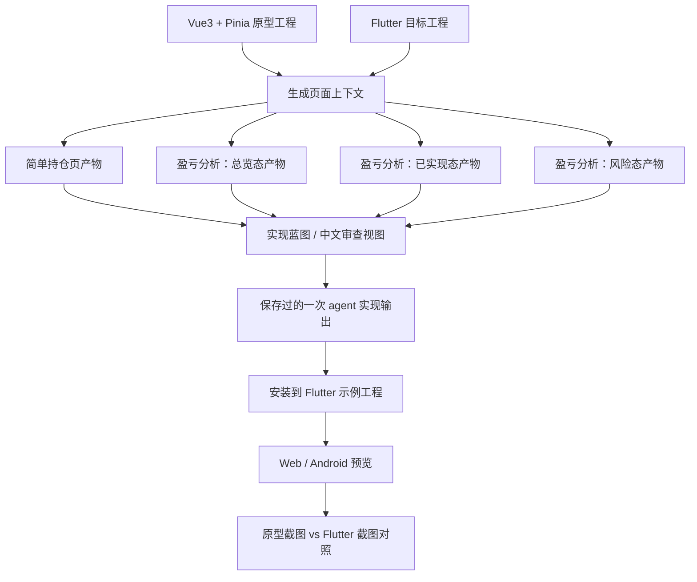
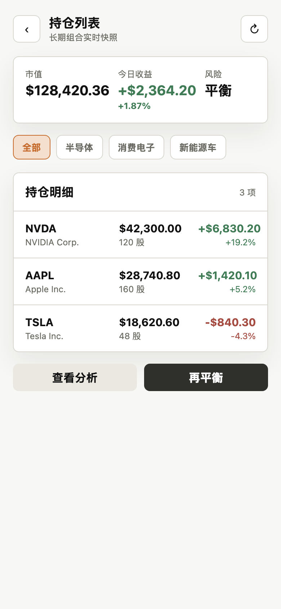
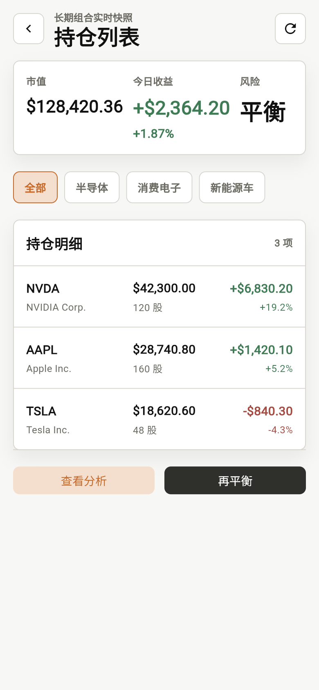
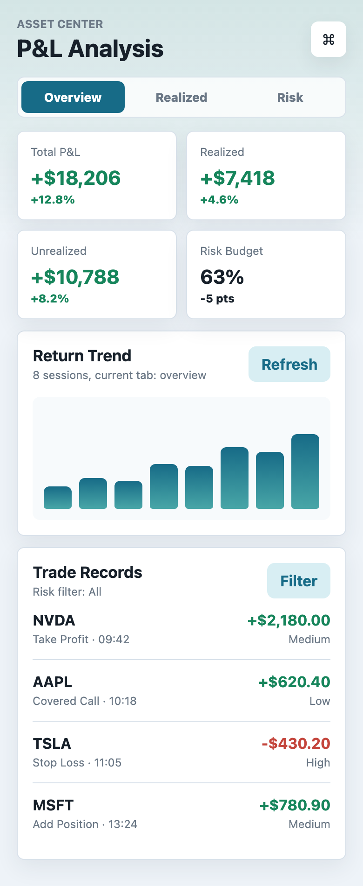
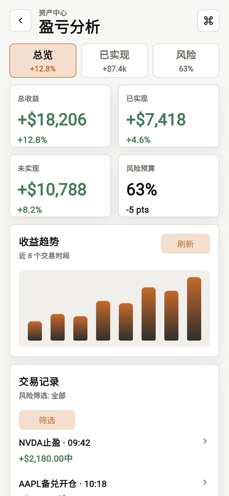

# Vue3 Source to Flutter Target Example

这个示例展示 ProtoBridge 的当前产物体系：把 Vue3 原型源码、运行时页面、截图证据和 Flutter target 工程扫描结果，整理成 `ui-build-plan.json` 这份唯一机器契约，再用 `ui-build-review.md` 生成中文 review 视图。

它不是 Vue 到 Dart 编译器。示例里的 Flutter 页面来自一次 agent 工作流输出，仓库把这份输出保存为 `.dart.txt` 静态文本，`pnpm run example` 会把它安装到 target 的 `_proto` 入口，方便本地预览。



## 示例页面

| Case | Vue route | Flutter route | 覆盖点 |
| --- | --- | --- | --- |
| simple | `/prototype/asset/holding-list` | `/account/holding-list` | 标题、摘要、筛选、列表、loading/empty。 |
| complex | `/prototype/asset/pnl-analysis` | `/account/pnl-analysis` | tab、筛选、指标卡、趋势图、交易列表、bottom sheet。 |

## 目录

```text
examples/vue3-to-flutter/
├── source-vue3/          # Vue3 + Vite + Vue Router + Pinia 原型工程
├── target-flutter/       # Flutter target 工程
├── agent-output/         # 已保存的一次 agent 输出，git tracked
├── output/               # pnpm run example 后生成，git ignored
├── screenshots/          # 原型和 Flutter 还原截图
├── proto-bridge.config.json
└── README.md
```

## 命令

| 命令 | 做什么 |
| --- | --- |
| `pnpm run example` | 生成 simple 和 complex 三个 tab 状态的 artifacts，并安装 `_proto` Flutter 页面。 |
| `pnpm run example:clean` | 删除 `_proto` 安装结果，并清空 `output/`。 |
| `pnpm run example:dev` | 启动 Vue 原型和 Flutter Web 静态预览。 |
| `pnpm run example:android` | 运行 Flutter target 到 Android 设备或模拟器。 |

推荐：

```bash
pnpm run example
pnpm run example:dev
```

## 生成内容

`pnpm run example` 会：

1. 构建 ProtoBridge packages。
2. 构建 Vue3 source prototype。
3. 启动 Vue runtime。
4. 生成 simple artifacts。
5. 生成 complex overview、realized、risk 三个状态的 artifacts。
6. 按 `agent-output/flutter-proto-manifest.json` 安装已保存的 agent Flutter 输出。
7. 校验 `_proto` 页面和 route registry。

每个 `output/<case>/` 包含：

```text
page-canonical.json
page-debug-index.json
ui-build-plan.json
ui-build-review.md
screenshots/full-page.png
```

Source-aware 信息统一进入 `ui-build-plan.json#/implementationContract/sourceSemantics`，并由 `ui-build-review.md` 展示。

## 示例如何体现新契约

`ui-build-plan.json` 是这个示例的核心产物：

| 区域 | 示例中的作用 |
| --- | --- |
| `targetConventions.architectureProfile` | 扫描 `target-flutter` 的状态、路由、主题、组件和文件组织模式。 |
| `implementationContract` | 给出页面文件、Widget 拆分、状态边界、Widget contract 和 source semantics。 |
| `visualPlan` | 保留 runtime section、bbox、截图引用和布局证据。 |
| `themeMappings` | 映射 source token 到 target theme/text style token，并保留 typography lock。 |
| `componentMappings` | 给出可复用 target component 候选。 |

这个 target 工程里出现的 flutter_bloc、公共组件、主题 token 等都只是该 target 的扫描证据，不是 ProtoBridge 默认偏好。换成 GetX target 时，contract 应基于 GetX 证据生成；扫不到时应保持 unknown 并输出 warnings/manual questions。

Typography mapping 如果带 `lockToken=true`，agent 必须直接使用扫描或映射得到的 target text style token，不再覆盖 `fontSize`、`fontWeight`、`height` 或 `fontFamily`。

## Agent 工作流产物

可提交的 agent 输出位于：

```text
agent-output/flutter-proto-manifest.json
agent-output/flutter-proto-files/*.dart.txt
```

运行 `pnpm run example` 后会安装到：

```text
target-flutter/lib/main_proto.dart
target-flutter/lib/app/app_proto.dart
target-flutter/lib/app/routes/app_pages_proto.dart
target-flutter/lib/app/modules/account/_proto/
```

这份 agent 输出读取的是：

```text
output/<case>/ui-build-plan.json
output/<case>/ui-build-review.md
output/<case>/page-canonical.json
output/<case>/page-debug-index.json
target-flutter/lib/app/theme/
target-flutter/lib/app/common/widgets/
target-flutter/lib/app/routes/
```

## 阅读顺序

```text
output/simple/ui-build-plan.json
output/simple/ui-build-review.md
output/simple/page-debug-index.json
output/simple/page-canonical.json

output/complex-overview/ui-build-plan.json
output/complex-overview/ui-build-review.md
output/complex-overview/page-debug-index.json
output/complex-overview/page-canonical.json

output/complex-realized/ui-build-plan.json
output/complex-realized/ui-build-review.md
output/complex-realized/page-debug-index.json
output/complex-realized/page-canonical.json

output/complex-risk/ui-build-plan.json
output/complex-risk/ui-build-review.md
output/complex-risk/page-debug-index.json
output/complex-risk/page-canonical.json
```

Agent 以 `ui-build-plan.json` 为机器契约；人类可以看 `ui-build-review.md` 快速 review 表格化摘要。

## Web 预览

```bash
pnpm run example:dev
```

入口地址：

```text
Vue prototype:  http://127.0.0.1:5173/
Flutter target: http://127.0.0.1:5599/
```

如果默认端口被占用，脚本会自动使用后续可用端口，请以终端输出为准。Flutter 入口是 build 后的静态预览；存在 `main_proto.dart` 时会使用 `_proto` 页面，不存在时显示 fallback 提示页。

## Android 预览

```bash
pnpm run example:android
```

指定设备：

```bash
pnpm run example:android -- -d emulator-5554
```

`example:android` 会在缺少 Android 平台目录时执行 `flutter create --platforms=android .`。存在 `main_proto.dart` 时使用 `-t lib/main_proto.dart` 运行生成页。

## Source 工程

`source-vue3/` 是一个简化但正常的 Vue3 原型工程：

- Vue3 + Vite。
- Vue Router hash route。
- Pinia 管理筛选、tab、loading、弹层和选中记录。
- scoped style 和全局 CSS tokens。
- `prototype/src/config/prototypeScreens.js` 提供 route 到 Vue SFC 的映射。
- `prototype/notes/asset/*.md` 和 `prototype/src/i18n/prototype/*.json` 提供 source evidence。

URL-first 输入示例：

```bash
pnpm run generate -- \
  --config examples/vue3-to-flutter/proto-bridge.config.json \
  --url "http://127.0.0.1:5173/#/prototype/asset/pnl-analysis?tab=overview" \
  --output examples/vue3-to-flutter/output/complex-overview
```

## Target 工程

`target-flutter/` 是一个小型 Flutter target app：

- Flutter 3.x。
- `lib/app/routes` 提供目标路由。
- `lib/app/theme` 提供色板、文本样式和 spacing tokens。
- `lib/app/common/widgets` 提供公共组件。
- `lib/app/modules/account/_proto` 是 `pnpm run example` 安装出来的运行时示例实现。

示例里的 source module 是 `asset`，target module 是 `account`。产物中出现 source/target module 不一致的确认项是预期行为，用来展示 ProtoBridge 如何显式暴露模块映射风险。

## 截图

| Prototype | Generated Flutter page |
| --- | --- |
|  |  |
|  |  |
